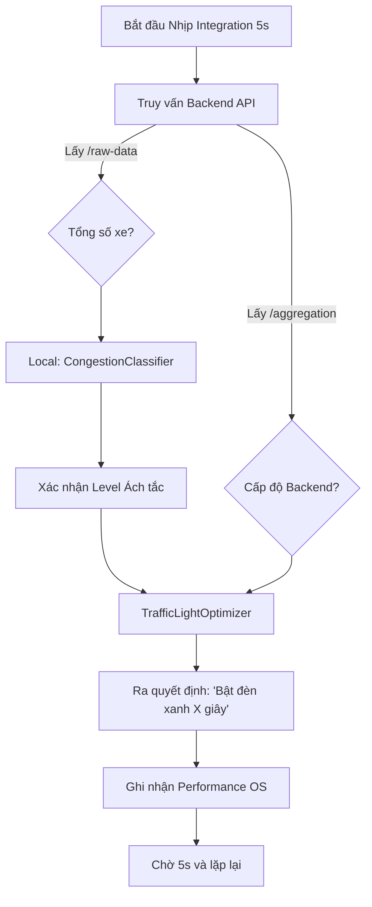

# 🔗 TỔNG QUAN MODULE: INTEGRATION SYSTEM (`integration_system/`)

Thư mục `integration_system` đóng vai trò là khối **Điều phối và Tích hợp logic (Orchestrator & Business Logic)** của hệ thống. Thay vì chỉ nhận diện và lưu trữ, hệ thống này đóng vai trò lấy dữ liệu từ Backend đem đi xử lý các bài toán nghiệp vụ cụ thể như: theo dõi hiệu năng, chuẩn đoán lại mức độ ách tắc hiện thời, và điển hình nhất là **tối ưu hóa thời gian đèn tín hiệu giao thông (Traffic Light Optimization)**.

---

## 🎯 1. Chức năng chính thống
* Điều phối tự động (Cron-like scheduler) việc liên tục query dữ liệu từ Backend API (REST).
* Áp dụng Business Logic để tính toán độc lập mức độ tắc nghẽn dựa trên số lượng xe.
* Tính toán thời gian đèn xanh (Green light) tối ưu tùy thuộc vào cấu hình đường truyền giao thông.
* Giám sát hiệu năng hệ thống phần cứng (CPU & RAM) ở thời gian thực.
* Môi trường cung cấp kịch bản giả lập (Mockup pipeline) nhằm kiểm soát chất lượng tích hợp mà không cần mở toàn bộ AI Engine.

---

## 📁 2. Chi tiết các thành phần (File Structure)

### 2.1. Lõi Điều Phối Hệ Thống
* **`system_runner.py` (Lõi chính)**
  * **Chức năng:** Là linh hồn của toàn bộ thư mục integration, mô phỏng lại một quy trình sử dụng đầy đủ các component liên quan.
  * **Quy trình hoạt động (Loop mỗi 5s):**
    1. **Lấy dữ liệu thô:** Truy vấn `GET /raw-data` (Backend) để biết tổng số lượng xe đã đếm được.
    2. **Phân tích Backend:** Truy vấn `GET /aggregation` để mượn năng lực Backend tổng hợp xem trạng thái ách tắc hiện tại là gì.
    3. **Phân loại nội bộ:** Chạy qua hàm `CongestionClassifier` để double-check lại mức độ lưu thông.
    4. **Điều phối đèn giao thông:** Bỏ Level tắc đường vào `TrafficLightOptimizer` để trả về số giây đèn xanh (green time).
    5. **Giám sát thiết bị:** Gọi `PerformanceMonitor` để soi xét sức khỏe server đằng sau.
* **`scheduler.py`**
  * **Chức năng:** Bản rút gọn của system runner nhưng chạy vòng lặp lớn (60 giây), có mục tiêu liên kết giữa hệ Backend thông thường và nền tảng Deep Learning (`/predict-next`).

### 2.2. Các Bộ Xử Lý Nghiệp Vụ (Business Logic)
* **`congestion_classifier.py`**
  * Đánh giá mức độ kẹt xe chay qua cơ chế logic cơ bản:
    * `$< 15` xe: **Low** (Thấp)
    * `15 - 29` xe: **Medium** (Trung bình)
    * `30 - 49` xe: **High** (Cao)
    * `> 50` xe: **Severe** (Rất nghiêm trọng)
* **`traffic_light_logic.py`**
  * Thuật toán cấp phát thời lượng đèn giao thông tùy theo mức độ kẹt xe hiện hữu:
    * Mức độ **LOW** => Đèn xanh 20 giây.
    * Mức độ **MEDIUM** => Đèn xanh 40 giây.
    * Mức độ **HIGH** => Đèn xanh 60 giây.
    * Mức độ **Severe** => Đèn xanh 90 giây nhằm ưu tiên xả trạm.
* **`performance_monitor.py`**
  * Sử dụng thư viện `psutil` để trích xuất ra `% CPU usage` và `% Virtual Memory usage` giúp phân loại sức khỏe máy hiện thái tại thời điểm đang vận hành tính toán AI.

### 2.3. Công cụ Kiểm tra (Testing & Debug)
* **`pipeline_test.py`**
  * Giả lập Mocking Data: Random từ khoảng 5 - 50 chiếc xe (không cần mở AI thật) và đẩy thẳng vào Backend API qua luồng `GET /aggregation`. Giúp cho Backend dev dễ dàng test API mà không bị phụ thuộc rào cản quá nặng nề về cài đặt Model AI yolov9.

---

## ⚙️ 3. Workflow Luồng Vận Hành Điển Hình



## 🚀 4. Cách Sử Dụng
* Thông thường, ta chạy trực tiếp file module này thông qua Terminal / CMD sau khi đã khởi động **Backend Server**:
```bash
# Trải nghiệm toàn bộ flow phân tích giao thông tự động
python integration_system/system_runner.py

# Giả lập data test nhanh hệ Backend
python integration_system/pipeline_test.py
```
