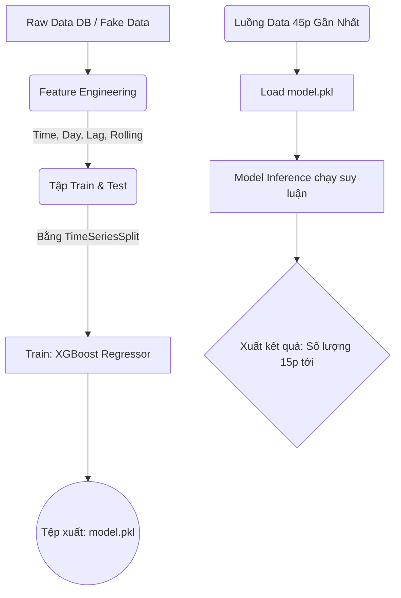

# 🔮 TỔNG QUAN MODULE: ML_SERVICE (`ml_service/`)

Thư mục `ml_service` là một phân hệ (module) độc lập chịu trách nhiệm về phân tích dự đoán và dự báo lưu lượng giao thông trong tương lai theo thời gian thực (Time-series Forecasting). Mục tiêu chính của phân hệ này là học hỏi từ các luồng phân tích phương tiện lịch sử để dự báo được chuẩn xác mức độ kẹt xe trong "15 phút kế tiếp".

---

## 🎯 1. Chức năng cốt lõi
* **Máy học (Machine Learning):** Ứng dụng mô hình suy luận `XGBoost Regressor`, chuyên trị để tìm ra quy luật từ dữ liệu bảng biểu dạng dãy chuỗi thời gian (Time-series data).
* **Kỹ nghệ Đặc trưng (Feature Engineering):** Biến đổi dữ liệu thô (chỉ có thời gian và số lượng) thành các nhân tố dự báo như: Giờ cao điểm, ngày thứ mấy trong tuần, độ trễ thời gian (Shift lag) hay lưu lượng Trung bình trượt (Rolling mean).
* **Đánh giá Chéo Dữ Liệu Thời Gian (Time Series Split CV):** Đảm bảo việc train model chặt chẽ theo dòng thời gian mà không bị trộn lẫn (data leakage) giữa tương lai và quá khứ.
* **Dự báo chủ động:** Gọi và nạp lại Model nhúng với một bộ nhớ lưu lượng nhỏ để tính toán ngay tức khắc con số xe dự kiến sắp lao đến trong 15 phút tới.

---

## 📁 2. Chi tiết Cấu trúc File

### 2.1. `traffic_predictor.py` (Lõi Bộ Não Trí Tuệ Nhân Tạo)
* **Ý nghĩa:** Chứa Class tổng `TrafficPredictor` lo từ A-Z mọi quy trình tiền xử lý, đào tạo và định hình tính toán cho toàn bộ phân hệ ML.
* **Các cơ chế nổi bật trong file:**
  * **Thuật toán XGBoost:** Init XGBRegressor với tối ưu Hyperparameters mặc định chống Overfit (`n_estimators=100, max_depth=5, learning_rate=0.1`).
  * **Hàm `generate_dummy_data`:** Tự động mô phỏng giả lập dữ liệu lịch sử chuẩn xác trong vòng 30 - 60 ngày nếu DB chưa có Data thật. Tái lập tính chất giao thông như: Cuối tuần vắng xe, từ `7h-9h` và `17h-19h` lượng xe tăng vọt.
  * **Hàm `create_features`:** Phân rã thời gian gốc thành các Features như `lag_1`, `lag_2`, `rolling_mean_3` và cờ bắt đỉnh `is_peak_hour` để ML Model "hiểu" về chu kỳ.
  * **Hàm `train_and_evaluate`:** Chia fold TimeSeries tiến hành huấn luyện chuẩn xác nhất giúp AI rút tóm được xu hướng (Trend).
  * **Hàm `predict`:** Đầu vào là dòng thời gian thực tóm gọn (vd: 3 bản ghi camera ngay trước đó), bù lại output phán đoán ngay 15 phút tới có bao nhiêu xe.

### 2.2. `train.py` (Kịch bản Huấn Luyện)
* **Ý nghĩa:** Một Pipeline độc lập chỉ dùng mỗi khi bạn muốn đào tạo mới lại trọng số cho Model.
* **Quy trình:** Khi bấm chạy, file này chủ động gọi sinh dữ liệu ảo (60 ngày), gọi đánh giá tập validation và cuối cùng gói ghém (Dump) lại bằng thư viện `joblib` để tạo ra kết quả file nhị phân `model.pkl`. Quá trình diễn ra hoàn toàn tự động.

### 2.3. `predict.py` (Kịch bản Dự Báo Thực Tế)
* **Ý nghĩa:** Là một Test script chuẩn bị phục vụ hoặc Tích hợp thẳng vào Backend sau này.
* **Quy trình:**
  * Bỏ qua vòng lập huấn luyện tốn CPU/GPU, nó sẽ bốc file `model.pkl` được làm sẵn từ hệ thống gắn lên Memory.
  * Trích xuất vài dòng dữ liệu tượng trưng cho "Lịch sử của 45 phút gần nhất" được Camera soi được.
  * Đẩy thẳng vào model inference và xuất ra Terminal lệnh gợi ý về `KẾT QUẢ DỰ BÁO` sau 15p.

### 2.4. `model.pkl` (Model Weights)
* **Ý nghĩa:** Đầu ra tĩnh của quá trình Machine Learning. Lưu trữ cấu trúc Cây quyết định (Decision Trees) đã được rèn luyện từ `train.py`.

---

## ⚙️ 3. Mô hình Hoạt Động Cốt Lõi (Architecture diagram)



## 🚀 4. Hướng dẫn test nhanh Module

Module này được thiết kế theo hướng dễ test cục bộ (Local Testing) mà không cần bật Database. Bạn mở Terminal và gõ:

```bash
# 1. Để tiến hành train lại AI cho hiểu quy luật đường (Mất chừng ~5-10s)
python ml_service/train.py

# 2. Để bật thử kịch bản dự báo tương lai ngay khi vừa train xong
python ml_service/predict.py
```
