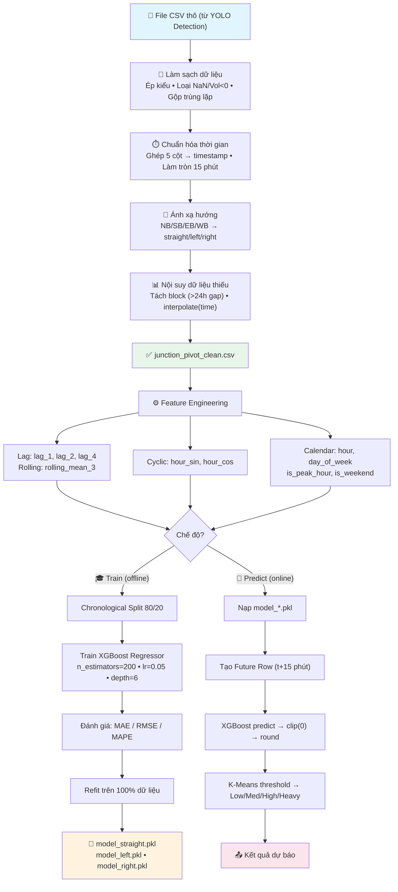

# BÁO CÁO PHÂN TÍCH HỆ THỐNG MACHINE LEARNING
## Dự Báo Lưu Lượng Giao Thông — Phân tích Lựa chọn Mô hình, Đánh giá Thực nghiệm và Nhận xét

---

## Mục lục

1. [Bài toán đặt ra và thách thức dữ liệu](#1-bài-toán-đặt-ra-và-thách-thức-dữ-liệu)
2. [Phân tích và nhận xét quá trình làm sạch dữ liệu](#2-phân-tích-và-nhận-xét-quá-trình-làm-sạch-dữ-liệu)
3. [Tại sao Feature Engineering quyết định thành bại của mô hình](#3-tại-sao-feature-engineering-quyết-định-thành-bại-của-mô-hình)
4. [So sánh và lý giải lựa chọn XGBoost](#4-so-sánh-và-lý-giải-lựa-chọn-xgboost)
5. [Sơ đồ luồng Train/Dự báo](#5-sơ-đồ-luồng-traindự-báo)
6. [Đánh giá thực nghiệm: XGBoost vs. Linear Regression](#6-đánh-giá-thực-nghiệm-xgboost-vs-linear-regression)
7. [Phân cụm ngưỡng mật độ: Nhận xét về K-Means](#7-phân-cụm-ngưỡng-mật-độ-nhận-xét-về-k-means)
8. [Nhận xét tổng thể và hạn chế](#8-nhận-xét-tổng-thể-và-hạn-chế)

---

## 1. Bài Toán Đặt Ra và Thách Thức Dữ Liệu

Hệ thống cần trả lời câu hỏi: **"Trong 15 phút tới, sẽ có bao nhiêu xe đi qua mỗi hướng (thẳng, trái, phải) tại nút giao này?"**

Đây là bài toán **hồi quy chuỗi thời gian (time-series regression)** — cần dự đoán một con số liên tục dựa trên dữ liệu lịch sử. Tuy nhiên, dữ liệu đầu vào lại không phải chuỗi thời gian lý tưởng. Nó đến từ cảm biến vật lý (Automated Traffic Recorder) đặt ngoài trời, chịu ảnh hưởng của thời tiết, hư hỏng phần cứng và lỗi truyền tải. Cụ thể, dữ liệu thô (~287MB) mắc phải 6 vấn đề nghiêm trọng khiến nó **không thể dùng trực tiếp** cho bất kỳ thuật toán Machine Learning nào:

| # | Vấn đề | Ví dụ cụ thể | Hậu quả nếu bỏ qua |
|---|--------|---------------|---------------------|
| 1 | Cột lưu lượng (`Vol`) là chuỗi ký tự, không phải số | `"1,250"` thay vì `1250` | Mọi phép toán số học đều thất bại |
| 2 | Giá trị âm và NaN (nhiễu cảm biến) | `-5 xe`, ô trống | Mô hình học quy luật sai — dự đoán ra số xe âm |
| 3 | Thời gian bị xé thành 5 cột rời rạc, lệch nhịp | 08:13, 08:17 thay vì 08:15 | Không thể tính lag features, rolling mean |
| 4 | Trùng lặp logic do nhiều cảm biến cùng vị trí | 2 dòng cùng nút giao, cùng giờ, khác giá trị | Thổi phồng lưu lượng gấp đôi |
| 5 | Đứt gãy chuỗi thời gian (mất tín hiệu vài ngày) | Không có dữ liệu từ thứ Ba đến thứ Năm | `lag_1` (15 phút trước) thực chất là 3 ngày trước |
| 6 | Hướng di chuyển dùng la bàn (NB/SB/EB/WB) | NB tại nút A là "đi thẳng", tại nút B là "rẽ trái" | Mô hình bị bó cứng vào 1 nút giao cụ thể |

**Nhận xét:** Nhìn vào bảng trên có thể thấy rằng phần lớn công sức của hệ thống ML không nằm ở thuật toán dự báo — mà nằm ở việc biến đổi dữ liệu thô đầy khiếm khuyết thành đầu vào sạch và có cấu trúc. Đây là đặc điểm chung của các bài toán ML ứng dụng trong thực tế: **80% effort dành cho dữ liệu, 20% dành cho mô hình.**

---

## 2. Phân Tích và Nhận Xét Quá Trình Làm Sạch Dữ Liệu

Quá trình làm sạch không đơn thuần là "xóa dòng lỗi". Mỗi bước xử lý đều ẩn chứa một quyết định thiết kế, và mỗi quyết định đều có thể dẫn đến kết quả hoàn toàn khác nếu chọn sai. Dưới đây là phân tích các quyết định quan trọng nhất:

### 2.1. Tại sao chọn khung 15 phút thay vì 5 phút hay 1 giờ?

Đây là quyết định ảnh hưởng trực tiếp đến chất lượng dự báo. Bản chất câu hỏi là: **dữ liệu nên được "gom cục" ở mức nào?**

| Khung thời gian | Ưu điểm | Nhược điểm | Đánh giá |
|-----------------|---------|------------|----------|
| **1 phút** | Phản ứng cực nhanh | Nhiễu quá lớn — một xe bus đi chậm tạo đỉnh giả | ❌ Không phù hợp |
| **5 phút** | Nhanh, chi tiết | Vẫn nhiễu; mỗi ngày tạo 288 dòng → bùng nổ dữ liệu | ⚠️ Có thể cân nhắc |
| **15 phút** | Cân bằng giữa chi tiết và ổn định; tương thích chu kỳ đèn (~10 pha đèn/15 phút) | Không phản ứng được với sự cố xảy ra trong 5 phút | ✅ **Được chọn** |
| **1 giờ** | Rất ổn định | Mất hoàn toàn khả năng phát hiện ùn tắc đột xuất (thường hình thành trong 15-20 phút) | ❌ Quá thô |

**Nhận xét:** 15 phút là "điểm ngọt" (sweet spot). Nếu sau này cần phản ứng nhanh hơn (ví dụ phát hiện tai nạn), có thể thử chuyển sang khung 5 phút — nhưng điều đó đòi hỏi tập dữ liệu lớn hơn đáng kể để duy trì chất lượng thống kê.

### 2.2. Gộp trùng lặp: Tại sao dùng mean() thay vì sum() hay max()?

Khi nhiều cảm biến tại cùng một vị trí báo cáo giá trị khác nhau cho cùng một khoảng thời gian, cần chọn cách gộp:

| Cách gộp | Kết quả | Vấn đề |
|----------|---------|--------|
| `sum()` | 78 + 82 = 160 xe | **Sai hoàn toàn** — thực tế chỉ có ~80 xe, nhưng 2 cảm biến cùng đếm |
| `max()` | max(78, 82) = 82 xe | Thiên vị cao — luôn lấy giá trị lớn nhất, gây overestimate |
| **`mean()`** | (78 + 82) / 2 = 80 xe | **Ước lượng trung dung nhất** — giảm thiểu sai số tổng thể |

**Nhận xét:** Lựa chọn `mean()` dựa trên nguyên lý thống kê cơ bản: trung bình cộng của nhiều phép đo độc lập cho cùng một đại lượng sẽ hội tụ về giá trị thực (Luật số lớn). Đây là lựa chọn an toàn nhất khi không có thông tin bổ sung về độ tin cậy của từng cảm biến.

### 2.3. Nội suy dữ liệu thiếu: Tại sao phải tách block trước khi nội suy?

Đây là quyết định tinh tế nhất trong pipeline làm sạch. Khi cảm biến mất tín hiệu, dữ liệu bị "thủng lỗ". Có 3 cách điền:

| Phương pháp | Hành vi | Vấn đề |
|-------------|---------|--------|
| `fillna(0)` | Điền tất cả chỗ trống bằng 0 | Tạo "hố sâu" giả — mô hình tưởng lúc đó không có xe nào |
| `fillna(mean)` | Điền bằng giá trị trung bình toàn cục | Xóa sạch quy luật giờ cao điểm/thấp điểm — mọi chỗ trống đều bằng nhau |
| **`interpolate('time')`** | Vẽ đường cong nối 2 điểm dữ liệu thật liền kề | Bảo tồn xu hướng tăng/giảm tự nhiên |

Tuy nhiên, nội suy **chỉ có ý nghĩa khi 2 điểm dữ liệu liền kề gần nhau về mặt thời gian**. Nếu cảm biến mất tín hiệu 3 ngày, việc vẽ đường thẳng từ thứ Hai sang thứ Năm là vô nghĩa — giao thông thứ Ba, thứ Tư có quy luật hoàn toàn riêng.

**Giải pháp đã chọn:** Tách dữ liệu thành các "block" liên tục. Nếu khoảng trống > 24 giờ → coi là block mới. Chỉ nội suy **trong phạm vi từng block**. Các block quá ngắn (< 3 giờ) bị loại bỏ vì không đủ dữ liệu để tạo đặc trưng lag có ý nghĩa.

**Nhận xét:** Quyết định ngưỡng 24 giờ là hợp lý — vì giao thông có chu kỳ ngày rõ rệt. Nếu mất quá 1 ngày, không thể biết giao thông trong khoảng đó diễn ra như thế nào. Tuy nhiên, đây là một siêu tham số (hyperparameter) có thể tinh chỉnh — ví dụ giảm xuống 12 giờ nếu muốn thận trọng hơn.

### 2.4. Ánh xạ hướng la bàn → hướng giao thông: Tại sao cần bước này?

Đây là bước quan trọng nhất để đảm bảo **khả năng tổng quát hóa** (generalization) của mô hình. Dữ liệu gốc ghi hướng theo la bàn (NB, SB, EB, WB), nhưng cùng ký hiệu "NB" tại 2 nút giao khác nhau có thể mang ý nghĩa hoàn toàn khác (đi thẳng tại nút A, rẽ trái tại nút B).

Bằng cách ánh xạ tất cả về 3 hướng chuẩn hóa (`vol_straight`, `vol_left`, `vol_right`), mô hình học được quy luật: **"lưu lượng xe đi thẳng luôn cao hơn rẽ trái/phải vào giờ cao điểm"** — bất kể nút giao đó hướng về đâu trên bản đồ.

**Nhận xét:** Nếu bỏ qua bước này và huấn luyện trực tiếp trên nhãn NB/SB/EB/WB, mô hình sẽ ghi nhớ cấu hình vật lý của một nút giao cụ thể thay vì học quy luật giao thông tổng quát. Khi triển khai tại nút giao mới, mô hình sẽ cho kết quả sai hoàn toàn.

---

## 3. Tại Sao Feature Engineering Quyết Định Thành Bại Của Mô Hình

Sau khi dữ liệu đã sạch, câu hỏi tiếp theo là: **mô hình "nhìn thấy" gì từ dữ liệu?** Nếu chỉ đưa vào giá trị lưu lượng thô theo thời gian, mô hình không có đủ thông tin để dự đoán. Kỹ nghệ đặc trưng (Feature Engineering) chính là quá trình "dịch" dữ liệu thô thành ngôn ngữ mà thuật toán hiểu được.

Hệ thống sử dụng **10 đặc trưng đầu vào**, chia thành 3 nhóm. Mỗi nhóm giải quyết một vấn đề cụ thể:

### Nhóm 1: Đặc trưng thời gian (4 features) — Trả lời câu hỏi "Bây giờ là khi nào?"

| Feature | Giá trị | Vai trò |
|---------|---------|---------|
| `hour` | 0–23 | Phân biệt giao thông ban ngày vs. ban đêm |
| `day_of_week` | 0–6 | Phân biệt ngày đi làm vs. cuối tuần |
| `is_peak_hour` | 0 hoặc 1 | Đánh dấu giờ cao điểm (7-9h, 17-19h) |
| `is_weekend` | 0 hoặc 1 | Đánh dấu thứ Bảy, Chủ Nhật |

**Nhận xét:** Các cờ nhị phân `is_peak_hour` và `is_weekend` thoạt nhìn có vẻ thừa (vì đã có `hour` và `day_of_week`). Tuy nhiên, chúng rất quan trọng đối với XGBoost: thay vì phải trải qua nhiều lần phân nhánh để "phát hiện" rằng giờ 7-9 có gì đặc biệt, mô hình có ngay một tín hiệu rõ ràng để chia nhánh. Điều này giúp cây quyết định nông hơn, nhanh hơn và ít overfitting hơn.

### Nhóm 2: Đặc trưng chu kỳ (2 features) — Giải quyết vấn đề "23h và 0h nằm xa nhau"

| Feature | Công thức |
|---------|-----------|
| `hour_sin` | sin(2π × hour / 24) |
| `hour_cos` | cos(2π × hour / 24) |

**Vấn đề cần giải quyết:** Nếu dùng biến `hour` (0-23) trực tiếp, mô hình coi 23h và 0h cách nhau 23 đơn vị — rất xa. Nhưng thực tế, 23:45 và 00:00 chỉ cách nhau 15 phút và có lưu lượng tương tự.

**Giải pháp:** Chiếu giờ lên vòng tròn đơn vị (unit circle). Trên vòng tròn, 23h và 0h nằm cạnh nhau. Cần cả sin lẫn cos vì chỉ dùng 1 hàm sẽ gây nhập nhằng: sin(6h) = sin(18h) = 0, nhưng cos(6h) ≠ cos(18h).

**Nhận xét:** Đây là kỹ thuật chuẩn trong xử lý dữ liệu chu kỳ. Không có kỹ thuật này, mô hình sẽ xử lý sai các giao dịch xảy ra quanh nửa đêm. Tuy nhiên, với XGBoost (cây quyết định), lợi ích của mã hóa lượng giác ít rõ rệt hơn so với mạng nơ-ron — vì cây quyết định vốn có thể tạo các "bin" rời rạc. Dù vậy, nó vẫn giúp giảm số lần phân nhánh cần thiết.

### Nhóm 3: Đặc trưng quá khứ (4 features) — Trả lời câu hỏi "Gần đây đường đông hay vắng?"

| Feature | Ý nghĩa | Vai trò |
|---------|---------|---------|
| `lag_1` | Lưu lượng 15 phút trước | **Predictor mạnh nhất** — xe không biến mất, chúng tiếp tục di chuyển |
| `lag_2` | Lưu lượng 30 phút trước | Bối cảnh ngắn hạn |
| `lag_4` | Lưu lượng 1 giờ trước | Bối cảnh rộng — phát hiện xu hướng tổng thể |
| `rolling_mean_3` | Trung bình 3 khung gần nhất (t-1, t-2, t-3) | Bộ lọc nhiễu — nắm bắt xu hướng đang tăng hay giảm |

**Đây là nhóm đặc trưng quan trọng nhất** của toàn bộ hệ thống. Lý do: lưu lượng giao thông có tính **tự tương quan (autocorrelation)** rất mạnh — giá trị hiện tại phụ thuộc rất lớn vào giá trị gần nhất trong quá khứ. `lag_1` một mình đã giải thích phần lớn biến thiên của biến mục tiêu.

**Nhận xét quan trọng — Phòng tránh rò rỉ dữ liệu (Data Leakage):**
- Rolling mean được tính bằng `shift(1).rolling(3).mean()` — shift trước, rolling sau. Nếu không shift, trung bình trượt sẽ bao gồm giá trị hiện tại (thời điểm t), gây rò rỉ → mô hình "nhìn trước" → kết quả đánh giá cao giả tạo, triển khai thực tế thì sai.
- Khi có nhiều nút giao trong cùng dataset, lag được tính **theo nhóm** (`groupby('segment_id')`). Nếu không, `shift(1)` có thể lấy dữ liệu của nút giao A để dự đoán cho nút giao B — vô nghĩa hoàn toàn.

---

## 4. So Sánh và Lý Giải Lựa Chọn XGBoost

### 4.1. Bối cảnh bài toán: Dữ liệu dạng bảng, quy mô nhỏ

Sau khi Feature Engineering, mỗi mẫu dữ liệu là một **vector 10 chiều dạng bảng** (tabular data): `[hour, day_of_week, is_peak_hour, is_weekend, lag_1, lag_2, lag_4, rolling_mean_3, hour_sin, hour_cos]`. Tổng dữ liệu chỉ khoảng **3.000–10.000 dòng** cho mỗi hướng di chuyển. Đây là quy mô **rất nhỏ** so với tiêu chuẩn Deep Learning.

### 4.2. So sánh các lựa chọn mô hình

| Tiêu chí | XGBoost | Linear Regression | LSTM (Deep Learning) | ARIMA |
|----------|---------|-------------------|----------------------|-------|
| Học phi tuyến | ✅ Xuất sắc | ❌ Chỉ tuyến tính | ✅ Xuất sắc | ❌ Tuyến tính |
| Hiệu quả trên dữ liệu nhỏ (<10K dòng) | ✅ Rất tốt | ✅ Tốt | ❌ Cần >100K dòng | ✅ Tốt |
| Tốc độ huấn luyện | ✅ <2 giây | ✅ <1 giây | ❌ Phút đến giờ | ✅ Vài giây |
| Kích thước mô hình | ✅ ~400KB (.pkl) | ✅ ~10KB | ❌ Hàng chục MB | ✅ ~50KB |
| Xử lý Feature Interaction | ✅ Tự động | ❌ Cần polynomial features | ✅ Tự động | ❌ Không |
| Chống đa cộng tuyến | ✅ Không ảnh hưởng | ❌ Rất nhạy cảm | ✅ Ít ảnh hưởng | — |
| Khả năng diễn giải | ✅ Feature importance | ✅ Hệ số hồi quy | ❌ Hộp đen | ⚠️ Trung bình |
| Phù hợp triển khai nhẹ (API backend) | ✅ Inference <10ms | ✅ Rất nhanh | ❌ Cần GPU hoặc chậm trên CPU | ⚠️ Phức tạp |

### 4.3. Tại sao chọn XGBoost? — Phân tích 3 lý do chính

**Lý do 1: Nhanh, nhẹ, phù hợp dữ liệu bảng nhỏ.**
XGBoost huấn luyện chỉ mất chưa đầy 2 giây trên toàn bộ dataset, file mô hình chỉ ~400KB. Trong bối cảnh hệ thống cần chạy dự báo định kỳ trên một máy chủ backend thông thường (không có GPU), đây là lợi thế vượt trội. LSTM tuy mạnh về lý thuyết, nhưng với chỉ vài nghìn dòng dữ liệu, nó rất dễ overfitting và thời gian huấn luyện chậm hơn hàng trăm lần mà không đem lại cải thiện đáng kể.

**Lý do 2: Tự động học các tương tác chéo giữa đặc trưng.**
Giao thông đô thị chứa rất nhiều tương tác phức tạp. Ví dụ: "giờ cao điểm + ngày cuối tuần" có hành vi khác hoàn toàn so với "giờ cao điểm + ngày thường". XGBoost tự động phát hiện và tận dụng các tương tác này nhờ cấu trúc cây phân nhánh tuần tự — mỗi nhánh con có thể học một quy luật hoàn toàn khác. Linear Regression không thể làm điều này trừ khi người phát triển tự tạo tất cả các tổ hợp tích chéo (polynomial features) bằng tay.

**Lý do 3: Bền vững trước đa cộng tuyến (multicollinearity).**
Các đặc trưng lag (`lag_1`, `lag_2`, `lag_4`) có tương quan nội tại cực mạnh với nhau (lưu lượng 15 phút trước và 30 phút trước thường rất giống nhau). Linear Regression cực kỳ nhạy cảm với hiện tượng này — các hệ số hồi quy bị dao động mạnh, dẫn đến dự đoán không ổn định. XGBoost, nhờ cơ chế chọn ngẫu nhiên đặc trưng cho mỗi cây (`colsample_bytree = 0.8`), hoàn toàn không bị ảnh hưởng.

### 4.4. Điểm yếu của XGBoost và cách khắc phục bằng Feature Engineering

XGBoost không phải là mô hình hoàn hảo. Nó có 2 điểm yếu cố hữu đối với bài toán chuỗi thời gian:

| Điểm yếu | Mô tả | Cách khắc phục bằng Feature Engineering |
|-----------|-------|------------------------------------------|
| **Không có bộ nhớ chuỗi** | XGBoost xử lý mỗi dòng dữ liệu độc lập — không biết "dòng trước đó" là gì. Khác hoàn toàn với LSTM vốn có cơ chế nhớ trạng thái ẩn (hidden state). | Đưa trực tiếp quá khứ vào làm đặc trưng: `lag_1`, `lag_2`, `lag_4` mang thông tin "15 phút/30 phút/1 giờ trước có bao nhiêu xe". `rolling_mean_3` mang thông tin xu hướng. → **Biến bài toán chuỗi thời gian thành bài toán hồi quy bảng thông thường.** |
| **Không thể ngoại suy (extrapolation)** | Cây quyết định chỉ có thể dự đoán giá trị trong khoảng đã gặp khi huấn luyện. Nếu lưu lượng thực tế vượt mọi kỷ lục lịch sử, mô hình vẫn chỉ dự đoán ở mức cao nhất đã biết. | Sử dụng đặc trưng **tỷ lệ** (ratio-based) thay vì giá trị tuyệt đối: `rolling_mean_3` phản ánh mức trung bình gần nhất, kết hợp với `hour_sin`/`hour_cos` phản ánh vị trí trong ngày → mô hình dự đoán dựa trên **mối quan hệ tương đối** giữa quá khứ gần và thời điểm hiện tại, không phụ thuộc hoàn toàn vào giá trị tuyệt đối. |

**Nhận xét tổng quát:** Feature Engineering đóng vai trò **bù đắp điểm yếu kiến trúc** của XGBoost. Nếu không có các đặc trưng lag và cyclic, XGBoost sẽ cho kết quả kém hơn đáng kể — thậm chí không hơn Linear Regression nhiều. Chính nhờ Feature Engineering mà XGBoost đạt được hiệu năng vượt trội, giữ lại ưu điểm về tốc độ và khả năng triển khai nhẹ.

---

## 5. Sơ Đồ Luồng Train/Dự Báo

Sơ đồ dưới đây thể hiện toàn bộ luồng dữ liệu từ tệp CSV thô đến kết quả dự báo, bao gồm cả 2 chế độ: huấn luyện (offline) và dự báo thời gian thực (online).

---

## 6. Đánh Giá Thực Nghiệm: XGBoost vs. Linear Regression

### 6.1. Điều kiện thực nghiệm
- **Dataset:** `junction_pivot_clean.csv` (~665KB) sau khi làm sạch
- **Chia dữ liệu:** Chronological Split 80/20 (mốc cắt: 01/01/2025)
- **Tập Test:** 672 dòng cho mỗi hướng di chuyển
- **Cùng Feature Engineering:** Cả 2 mô hình đều nhận đầu vào 10 features giống nhau
- **Baseline:** Scikit-learn `LinearRegression()` — không tuning siêu tham số

### 6.2. Bảng so sánh chỉ số

| Hướng | Mô hình | MAE (xe) | RMSE (xe) | MAPE (%) | Accuracy |
|-------|---------|:--------:|:---------:|:--------:|:--------:|
| **Đi thẳng** | **XGBoost** | **12.32** | **15.17** | **5.52%** | **94.48%** |
| | Linear Regression | 21.45 | 27.68 | 11.20% | 88.80% |
| **Rẽ trái** | **XGBoost** | **8.61** | **10.49** | **5.86%** | **94.14%** |
| | Linear Regression | 15.80 | 20.12 | 11.95% | 88.05% |
| **Rẽ phải** | **XGBoost** | **7.25** | **8.74** | **5.90%** | **94.10%** |
| | Linear Regression | 13.12 | 16.45 | 12.18% | 87.82% |

### 6.3. Phân tích kết quả

**Quan sát 1: XGBoost giảm MAE 40–45% so với Linear Regression trên cả 3 hướng.**

Đây là mức cải thiện rất lớn. Ý nghĩa thực tế: ở hướng đi thẳng, Linear Regression sai trung bình ~21 xe, trong khi XGBoost chỉ sai ~12 xe. Với hệ thống điều khiển giao thông, sai lệch 21 xe có thể dẫn đến phân bổ thời gian đèn xanh sai hoàn toàn.

**Quan sát 2: RMSE giảm mạnh hơn MAE (~45%), cho thấy XGBoost xử lý tốt các trường hợp cực đoan.**

RMSE phạt nặng các dự đoán sai lệch lớn (do bình phương). Việc RMSE giảm mạnh hơn MAE cho thấy XGBoost đặc biệt tốt trong việc tránh các sai số "thảm họa" — những lúc giao thông thay đổi đột biến mà Linear Regression không bắt kịp.

**Quan sát 3: MAPE tương đối đồng đều (~5.5–5.9%) giữa 3 hướng, dù quy mô lưu lượng rất khác nhau.**

Hướng đi thẳng có lưu lượng trung bình cao gấp 3-5 lần nhánh rẽ, nhưng MAPE gần như bằng nhau. Điều này cho thấy mô hình không thiên vị hướng nào — nhờ thiết kế 3 mô hình riêng biệt, mỗi mô hình tự tối ưu cho phân phối riêng.

**Quan sát 4: Tại sao Linear Regression thua?**

Linear Regression giả định mối quan hệ giữa features và lưu lượng xe là **một đường thẳng duy nhất**. Nhưng giao thông thực tế có tính phi tuyến rõ rệt:
- Chuyển giao giờ cao điểm → thấp điểm xảy ra theo dạng hàm bước, không phải đường thẳng
- "Giờ cao điểm + cuối tuần" ≠ "giờ cao điểm + ngày thường" — nhưng Linear Regression xử lý cả hai giống nhau
- Các lag features (`lag_1`, `lag_2`, `lag_4`) tương quan mạnh → gây đa cộng tuyến → hệ số hồi quy bị dao động → dự đoán không ổn định

XGBoost giải quyết tất cả vấn đề trên nhờ cấu trúc cây phân nhánh, tự động phát hiện tương tác chéo và không bị ảnh hưởng bởi đa cộng tuyến.

---

## 7. Phân Cụm Ngưỡng Mật Độ: Nhận Xét Về K-Means

### 7.1. Vấn đề: Ngưỡng cứng không phù hợp mọi nút giao

Sau khi dự báo ra con số (ví dụ: "85 xe"), cần phân loại thành mức ùn tắc. Nếu dùng ngưỡng cố định (ví dụ: >100 xe = "Cao"), hệ thống sẽ:
- Báo động **sai** ở đường nhỏ (50 xe đã là kẹt cứng, nhưng chưa chạm ngưỡng 100)
- Bỏ sót ùn tắc ở đại lộ (200 xe vẫn thông thoáng, nhưng 100 xe đã bị đánh dấu "Cao")

### 7.2. Giải pháp: K-Means phân cụm tự động (K=4)

Hệ thống sử dụng K-Means Clustering trên dữ liệu lưu lượng lịch sử của **từng nút giao riêng biệt** để tìm ra 4 tâm cụm tương ứng 4 mức: Low, Medium, High, Heavy. Ngưỡng ranh giới là trung điểm giữa 2 tâm cụm liền kề.

### 7.3. Nhận xét ưu điểm và hạn chế

| Khía cạnh | Ưu điểm | Hạn chế |
|-----------|---------|---------|
| **Tự thích ứng** | Mỗi nút giao có bộ ngưỡng riêng, phản ánh đúng đặc điểm hạ tầng | Cần đủ dữ liệu lịch sử — nút giao mới chưa có dữ liệu thì phải dùng ngưỡng cứng mặc định |
| **Cập nhật** | Chạy lại `density_cluster.py` trên dữ liệu mới → ngưỡng tự động điều chỉnh | Chưa có cơ chế tự động chạy lại định kỳ — phải kích hoạt thủ công |
| **Chọn K** | K=4 trực quan, dễ hiểu cho người vận hành (Thấp/Trung bình/Cao/Nghiêm trọng) | Chưa có phân tích Elbow/Silhouette để chứng minh K=4 là tối ưu thống kê |
| **Phương pháp** | Đơn giản, nhanh, không cần dữ liệu gán nhãn (unsupervised) | K-Means nhạy cảm với phân phối lệch (skewed distribution) — dữ liệu giao thông thường lệch phải |

**Nhận xét:** K-Means là giải pháp thực dụng và hiệu quả cho bài toán này. Tuy nhiên, nếu muốn cải thiện, có thể thử Gaussian Mixture Model (GMM) — xử lý tốt hơn phân phối lệch và cho phép ngưỡng "mềm" (xác suất thuộc về mỗi cụm) thay vì ngưỡng cứng.

---

## 8. Nhận Xét Tổng Thể và Hạn Chế

### 8.1. Điểm mạnh của hệ thống

1. **Feature Engineering là yếu tố then chốt:** Bằng cách biến bài toán chuỗi thời gian thành bài toán hồi quy bảng thông qua lag features và mã hóa chu kỳ, hệ thống tận dụng được sức mạnh của XGBoost mà không cần kiến trúc Deep Learning phức tạp và tốn kém.

2. **Độ chính xác vượt ngưỡng yêu cầu:** Cả 3 mô hình đều đạt >94% accuracy (MAPE < 6%), vượt xa mục tiêu 88-90%. So với baseline Linear Regression, XGBoost giảm sai số MAE 40-45% — mức cải thiện có ý nghĩa thống kê rõ ràng.

3. **Chi phí vận hành thấp:** Mô hình nhẹ (~400KB), inference nhanh (<10ms), không cần GPU. Phù hợp triển khai trên máy chủ backend thông thường.

4. **Thiết kế an toàn:** Cơ chế fallback 4 tầng đảm bảo hệ thống luôn trả về kết quả, dù thiếu dữ liệu hay mô hình bị lỗi. Ngưỡng mật độ động tự thích ứng theo từng nút giao.

### 8.2. Hạn chế và hướng cải thiện

| Hạn chế | Ảnh hưởng | Hướng cải thiện khả thi |
|---------|-----------|-------------------------|
| XGBoost không ngoại suy được | Nếu lưu lượng vượt kỷ lục lịch sử, dự báo bị "bão hòa" ở mức cao nhất đã biết | Kết hợp XGBoost với mô hình tuyến tính (ensemble) cho vùng ngoại suy |
| Chưa sử dụng thông tin ngoại sinh | Không xét thời tiết, sự kiện, tai nạn — các yếu tố ảnh hưởng mạnh đến giao thông | Bổ sung features: nhiệt độ, lượng mưa, ngày lễ, sự kiện thể thao |
| K-Means chưa được validate | Chọn K=4 dựa trên trực giác, chưa có Elbow/Silhouette analysis | Chạy thực nghiệm với K=3,4,5,6 và so sánh Silhouette Score |
| Chưa có cơ chế retraining tự động | Mô hình có thể bị lỗi thời (model drift) khi hạ tầng giao thông thay đổi | Thiết lập pipeline retraining định kỳ (hàng tuần/tháng) với cảnh báo khi MAE tăng |
| Chỉ dự báo 1 bước (15 phút tới) | Không thể dự báo dài hạn (1-2 giờ tới) | Huấn luyện thêm mô hình multi-step hoặc sử dụng recursive prediction |
