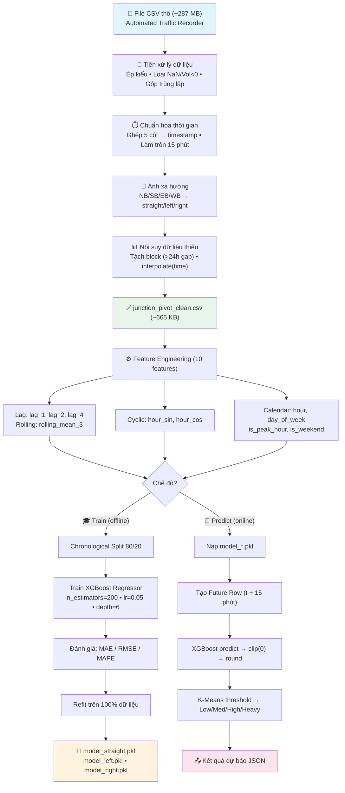
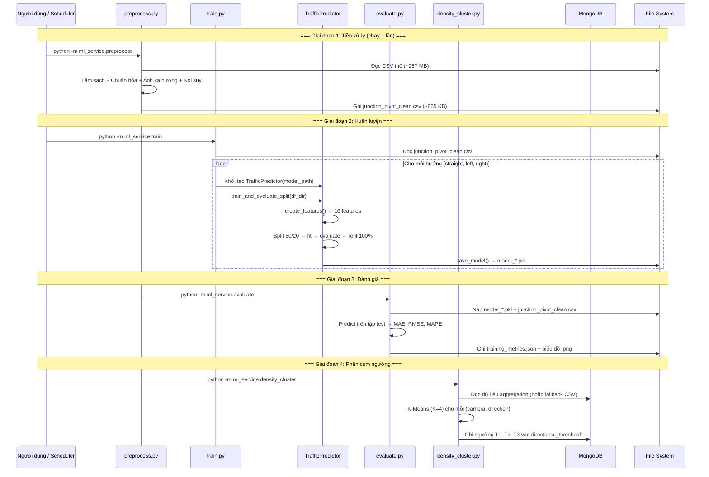

# CHƯƠNG 3: HỆ THỐNG DỰ BÁO LƯU LƯỢNG GIAO THÔNG DỰA TRÊN HỌC MÁY

## Dự Báo Mật Độ Phương Tiện Theo Hướng Di Chuyển Tại Nút Giao Đô Thị — Phân Tích Bài Toán, Phương Pháp Luận và Đánh Giá Thực Nghiệm

---

## Mục lục

1. [Đặt vấn đề nghiên cứu](#31-đặt-vấn-đề-nghiên-cứu)
2. [Phân tích dữ liệu đầu vào và các thách thức thực tiễn](#32-phân-tích-dữ-liệu-đầu-vào-và-các-thách-thức-thực-tiễn)
3. [Phương pháp tiền xử lý dữ liệu](#33-phương-pháp-tiền-xử-lý-dữ-liệu)
4. [Kỹ nghệ đặc trưng (Feature Engineering)](#34-kỹ-nghệ-đặc-trưng-feature-engineering)
5. [Lựa chọn mô hình dự báo](#35-lựa-chọn-mô-hình-dự-báo)
6. [Kiến trúc pipeline huấn luyện và dự báo](#36-kiến-trúc-pipeline-huấn-luyện-và-dự-báo)
7. [Chi tiết cài đặt trong thư mục ml_service](#37-chi-tiết-cài-đặt-trong-thư-mục-ml_service)
8. [Kết quả thực nghiệm và đánh giá](#38-kết-quả-thực-nghiệm-và-đánh-giá)
9. [Phân cụm ngưỡng mật độ giao thông](#39-phân-cụm-ngưỡng-mật-độ-giao-thông)
10. [Đầu ra của hệ thống ML Service](#310-đầu-ra-của-hệ-thống-ml-service)
11. [Đánh giá tổng thể và hướng phát triển](#311-đánh-giá-tổng-thể-và-hướng-phát-triển)

---

## 3.1. Đặt Vấn Đề Nghiên Cứu

### 3.1.1. Bối cảnh thực tiễn

Trong bối cảnh đô thị hóa ngày càng gia tăng, ùn tắc giao thông tại các nút giao trở thành vấn đề cấp bách ảnh hưởng trực tiếp đến chất lượng sống của người dân, hiệu suất kinh tế và mức độ ô nhiễm môi trường. Các hệ thống quản lý giao thông truyền thống chủ yếu hoạt động theo cơ chế **phản ứng (reactive)** — nghĩa là chỉ điều chỉnh khi ùn tắc đã xảy ra. Cách tiếp cận này có độ trễ lớn, bởi khi ùn tắc đã hình thành, chi phí giải tỏa cao hơn rất nhiều so với chi phí phòng ngừa.

Luận án này đặt ra yêu cầu xây dựng một hệ thống hoạt động theo cơ chế **dự đoán trước (proactive)**: dựa trên dữ liệu lưu lượng lịch sử, hệ thống cần trả lời câu hỏi trọng tâm:

> *"Trong 15 phút tới, sẽ có bao nhiêu phương tiện đi qua mỗi hướng (đi thẳng, rẽ trái, rẽ phải) tại một nút giao đô thị, và mức độ mật độ tương ứng là gì?"*

### 3.1.2. Phát biểu bài toán

Về mặt hình thức, đây là bài toán **hồi quy chuỗi thời gian (time-series regression)**. Cho trước chuỗi quan sát lưu lượng phương tiện $\{x_{t-k}, x_{t-k+1}, \ldots, x_{t}\}$ tại một hướng di chuyển cụ thể, cần dự đoán giá trị $\hat{x}_{t+1}$ — số phương tiện trong khung 15 phút tiếp theo. Bài toán được giải riêng biệt cho 3 hướng di chuyển: **đi thẳng** (*straight*), **rẽ trái** (*left*) và **rẽ phải** (*right*), dẫn đến việc xây dựng song song 3 mô hình dự báo độc lập.

Sau khi thu được giá trị dự báo liên tục $\hat{x}_{t+1}$, hệ thống cần **phân loại** mức mật độ thành 4 nhãn rời rạc: *Low* (Thấp), *Medium* (Trung bình), *High* (Cao), *Heavy* (Nghiêm trọng). Ngưỡng phân loại phải **tự thích ứng** theo đặc điểm hạ tầng riêng của từng nút giao, không thể dùng ngưỡng cố định chung cho mọi vị trí.

### 3.1.3. Phạm vi và giới hạn

Phạm vi của module ML Service trong luận án này bao gồm:
- Tiền xử lý dữ liệu thô từ hệ thống cảm biến (Automated Traffic Recorder)
- Trích xuất đặc trưng (Feature Engineering) cho bài toán chuỗi thời gian
- Huấn luyện và đánh giá mô hình hồi quy dự báo lưu lượng
- Phân cụm ngưỡng mật độ tự thích ứng theo nút giao
- Cung cấp kết quả dự báo thông qua API cho các thành phần khác của hệ thống

---

## 3.2. Phân Tích Dữ Liệu Đầu Vào và Các Thách Thức Thực Tiễn

### 3.2.1. Mô tả nguồn dữ liệu

Dữ liệu đầu vào là tập tin CSV thô có dung lượng khoảng **287 MB**, chứa các bản ghi lưu lượng giao thông được thu thập từ hệ thống đếm phương tiện tự động (Automated Traffic Recorder — ATR). Mỗi bản ghi bao gồm 8 trường thông tin quan trọng:

| Trường dữ liệu | Ý nghĩa | Kiểu dữ liệu gốc |
|----------------|---------|-------------------|
| `Yr`, `M`, `D`, `HH`, `MM` | 5 thành phần thời gian rời rạc | Số nguyên |
| `Vol` | Số lượng phương tiện đếm được | Chuỗi ký tự (chứa dấu phẩy phân cách hàng nghìn) |
| `SegmentID` | Mã định danh đoạn đường / nút giao | Số nguyên |
| `Direction` | Hướng di chuyển theo la bàn | Chuỗi ký tự (NB/SB/EB/WB) |

Hệ thống sử dụng dữ liệu từ 3 nút giao (SegmentID: 138, 72887, 83624) với đặc điểm hạ tầng khác nhau để huấn luyện mô hình có khả năng tổng quát hóa.

### 3.2.2. Các vấn đề chất lượng dữ liệu

Phân tích sơ bộ cho thấy dữ liệu thô mắc 6 vấn đề nghiêm trọng khiến nó **không thể sử dụng trực tiếp** cho bất kỳ thuật toán học máy nào:

| # | Vấn đề | Biểu hiện cụ thể | Hậu quả nếu không xử lý |
|---|--------|-------------------|--------------------------|
| 1 | Kiểu dữ liệu sai — cột `Vol` là chuỗi ký tự | `"1,250"` thay vì giá trị số `1250` | Mọi phép toán số học đều thất bại, mô hình không thể huấn luyện |
| 2 | Giá trị bất thường: âm và NaN | Cảm biến báo `-5` xe hoặc trả về ô trống | Mô hình học quy luật sai — có thể dự đoán ra số phương tiện âm |
| 3 | Thời gian phân mảnh và lệch nhịp | 5 cột rời rạc, phút ghi nhận không đều: 08:13, 08:17 | Không thể xây dựng chuỗi thời gian liên tục, lag features vô nghĩa |
| 4 | Trùng lặp logic do nhiều cảm biến | Cùng nút giao, cùng khung giờ, khác giá trị đo | Thổi phồng lưu lượng thực tế, gây sai lệch thống kê |
| 5 | Đứt gãy chuỗi thời gian | Mất tín hiệu nhiều ngày liên tiếp | `lag_1` (15 phút trước) thực chất phản ánh dữ liệu cách đó vài ngày |
| 6 | Hướng di chuyển mã hóa theo la bàn | NB tại nút giao A = "đi thẳng", tại nút giao B = "rẽ trái" | Mô hình bị gắn cứng vào cấu hình vật lý của một nút giao cụ thể, mất khả năng tổng quát hóa |

Các vấn đề trên cho thấy phần lớn công sức kỹ thuật của hệ thống ML không nằm ở việc chọn thuật toán dự báo, mà nằm ở giai đoạn **biến đổi dữ liệu thô thành đầu vào sạch và có cấu trúc**. Đây là đặc điểm phổ biến của các bài toán học máy ứng dụng trong thực tiễn, nơi 80% nỗ lực dành cho dữ liệu và chỉ 20% dành cho mô hình (Domingos, 2012).

---

## 3.3. Phương Pháp Tiền Xử Lý Dữ Liệu

Quá trình tiền xử lý không đơn thuần là loại bỏ dòng lỗi. Mỗi bước xử lý đều ẩn chứa một **quyết định thiết kế** (design decision) có ảnh hưởng trực tiếp đến chất lượng mô hình cuối cùng. Phần này trình bày chi tiết từng quyết định cùng lập luận khoa học đằng sau.

### 3.3.1. Chuẩn hóa kiểu dữ liệu và loại bỏ giá trị bất thường

**Vấn đề:** Cột `Vol` được lưu trữ dưới dạng chuỗi ký tự có chứa dấu phẩy phân cách hàng nghìn (ví dụ: `"1,250"`), đồng thời tồn tại các giá trị âm (nhiễu cảm biến) và giá trị thiếu (NaN).

**Giải pháp:** Pipeline thực hiện tuần tự 3 bước:
1. Loại bỏ ký tự phân cách `,` và ép kiểu sang số thực (`pd.to_numeric` với `errors='coerce'` để chuyển các giá trị không hợp lệ thành NaN)
2. Loại bỏ tất cả các dòng chứa NaN tại cột lưu lượng
3. Lọc bỏ các giá trị `Vol < 0` (nhiễu cảm biến)

**Lý do không dùng phương pháp imputation:** Đối với giá trị âm và NaN ở giai đoạn này, việc nội suy hoặc thay thế bằng giá trị trung bình sẽ dẫn đến sai lệch mang tính hệ thống, bởi chúng phản ánh lỗi phần cứng chứ không phải dữ liệu thiếu ngẫu nhiên (missing at random). Loại bỏ hoàn toàn là lựa chọn an toàn nhất trong trường hợp này.

### 3.3.2. Chuẩn hóa thời gian và lựa chọn khung thời gian 15 phút

**Vấn đề:** Thời gian được phân mảnh thành 5 cột riêng biệt (`Yr`, `M`, `D`, `HH`, `MM`) và phút ghi nhận không đồng đều (08:13, 08:17, ...), gây khó khăn trong việc xây dựng chuỗi thời gian liên tục.

**Giải pháp:** Ghép 5 cột thành một trường `timestamp` duy nhất kiểu `datetime`, sau đó làm tròn về **bin 15 phút chuẩn** (00, 15, 30, 45) bằng phương thức `dt.round('15min')`.

**Lý do chọn khung 15 phút:**

| Khung thời gian | Ưu điểm | Nhược điểm | Đánh giá |
|-----------------|---------|------------|----------|
| **1 phút** | Phản ứng cực nhanh | Nhiễu quá lớn — một xe bus đi chậm tạo đỉnh giả | ❌ Không phù hợp |
| **5 phút** | Chi tiết | Vẫn nhiễu; mỗi ngày tạo 288 dòng → bùng nổ chiều dữ liệu | ⚠️ Cân nhắc |
| **15 phút** | Cân bằng giữa chi tiết và ổn định thống kê; tương thích với chu kỳ đèn giao thông (~10 pha đèn/15 phút) | Không phản ứng kịp sự cố xảy ra trong 5 phút | ✅ **Được chọn** |
| **1 giờ** | Rất ổn định | Mất hoàn toàn khả năng phát hiện ùn tắc đột xuất (thường hình thành trong 15-20 phút) | ❌ Quá thô |

Khung 15 phút được xác định là **sweet spot** — đủ dài để triệt tiêu nhiễu ngắn hạn, đủ ngắn để phản ánh sự thay đổi mật độ trong giờ cao điểm. Lựa chọn này cũng phù hợp với các nghiên cứu giao thông đô thị quốc tế, nơi khung 15 phút là tiêu chuẩn phổ biến (TRB Highway Capacity Manual, 2022).

### 3.3.3. Xử lý trùng lặp logic bằng phép tổng hợp trung bình

**Vấn đề:** Tại cùng một nút giao và cùng một khung thời gian, có thể có nhiều cảm biến báo cáo giá trị khác nhau (ví dụ: cảm biến A đếm 78 xe, cảm biến B đếm 82 xe), tạo ra các dòng dữ liệu trùng lặp về mặt logic.

**Giải pháp:** Gộp các bản ghi trùng lặp theo bộ khóa `(SegmentID, Direction, timestamp)` và lấy **giá trị trung bình (`mean()`)**.

**Lý do chọn `mean()` thay vì `sum()` hay `max()`:**

| Phương pháp gộp | Kết quả | Phân tích |
|-----------------|---------|-----------|
| `sum()` | 78 + 82 = 160 xe | **Sai hoàn toàn** — hai cảm biến đếm cùng một luồng xe, không phải hai luồng riêng biệt |
| `max()` | max(78, 82) = 82 xe | Thiên vị hệ thống — luôn chọn giá trị lớn nhất, dẫn đến overestimate có hệ thống |
| **`mean()`** | (78 + 82) / 2 = 80 xe | **Ước lượng không chệch (unbiased)** — dựa trên Luật Số Lớn: trung bình cộng của nhiều phép đo độc lập cho cùng đại lượng sẽ hội tụ về giá trị thực |

Lựa chọn `mean()` là phương pháp tối ưu khi không có thông tin bổ sung về độ tin cậy tương đối của từng cảm biến (ví dụ: trọng số chuẩn hóa theo tuổi cảm biến hoặc tỷ lệ lỗi lịch sử).

### 3.3.4. Phân đoạn block liên tục và nội suy dữ liệu thiếu

**Vấn đề:** Chuỗi thời gian bị đứt gãy do cảm biến mất tín hiệu (đôi khi kéo dài nhiều ngày). Nếu áp dụng nội suy trực tiếp trên toàn bộ chuỗi, hệ thống sẽ vẽ đường thẳng từ thứ Hai sang thứ Năm — một phép nội suy hoàn toàn vô nghĩa vì giao thông các ngày trong tuần có quy luật riêng biệt.

**Giải pháp:**
1. **Phát hiện block tự động:** Tính khoảng cách thời gian giữa các mốc liên tiếp. Nếu khoảng cách > 24 giờ → đánh dấu điểm bắt đầu block mới (sử dụng `cumsum()` trên cờ nhị phân `diff > gap_threshold`)
2. **Nội suy trong phạm vi block:** Áp dụng `interpolate(method='time')` chỉ trong nội bộ từng block, kết hợp `ffill()` và `bfill()` cho các điểm biên
3. **Loại bỏ block quá ngắn:** Các block có ít hơn 12 dòng (< 3 giờ) bị loại bỏ vì không đủ dữ liệu để xây dựng đặc trưng lag có ý nghĩa thống kê

**Lý do chọn nội suy theo thời gian (`interpolate('time')`) thay vì các phương pháp khác:**

| Phương pháp | Hành vi | Vấn đề |
|-------------|---------|--------|
| `fillna(0)` | Điền tất cả chỗ trống bằng 0 | Tạo "hố sâu" giả — mô hình tưởng rằng không có phương tiện nào lưu thông |
| `fillna(mean)` | Điền bằng giá trị trung bình toàn cục | Xóa sạch quy luật giờ cao điểm/thấp điểm |
| **`interpolate('time')`** | Vẽ đường cong nối hai điểm dữ liệu thật liền kề, có trọng số theo khoảng cách thời gian | **Bảo tồn xu hướng tăng/giảm tự nhiên** của lưu lượng giao thông |

Ngưỡng 24 giờ cho việc phân block được lựa chọn dựa trên đặc điểm **chu kỳ ngày** (diurnal cycle) rõ rệt của giao thông đô thị. Nếu mất dữ liệu quá 1 ngày, không có cơ sở thống kê để suy luận lưu lượng trong khoảng trống đó.

### 3.3.5. Ánh xạ hướng la bàn sang hướng giao thông chuẩn hóa

**Vấn đề:** Dữ liệu gốc mã hóa hướng di chuyển theo la bàn (NB — North Bound, SB — South Bound, EB — East Bound, WB — West Bound). Cùng ký hiệu "NB" tại hai nút giao khác nhau có thể mang ý nghĩa hoàn toàn khác: "đi thẳng" tại nút giao A nhưng "rẽ trái" tại nút giao B, tùy thuộc vào hướng đặt của con đường.

**Giải pháp:** Định nghĩa bảng ánh xạ (*mapping table*) riêng cho từng SegmentID, chuyển đổi tất cả về 3 hướng chuẩn hóa thống nhất: `vol_straight`, `vol_left`, `vol_right`.

```
SegmentID 138:   NB → vol_straight | WB → vol_left   | EB → vol_right
SegmentID 72887: EB → vol_straight | WB → vol_left   | (không có rẽ phải)
SegmentID 83624: NB → vol_straight | SB → vol_left   | (không có rẽ phải)
```

**Ý nghĩa đối với khả năng tổng quát hóa:** Nhờ bước ánh xạ này, mô hình học được quy luật tổng quát như *"lưu lượng đi thẳng luôn cao hơn lưu lượng rẽ vào giờ cao điểm"* — bất kể nút giao đó hướng về đâu trên bản đồ. Nếu bỏ qua bước này và huấn luyện trực tiếp trên nhãn NB/SB/EB/WB, mô hình sẽ ghi nhớ cấu hình vật lý cụ thể thay vì học quy luật giao thông, dẫn đến hiệu năng kém khi triển khai tại nút giao mới.

### 3.3.6. Kết quả tiền xử lý

Sau khi hoàn tất pipeline tiền xử lý, dữ liệu thô (~287 MB) được chuyển đổi thành tệp `junction_pivot_clean.csv` (~665 KB) với cấu trúc chuẩn hóa gồm 5 cột: `timestamp`, `segment_id`, `vol_straight`, `vol_left`, `vol_right`. Tệp này là đầu vào duy nhất cho giai đoạn Feature Engineering và huấn luyện mô hình.

---

## 3.4. Kỹ Nghệ Đặc Trưng (Feature Engineering)

### 3.4.1. Vai trò của Feature Engineering trong bài toán này

Sau khi dữ liệu đã sạch, câu hỏi tiếp theo là: **mô hình "nhìn thấy" gì từ dữ liệu?** Nếu chỉ cung cấp giá trị lưu lượng thô theo thời gian, mô hình không có đủ thông tin ngữ cảnh để đưa ra dự đoán chính xác. Kỹ nghệ đặc trưng (Feature Engineering) chính là quá trình **chuyển hóa** dữ liệu thô thành các tín hiệu có ý nghĩa mà thuật toán có thể khai thác hiệu quả.

Hệ thống sử dụng **10 đặc trưng đầu vào**, được thiết kế có chủ đích và chia thành 3 nhóm chức năng. Mỗi nhóm giải quyết một vấn đề cụ thể trong bài toán dự báo giao thông.

### 3.4.2. Nhóm 1: Đặc trưng thời gian (Temporal Features) — "Bây giờ là khi nào?"

| Đặc trưng | Miền giá trị | Vai trò |
|-----------|-------------|---------|
| `hour` | 0–23 | Phân biệt giao thông ban ngày vs. ban đêm |
| `day_of_week` | 0–6 (Thứ Hai → Chủ Nhật) | Phân biệt ngày làm việc vs. cuối tuần |
| `is_peak_hour` | {0, 1} | Cờ nhị phân đánh dấu giờ cao điểm (7h–9h, 17h–19h) |
| `is_weekend` | {0, 1} | Cờ nhị phân đánh dấu Thứ Bảy, Chủ Nhật |

**Giải thích tại sao cần `is_peak_hour` và `is_weekend` khi đã có `hour` và `day_of_week`:**

Thoạt nhìn, hai cờ nhị phân này có vẻ thừa vì thông tin đã chứa trong `hour` và `day_of_week`. Tuy nhiên, chúng đóng vai trò quan trọng đối với thuật toán XGBoost: thay vì phải xây dựng nhiều lần phân nhánh (splits) để "phát hiện" rằng giờ 7–9 có đặc điểm khác biệt, mô hình có ngay **một tín hiệu rõ ràng** để chia nhánh ngay tại gốc cây. Điều này giúp cây quyết định nông hơn, giảm phương sai (variance), và hạn chế hiện tượng overfitting.

### 3.4.3. Nhóm 2: Đặc trưng mã hóa chu kỳ (Cyclical Encoding) — "23h và 0h nằm cạnh nhau"

| Đặc trưng | Công thức |
|-----------|-----------|
| `hour_sin` | $\sin(2\pi \times \text{hour} / 24)$ |
| `hour_cos` | $\cos(2\pi \times \text{hour} / 24)$ |

**Vấn đề cần giải quyết:** Biến `hour` (0–23) là biến dạng thứ tự (ordinal), nhưng bản chất thời gian là **tuần hoàn** (cyclical). Nếu sử dụng `hour` trực tiếp, mô hình coi 23h và 0h cách nhau 23 đơn vị — rất xa. Nhưng trong thực tế, 23:45 và 00:00 chỉ cách nhau 15 phút và có lưu lượng tương tự.

**Nguyên lý giải pháp:** Chiếu giá trị giờ lên **vòng tròn đơn vị** (unit circle) bằng cặp hàm sin–cos. Trên vòng tròn, 23h và 0h nằm liền kề nhau. Cần sử dụng **cả hai** hàm vì chỉ dùng một hàm sẽ gây nhập nhằng: $\sin(6\text{h}) = \sin(18\text{h}) = 0$, nhưng $\cos(6\text{h}) \neq \cos(18\text{h})$.

Mặc dù XGBoost (cây quyết định) có thể tạo các "bin" rời rạc và lý thuyết không bắt buộc phải có mã hóa lượng giác, kỹ thuật này vẫn giúp **giảm số lần phân nhánh** cần thiết để nắm bắt tính tuần hoàn, từ đó cải thiện hiệu quả huấn luyện.

### 3.4.4. Nhóm 3: Đặc trưng quá khứ (Lag Features) — "Gần đây đường đông hay vắng?"

| Đặc trưng | Ý nghĩa | Vai trò |
|-----------|---------|---------|
| `lag_1` | Lưu lượng 15 phút trước ($x_{t-1}$) | **Predictor mạnh nhất** — phương tiện không biến mất, chúng tiếp tục lưu thông |
| `lag_2` | Lưu lượng 30 phút trước ($x_{t-2}$) | Bối cảnh ngắn hạn, bổ sung thông tin xu hướng |
| `lag_4` | Lưu lượng 1 giờ trước ($x_{t-4}$) | Bối cảnh trung hạn — phát hiện xu hướng tổng thể |
| `rolling_mean_3` | Trung bình trượt 3 khung gần nhất | Bộ lọc nhiễu (low-pass filter) — nắm bắt xu hướng đang tăng hay giảm |

**Đây là nhóm đặc trưng quan trọng nhất** của toàn bộ hệ thống. Lý do: lưu lượng giao thông có tính **tự tương quan (autocorrelation)** rất mạnh — giá trị hiện tại phụ thuộc rất lớn vào các giá trị gần nhất trong quá khứ. Riêng `lag_1` đã giải thích phần lớn biến thiên (variance) của biến mục tiêu.

**Biện pháp phòng tránh rò rỉ dữ liệu (Data Leakage):**

Đây là nguy cơ nghiêm trọng nhất trong bài toán chuỗi thời gian, nếu xảy ra sẽ dẫn đến kết quả đánh giá cao giả tạo nhưng hiệu năng triển khai thực tế cực kém:

1. **Rolling mean phải shift trước:** Công thức tính là `shift(1).rolling(3).mean()` — dịch chuyển 1 bước trước khi tính trung bình trượt. Nếu không shift, trung bình trượt sẽ bao gồm giá trị tại thời điểm $t$ (chính là giá trị cần dự đoán), khiến mô hình "nhìn trước" kết quả.

2. **Lag tính theo nhóm (`groupby('segment_id')`):** Khi tập dữ liệu chứa nhiều nút giao, phép `shift(1)` phải được áp dụng **trong phạm vi từng nút giao**. Nếu không, dữ liệu của nút giao A có thể bị dùng để tính lag cho nút giao B — tạo ra đặc trưng vô nghĩa.

### 3.4.5. Tổng kết vector đặc trưng

Sau quá trình Feature Engineering, mỗi mẫu dữ liệu được biểu diễn dưới dạng **vector 10 chiều dạng bảng (tabular)**:

$$\mathbf{x} = [\text{hour}, \text{day\_of\_week}, \text{is\_peak\_hour}, \text{is\_weekend}, \text{lag\_1}, \text{lag\_2}, \text{lag\_4}, \text{rolling\_mean\_3}, \text{hour\_sin}, \text{hour\_cos}]$$

Tổng dữ liệu sau Feature Engineering khoảng **3.000–10.000 dòng** cho mỗi hướng di chuyển. Đây là quy mô **rất nhỏ** so với yêu cầu của các phương pháp Deep Learning.

---

## 3.5. Lựa Chọn Mô Hình Dự Báo

### 3.5.1. Đặc điểm bài toán ảnh hưởng đến lựa chọn mô hình

Bài toán sau Feature Engineering có 3 đặc điểm chi phối việc lựa chọn thuật toán:

1. **Dữ liệu dạng bảng (tabular data):** Mỗi mẫu là một vector 10 chiều, không phải ảnh, văn bản hay chuỗi tuần tự
2. **Quy mô nhỏ:** Chỉ vài nghìn mẫu cho mỗi hướng di chuyển
3. **Quan hệ phi tuyến mạnh:** Tương tác giữa giờ cao điểm và ngày cuối tuần hoàn toàn khác so với ngày thường; chuyển giao giữa giờ cao điểm và thấp điểm có dạng hàm bước, không phải đường thẳng

### 3.5.2. So sánh các ứng viên mô hình

| Tiêu chí | XGBoost | Linear Regression | LSTM (Deep Learning) | ARIMA |
|----------|---------|-------------------|----------------------|-------|
| Khả năng học phi tuyến | ✅ Xuất sắc | ❌ Chỉ tuyến tính | ✅ Xuất sắc | ❌ Tuyến tính |
| Hiệu quả trên dữ liệu nhỏ (<10K dòng) | ✅ Rất tốt | ✅ Tốt | ❌ Cần >100K mẫu | ✅ Tốt |
| Tốc độ huấn luyện | ✅ <2 giây | ✅ <1 giây | ❌ Phút đến giờ | ✅ Vài giây |
| Kích thước mô hình lưu trữ | ✅ ~400KB (.pkl) | ✅ ~10KB | ❌ Hàng chục MB | ✅ ~50KB |
| Tự động học Feature Interaction | ✅ Có | ❌ Cần thêm polynomial features | ✅ Có | ❌ Không |
| Bền vững trước đa cộng tuyến | ✅ Không ảnh hưởng | ❌ Rất nhạy cảm | ✅ Ít ảnh hưởng | — |
| Khả năng diễn giải (Interpretability) | ✅ Feature importance | ✅ Hệ số hồi quy | ❌ Hộp đen | ⚠️ Trung bình |
| Phù hợp triển khai nhẹ trên backend | ✅ Inference <10ms | ✅ Rất nhanh | ❌ Cần GPU hoặc chậm trên CPU | ⚠️ Phức tạp |

### 3.5.3. Lập luận chọn XGBoost — 3 lý do chính

**Lý do 1: Hiệu quả cao trên dữ liệu bảng quy mô nhỏ**

XGBoost (eXtreme Gradient Boosting) là thuật toán ensemble dựa trên gradient boosting, đã được chứng minh qua nhiều cuộc thi Kaggle và nghiên cứu học thuật là **thuật toán tối ưu cho dữ liệu dạng bảng** (Chen & Guestrin, 2016). Với chỉ vài nghìn mẫu huấn luyện, XGBoost vẫn đạt hiệu năng cao nhờ cơ chế regularization tích hợp (`L1/L2 penalty`, `max_depth`, `subsample`), trong khi LSTM — dù mạnh về lý thuyết với chuỗi thời gian — rất dễ overfitting trên tập dữ liệu nhỏ và thời gian huấn luyện chậm hơn hàng trăm lần.

Hệ thống sử dụng cấu hình siêu tham số:
- `n_estimators = 200`: Số lượng cây vừa đủ để hội tụ mà không quá phức tạp
- `learning_rate = 0.05`: Tốc độ học thấp, kết hợp với nhiều cây, giúp mô hình ổn định hơn
- `max_depth = 6`: Giới hạn độ sâu cây để tránh overfitting
- `subsample = 0.8`, `colsample_bytree = 0.8`: Lấy mẫu ngẫu nhiên 80% dữ liệu và 80% đặc trưng cho mỗi cây — giảm phương sai

**Lý do 2: Tự động học tương tác chéo giữa đặc trưng (Feature Interaction)**

Giao thông đô thị chứa rất nhiều tương tác phức tạp giữa các yếu tố. Ví dụ: "giờ cao điểm + cuối tuần" có hành vi khác hoàn toàn so với "giờ cao điểm + ngày thường" (trung tâm thương mại đông vào cuối tuần, khu văn phòng vắng). XGBoost tự động phát hiện và khai thác các tương tác này nhờ cấu trúc **cây phân nhánh tuần tự** — mỗi nhánh con có thể học một quy luật riêng biệt.

Để đạt được khả năng tương đương với Linear Regression, nhà phát triển phải **tự tay tạo** tất cả các tổ hợp tích chéo (polynomial features), dẫn đến bùng nổ chiều dữ liệu và khó bảo trì.

**Lý do 3: Bền vững trước hiện tượng đa cộng tuyến (Multicollinearity)**

Các đặc trưng lag (`lag_1`, `lag_2`, `lag_4`) có **tương quan nội tại cực mạnh** — lưu lượng 15 phút trước và 30 phút trước thường rất giống nhau. Linear Regression cực kỳ nhạy cảm với hiện tượng đa cộng tuyến: các hệ số hồi quy bị dao động mạnh, không ổn định, dẫn đến dự đoán thiếu tin cậy.

XGBoost, nhờ cơ chế **chọn ngẫu nhiên đặc trưng** (`colsample_bytree = 0.8`) cho mỗi cây và bản chất phi tham số (non-parametric) của cây quyết định, **hoàn toàn không bị ảnh hưởng** bởi đa cộng tuyến.

### 3.5.4. Điểm yếu cố hữu của XGBoost và cách bù đắp

XGBoost có 2 điểm yếu khi áp dụng cho bài toán chuỗi thời gian, và cả hai đều được **bù đắp thông qua Feature Engineering**:

| Điểm yếu | Bản chất | Cách bù đắp |
|-----------|---------|-------------|
| **Không có bộ nhớ chuỗi (no sequential memory)** | XGBoost xử lý mỗi dòng dữ liệu độc lập — không biết "dòng trước đó" là gì. Khác với LSTM có cơ chế hidden state. | Đưa trực tiếp quá khứ vào làm đặc trưng: `lag_1`, `lag_2`, `lag_4` cung cấp thông tin lịch sử; `rolling_mean_3` cung cấp xu hướng → **biến bài toán chuỗi thời gian thành bài toán hồi quy bảng.** |
| **Không thể ngoại suy (no extrapolation)** | Cây quyết định chỉ dự đoán giá trị trong khoảng đã gặp khi huấn luyện. Nếu lưu lượng thực tế vượt mọi kỷ lục lịch sử, dự đoán bị "bão hòa". | Sử dụng đặc trưng **tương đối** (`rolling_mean_3`, `hour_sin`, `hour_cos`) thay vì chỉ phụ thuộc vào giá trị tuyệt đối → mô hình dự đoán dựa trên mối quan hệ giữa quá khứ gần và ngữ cảnh thời gian. |

**Nhận xét:** Feature Engineering đóng vai trò **bù đắp điểm yếu kiến trúc** của XGBoost. Nếu không có lag features và mã hóa chu kỳ, XGBoost sẽ không vượt trội hơn Linear Regression nhiều. Chính sự kết hợp giữa Feature Engineering tinh tế và sức mạnh phi tuyến của XGBoost tạo nên hiệu năng vượt trội, đồng thời giữ lại ưu điểm về tốc độ và khả năng triển khai nhẹ.

---

## 3.6. Kiến Trúc Pipeline Huấn Luyện và Dự Báo

### 3.6.1. Tổng quan luồng dữ liệu

Sơ đồ dưới đây thể hiện toàn bộ luồng dữ liệu từ tệp CSV thô đến kết quả dự báo, bao gồm 2 chế độ hoạt động: **huấn luyện offline** và **dự báo thời gian thực (online)**.



### 3.6.2. Chế độ huấn luyện (Offline Training)

Quá trình huấn luyện diễn ra offline và bao gồm các bước:

1. **Chia dữ liệu theo thời gian (Chronological Split 80/20):** 80% dữ liệu đầu (theo trục thời gian) dùng để huấn luyện, 20% cuối dùng để đánh giá. Phương pháp này tôn trọng tính nhân quả — mô hình không bao giờ được "nhìn thấy" dữ liệu tương lai trong quá trình huấn luyện.

2. **Cross-Validation trên tập Train:** Áp dụng `TimeSeriesSplit` (5 folds) trên tập train để ước lượng phương sai của mô hình. Đây là kỹ thuật cross-validation chuyên dụng cho chuỗi thời gian — khác với k-fold thông thường vốn phá vỡ thứ tự thời gian.

3. **Đánh giá trên tập Hold-out Test:** Đo các chỉ số MAE, RMSE, MAPE trên 20% dữ liệu cuối — dữ liệu mà mô hình chưa bao giờ tiếp xúc.

4. **Refit toàn bộ dữ liệu:** Sau khi xác nhận hiệu năng đạt yêu cầu, mô hình được huấn luyện lại trên 100% dữ liệu để tận dụng tối đa thông tin trước khi triển khai.

5. **Lưu mô hình:** Xuất 3 file `.pkl` (model_straight.pkl, model_left.pkl, model_right.pkl) bằng `joblib.dump()`.

### 3.6.3. Chế độ dự báo thời gian thực (Online Prediction)

Khi nhận yêu cầu dự báo từ API:

1. **Nạp mô hình** từ file `.pkl` tương ứng
2. **Lấy 5 quan trắc lịch sử gần nhất** từ cơ sở dữ liệu
3. **Tạo "Future Row"** — dòng dữ liệu giả đại diện cho khung thời gian $t+15$ phút, với `vehicle_count = 0` (giá trị placeholder, sẽ được ghi đè bởi dự đoán)
4. **Feature Engineering** trên toàn bộ dữ liệu (lịch sử + future row) để tạo lag features chính xác
5. **Dự đoán** bằng `model.predict()` trên dòng cuối cùng → `clip(0)` → làm tròn thành số nguyên
6. **Phân loại mật độ** bằng ngưỡng từ K-Means (hoặc ngưỡng cứng fallback)

**Cơ chế fallback 4 tầng** đảm bảo hệ thống luôn trả về kết quả:
- Tầng 1: Dự báo bằng mô hình XGBoost (nếu đủ ≥ 5 quan trắc)
- Tầng 2: Trung bình 3 quan trắc gần nhất (nếu có 3–4 quan trắc)
- Tầng 3: Giá trị mặc định dựa trên khung giờ hiện tại
- Tầng 4: Báo lỗi rõ ràng cho client

---

## 3.7. Chi Tiết Cài Đặt Trong Thư Mục `ml_service`

Phần này trình bày chi tiết cách cài đặt (implementation) từng thành phần trong thư mục `ml_service/`, bao gồm cấu trúc mã nguồn, vai trò của từng file, và cách chúng phối hợp để giải quyết bài toán dự báo lưu lượng giao thông.

### 3.7.1. Cấu trúc thư mục và vai trò từng file

```
ml_service/
├── data/                              # Dữ liệu đầu vào và đầu ra
│   ├── Automated_Traffic_Volume_Counts_20260521.csv   # Dữ liệu thô (~287 MB)
│   ├── junction_pivot_clean.csv       # Dữ liệu sạch sau tiền xử lý (~665 KB)
│   ├── training_metrics.json          # Chỉ số đánh giá 3 mô hình
│   └── plot_actual_vs_predicted_*.png  # Biểu đồ so sánh Actual vs Predicted
├── model/                             # Trọng số mô hình đã huấn luyện
│   ├── model_straight.pkl             # Mô hình hướng đi thẳng (~838 KB)
│   ├── model_left.pkl                 # Mô hình hướng rẽ trái (~856 KB)
│   └── model_right.pkl                # Mô hình hướng rẽ phải (~854 KB)
├── preprocess.py                      # Pipeline tiền xử lý dữ liệu thô
├── traffic_predictor.py               # Lớp TrafficPredictor — core ML engine
├── train.py                           # Script điều phối huấn luyện 3 mô hình
├── evaluate.py                        # Đánh giá mô hình và xuất biểu đồ
├── density_cluster.py                 # Phân cụm K-Means ngưỡng mật độ
└── helpers/
    └── predict.py                     # Script gọi API dự báo (client helper)
```

Các file được thiết kế theo nguyên tắc **tách biệt trách nhiệm (Separation of Concerns)**: mỗi file đảm nhận đúng một giai đoạn trong pipeline ML, có thể chạy độc lập hoặc được gọi bởi các thành phần khác.

### 3.7.2. File `preprocess.py` — Pipeline tiền xử lý dữ liệu

**Vai trò:** Chuyển đổi file CSV thô (~287 MB) thành file dữ liệu sạch `junction_pivot_clean.csv` (~665 KB). Đây là bước đầu tiên trong toàn bộ pipeline và chỉ cần chạy **một lần** (hoặc khi có dữ liệu mới).

**Luồng xử lý chính:**

```python
# Bước 1: Đọc chỉ các cột cần thiết (tiết kiệm RAM)
cols_to_use = ['Yr', 'M', 'D', 'HH', 'MM', 'Vol', 'SegmentID', 'Direction']
df = pd.read_csv(raw_csv, usecols=cols_to_use)

# Bước 2: Chuẩn hóa cột Vol — loại bỏ dấu phẩy, ép kiểu, lọc giá trị âm
df['Vol_clean'] = df['Vol'].astype(str).str.replace(',', '')
df['Vol_clean'] = pd.to_numeric(df['Vol_clean'], errors='coerce')
df = df.dropna(subset=['Vol_clean'])
df = df[df['Vol_clean'] >= 0]

# Bước 3: Ghép 5 cột thời gian → timestamp duy nhất, làm tròn 15 phút
df['timestamp'] = pd.to_datetime(datetime_str, errors='coerce')
df['timestamp'] = df['timestamp'].dt.round('15min')

# Bước 4: Gộp trùng lặp bằng mean() theo nhóm (SegmentID, Direction, timestamp)
df_clean = df.groupby(['SegmentID', 'Direction', 'timestamp'])['Vol_clean'].mean()
```

**Cách xử lý đa nút giao:** File sử dụng dictionary `segments_config` để định nghĩa bảng ánh xạ hướng cho từng SegmentID:

```python
segments_config = {
    138:   {'mapping': {'NB': 'vol_straight', 'WB': 'vol_left', 'EB': 'vol_right'}},
    72887: {'mapping': {'EB': 'vol_straight', 'WB': 'vol_left'}},
    83624: {'mapping': {'NB': 'vol_straight', 'SB': 'vol_left'}},
}
```

**Cách xử lý đứt gãy chuỗi thời gian:** Với mỗi Segment, pipeline tự động phát hiện các block liên tục bằng cách tính khoảng cách giữa các mốc thời gian liên tiếp:

```python
# Nếu khoảng cách > 24h → đánh dấu block mới
gap_threshold = pd.Timedelta(hours=24)
block_idx = (diffs > gap_threshold).cumsum()

# Nội suy chỉ trong phạm vi từng block
p_pivot_res = p_pivot[['vol_straight', 'vol_left', 'vol_right']].resample('15min').asfreq()
p_pivot_res = p_pivot_res.interpolate(method='time').ffill().bfill()

# Loại bỏ block quá ngắn (< 3 giờ = 12 dòng)
if len(p_pivot_res) >= 12:
    chunks.append(p_pivot_res.reset_index())
```

**Đầu ra:** File `junction_pivot_clean.csv` với 5 cột: `timestamp`, `segment_id`, `vol_straight`, `vol_left`, `vol_right`.

---

### 3.7.3. File `traffic_predictor.py` — Lớp `TrafficPredictor` (Core ML Engine)

**Vai trò:** Đây là file trung tâm của toàn bộ ML Service. Lớp `TrafficPredictor` đóng gói toàn bộ logic Feature Engineering, huấn luyện, đánh giá và dự báo vào một đối tượng duy nhất, có thể tái sử dụng cho cả 3 hướng di chuyển.

**Cấu trúc lớp:**

```python
class TrafficPredictor:
    def __init__(self, model_path='model.pkl'):
        self.model = xgb.XGBRegressor(
            n_estimators=200, learning_rate=0.05, max_depth=6,
            subsample=0.8, colsample_bytree=0.8,
            objective='reg:squarederror', random_state=42,
        )
        self.features = [
            'hour', 'day_of_week', 'is_peak_hour', 'is_weekend',
            'lag_1', 'lag_2', 'lag_4', 'rolling_mean_3',
            'hour_sin', 'hour_cos'
        ]
```

#### Phương thức `create_features()` — Trích xuất 10 đặc trưng

Đây là phương thức quan trọng nhất, chuyển đổi DataFrame thô thành ma trận đặc trưng. Phương thức xử lý 3 nhóm đặc trưng tuần tự:

```python
def create_features(self, df: pd.DataFrame) -> pd.DataFrame:
    # (1) Temporal features
    data['hour'] = data['timestamp'].dt.hour
    data['day_of_week'] = data['timestamp'].dt.dayofweek
    data['is_peak_hour'] = data['hour'].apply(
        lambda x: 1 if (7 <= x <= 9) or (17 <= x <= 19) else 0
    )
    data['is_weekend'] = (data['day_of_week'] >= 5).astype(int)

    # (2) Cyclical encoding
    data['hour_sin'] = np.sin(2 * np.pi * data['hour'] / 24)
    data['hour_cos'] = np.cos(2 * np.pi * data['hour'] / 24)

    # (3) Lag features — CÓ XỬ LÝ GROUPED khi có nhiều segment
    if 'segment_id' in data.columns:
        data['lag_1'] = data.groupby('segment_id')['vehicle_count'].shift(1)
        data['rolling_mean_3'] = data.groupby('segment_id')['vehicle_count'].transform(
            lambda x: x.shift(1).rolling(window=3).mean()
        )
    else:
        data['lag_1'] = data['vehicle_count'].shift(1)
        data['rolling_mean_3'] = data['vehicle_count'].shift(1).rolling(window=3).mean()

    data = data.dropna()  # Loại bỏ các dòng đầu không đủ lag
    return data
```

**Điểm thiết kế quan trọng:**
- Kiểm tra tồn tại cột `segment_id` để quyết định tính lag **theo nhóm** hay toàn cục — đảm bảo dữ liệu của nút giao A không bị "rò rỉ" sang nút giao B
- `shift(1)` được gọi **trước** `rolling(3).mean()` trong `rolling_mean_3` — phòng tránh data leakage
- `dropna()` ở cuối loại bỏ 4 dòng đầu tiên (vì `lag_4` cần 4 quan sát trước đó)

#### Phương thức `train_and_evaluate_split()` — Huấn luyện và đánh giá

Phương thức này thực hiện quy trình **huấn luyện → đánh giá → refit** theo chuẩn khoa học:

```python
def train_and_evaluate_split(self, df: pd.DataFrame) -> dict:
    data = self.create_features(df)

    # Chia 80/20 theo thời gian (chronological — KHÔNG shuffle)
    split_idx = int(len(data) * 0.8)
    X_train, X_test = X.iloc[:split_idx], X.iloc[split_idx:]
    y_train, y_test = y.iloc[:split_idx], y.iloc[split_idx:]

    # Huấn luyện trên 80% đầu
    self.model.fit(X_train, y_train)
    y_pred = self.model.predict(X_test)
    y_pred = np.clip(y_pred, 0, None)  # Cắt giá trị âm về 0

    # Tính metrics: MAE, RMSE, MAPE
    mae = mean_absolute_error(y_test, y_pred)
    rmse = np.sqrt(mean_squared_error(y_test, y_pred))
    # MAPE chỉ tính trên y_test > 0 để tránh chia cho 0
    mask = y_test_arr > 0
    mape = np.mean(np.abs((y_test_arr[mask] - y_pred[mask]) / y_test_arr[mask])) * 100

    # Fit lại toàn bộ 100% dữ liệu để triển khai
    self.model.fit(X, y)
    return {"mae": mae, "rmse": rmse, "mape": mape}
```

#### Phương thức `predict()` — Dự báo thời gian thực

Đây là phương thức được gọi khi hệ thống nhận request dự báo từ API:

```python
def predict(self, raw_data_df: pd.DataFrame) -> int:
    # Kiểm tra và nạp mô hình nếu chưa sẵn sàng
    if not self.is_trained:
        if not self.load_model():
            raise Exception("Mô hình chưa sẵn sàng.")

    # Yêu cầu tối thiểu 5 quan trắc lịch sử
    if len(df) < 5:
        if len(df) >= 3:
            return max(0, int(round(df['vehicle_count'].mean())))  # Fallback
        else:
            raise ValueError("Cần ít nhất 3 quan trắc lịch sử.")

    # Tạo dòng "tương lai" — đại diện cho t + 15 phút
    last_time = pd.to_datetime(df['timestamp'].iloc[-1])
    next_time = last_time + pd.Timedelta(minutes=15)
    future_row = pd.DataFrame([{'timestamp': next_time, 'vehicle_count': 0}])

    # Ghép lịch sử + future row → Feature Engineering → lấy dòng cuối
    temp_df = pd.concat([df, future_row], ignore_index=True)
    processed = self.create_features(temp_df)
    target_features = processed.tail(1)[self.features]

    # Dự đoán và hậu xử lý
    predicted = self.model.predict(target_features)[0]
    return max(0, int(round(predicted)))  # clip(0) + round
```

**Cơ chế "Future Row":** Đây là kỹ thuật then chốt trong dự báo online. Vì `create_features()` cần giá trị `vehicle_count` để tính lag, nhưng tại thời điểm $t+15$ chưa có giá trị thực, nên tạo một dòng giả với `vehicle_count = 0`. Giá trị 0 này **không ảnh hưởng** đến kết quả dự đoán vì:
- `lag_1` của dòng cuối chính là `vehicle_count` thực tại thời điểm $t$ (dòng áp cuối)
- `lag_2` là giá trị thực tại $t-1$, `lag_4` là giá trị thực tại $t-3$
- Chỉ có `vehicle_count` của dòng cuối = 0, nhưng cột này không nằm trong danh sách `self.features` → mô hình không bao giờ "nhìn thấy" giá trị 0 giả này

#### Hàm phân loại mật độ mặc định `classify_congestion()`

Khi không có ngưỡng K-Means từ database, hệ thống sử dụng ngưỡng cứng fallback:

```python
def classify_congestion(vehicle_count: int) -> str:
    if vehicle_count < 30:   return "LOW"
    if vehicle_count < 100:  return "MEDIUM"
    if vehicle_count < 200:  return "HIGH"
    return "SEVERE"
```

Các ngưỡng 30/100/200 được hiệu chỉnh theo đặc điểm dữ liệu đô thị NYC (trung bình 50–100 xe/15 phút).

---

### 3.7.4. File `train.py` — Điều phối huấn luyện 3 mô hình

**Vai trò:** Đọc file dữ liệu sạch `junction_pivot_clean.csv`, tách thành 3 tập con theo hướng di chuyển, khởi tạo 3 instance `TrafficPredictor` riêng biệt và gọi huấn luyện tuần tự.

**Luồng xử lý:**

```python
# Cấu hình 3 mô hình
models_config = {
    'straight': {'col': 'vol_straight', 'file': 'model_straight.pkl'},
    'left':     {'col': 'vol_left',     'file': 'model_left.pkl'},
    'right':    {'col': 'vol_right',    'file': 'model_right.pkl'},
}

for direction, config in models_config.items():
    # 1. Lọc dữ liệu theo hướng — bỏ các dòng NaN
    #    (ví dụ: vol_right trống ở Segment 72887 vì nút giao đó không có rẽ phải)
    df_dir = df_merged[['timestamp', 'segment_id', col]].dropna().copy()
    df_dir = df_dir.rename(columns={col: 'vehicle_count'})

    # 2. Sắp xếp theo thời gian — bắt buộc cho chronological split
    df_dir = df_dir.sort_values('timestamp').reset_index(drop=True)

    # 3. Khởi tạo predictor riêng cho mỗi hướng
    predictor = TrafficPredictor(model_path=model_path)
    metrics = predictor.train_and_evaluate_split(df_dir)

    # 4. Lưu mô hình
    predictor.save_model()  # → joblib.dump() → model_*.pkl
```

**Điểm thiết kế quan trọng:**
- **Đổi tên cột:** Cột mục tiêu (ví dụ: `vol_straight`) được đổi thành `vehicle_count` để tương thích với interface của `TrafficPredictor` — giúp class predictor không cần biết đang xử lý hướng nào
- **Xử lý NaN tự nhiên:** Các nút giao chỉ có 2 hướng (ví dụ: Segment 72887 không có `vol_right`) sẽ tạo ra NaN. Phép `dropna()` loại bỏ các dòng này, đảm bảo mỗi mô hình chỉ học từ dữ liệu thực có
- **Cột `segment_id` được giữ lại:** Nhờ đó `create_features()` tự động kích hoạt chế độ grouped lag — tính lag riêng cho từng nút giao

**Đầu ra:** 3 file `.pkl` trong thư mục `model/` và bảng metrics in ra console.

---

### 3.7.5. File `evaluate.py` — Đánh giá mô hình và trực quan hóa

**Vai trò:** Nạp các mô hình đã huấn luyện, chạy dự đoán trên tập test (dữ liệu từ 01/01/2025 trở đi), tính chỉ số đánh giá và xuất biểu đồ so sánh Actual vs Predicted.

**Luồng xử lý:**

```python
for direction, config in models_config.items():
    # 1. Nạp mô hình đã huấn luyện
    predictor = TrafficPredictor(model_path=model_path)
    predictor.load_model()

    # 2. Tạo features TRƯỚC khi cắt tập test
    #    → đảm bảo lag features ở biên tập test không bị mất
    processed_data = predictor.create_features(df_dir)

    # 3. Lọc tập test từ mốc thời gian 2025-01-01
    test_data = processed_data[processed_data['timestamp'] >= '2025-01-01']

    # 4. Dự đoán và hậu xử lý giống hệt predict() wrapper
    y_pred = predictor.model.predict(X_test)
    y_pred = np.round(np.clip(y_pred, 0, None))  # clip(0) + round

    # 5. Tính metrics
    mae = mean_absolute_error(y_test, y_pred)
    rmse = np.sqrt(mean_squared_error(y_test, y_pred))
    mape = compute_mape(y_test, y_pred)
```

**Xử lý MAPE an toàn:** Hàm `compute_mape()` tự viết riêng để tránh chia cho 0:

```python
def compute_mape(y_true, y_pred):
    mask = y_true_arr > 0  # Chỉ tính trên giá trị dương
    if np.any(mask):
        return np.mean(np.abs((y_true_arr[mask] - y_pred_arr[mask]) / y_true_arr[mask])) * 100
    return 0.0
```

**Đầu ra:**
- File `training_metrics.json`: Chứa MAE, RMSE, MAPE cho 3 hướng dưới dạng JSON
- 3 file ảnh `plot_actual_vs_predicted_*.png`: Biểu đồ so sánh 100 khung thời gian liên tiếp giữa giá trị thực và giá trị dự đoán, có chú thích MAE và MAPE

---

### 3.7.6. File `density_cluster.py` — Phân cụm ngưỡng mật độ K-Means

**Vai trò:** Chạy thuật toán K-Means (K=4) trên dữ liệu lưu lượng lịch sử để xác định ngưỡng phân loại mật độ tự thích ứng cho từng nút giao và từng hướng. Kết quả được lưu vào MongoDB.

**Chiến lược nguồn dữ liệu 2 tầng:**

```python
def run_clustering():
    # Tầng 1: Ưu tiên dữ liệu từ MongoDB (dữ liệu real-time)
    try:
        camera_ids = db.traffic_aggregation.distinct("camera_id")
        if camera_ids:
            for cam_id in camera_ids:
                df = load_data_from_db(cam_id)
                process_clustering_for_dataframe(cam_id, df)
            return  # Dùng DB thành công → kết thúc
    except Exception:
        pass

    # Tầng 2: Fallback sang CSV nếu DB trống hoặc lỗi
    df_csv = load_data_from_csv()  # Đọc junction_pivot_clean.csv
    for seg_id in df_csv['segment_id'].unique():
        process_clustering_for_dataframe(str(seg_id), df_seg)
```

**Logic phân cụm cốt lõi:**

```python
def process_clustering_for_dataframe(camera_id: str, df: pd.DataFrame):
    for direction in ["straight", "left", "right"]:
        # Trích xuất vector 1 chiều
        V_D = df[f"vol_{direction}"].dropna().values.reshape(-1, 1)

        # Kiểm tra đủ dữ liệu (cần ít nhất 4 giá trị unique)
        if len(V_D) < 4 or len(np.unique(V_D)) < 4:
            continue

        # Chạy K-Means với K=4
        kmeans = KMeans(n_clusters=4, random_state=42, n_init=10)
        kmeans.fit(V_D)

        # Sắp xếp centroids tăng dần và tính ngưỡng
        centroids = sorted(kmeans.cluster_centers_.flatten())
        C0, C1, C2, C3 = centroids
        T1 = (C0 + C1) / 2.0  # Low ↔ Medium
        T2 = (C1 + C2) / 2.0  # Medium ↔ High
        T3 = (C2 + C3) / 2.0  # High ↔ Heavy

        # Lưu vào MongoDB với upsert
        db.directional_thresholds.update_one(
            {"camera_id": camera_id, "direction": direction},
            {"$set": document},
            upsert=True
        )
```

**Điểm thiết kế quan trọng:**
- **`n_init=10`:** Chạy K-Means 10 lần với khởi tạo ngẫu nhiên khác nhau, chọn kết quả tốt nhất — giảm rủi ro hội tụ vào cực trị địa phương
- **`random_state=42`:** Đảm bảo kết quả reproducible — chạy lại sẽ cho cùng ngưỡng nếu dữ liệu không đổi
- **`upsert=True`:** Nếu ngưỡng đã tồn tại → cập nhật; nếu chưa → tạo mới. Cho phép chạy lại nhiều lần mà không tạo trùng lặp
- **Sắp xếp centroids:** K-Means không đảm bảo thứ tự cluster. Bước `sorted()` đảm bảo $C_0 < C_1 < C_2 < C_3$ tương ứng Low → Heavy

---

### 3.7.7. Sơ đồ phối hợp giữa các file



---

### 3.7.8. Tổng kết thiết kế cài đặt

| File | Input | Output | Tần suất chạy |
|------|-------|--------|---------------|
| `preprocess.py` | CSV thô 287 MB | `junction_pivot_clean.csv` 665 KB | Một lần (hoặc khi có dữ liệu mới) |
| `train.py` | `junction_pivot_clean.csv` | 3 file `model_*.pkl` | Khi cần retrain (tuần/tháng) |
| `evaluate.py` | `model_*.pkl` + CSV sạch | `training_metrics.json` + biểu đồ PNG | Sau mỗi lần train |
| `density_cluster.py` | DB hoặc CSV sạch | Ngưỡng $(T_1, T_2, T_3)$ trong MongoDB | Khi có dữ liệu mới |
| `traffic_predictor.py` | Lịch sử 5+ dòng + model `.pkl` | Số xe dự báo (integer) | Mỗi request API (real-time) |

Thiết kế này đảm bảo **tách biệt rõ ràng giữa giai đoạn offline (tiền xử lý, huấn luyện, đánh giá) và online (dự báo real-time)**. Các file offline có thể chạy độc lập trên máy phát triển, trong khi `TrafficPredictor` được import và sử dụng bởi backend API trong môi trường production mà không cần chạy lại bất kỳ bước offline nào.

---

## 3.8. Kết Quả Thực Nghiệm và Đánh Giá

### 3.8.1. Thiết lập thực nghiệm

| Thông số | Giá trị |
|---------|---------|
| **Dataset** | `junction_pivot_clean.csv` (~665 KB), 3 nút giao hợp nhất |
| **Phương pháp chia dữ liệu** | Chronological Split 80/20 |
| **Kích thước tập Test** | 672 dòng cho mỗi hướng di chuyển |
| **Feature Engineering** | 10 features đồng nhất cho cả 2 mô hình so sánh |
| **Baseline** | Scikit-learn `LinearRegression()` — không tinh chỉnh siêu tham số |
| **Mô hình đề xuất** | XGBoost Regressor (`n_estimators=200, lr=0.05, max_depth=6`) |

### 3.8.2. Các chỉ số đánh giá

Luận án sử dụng 3 chỉ số đánh giá phổ biến trong bài toán hồi quy:

- **MAE (Mean Absolute Error):** Sai số tuyệt đối trung bình — dễ diễn giải, đơn vị "xe"
- **RMSE (Root Mean Squared Error):** Phạt nặng các sai số lớn — phản ánh khả năng xử lý trường hợp cực đoan
- **MAPE (Mean Absolute Percentage Error):** Sai số phần trăm — cho phép so sánh giữa các hướng có quy mô lưu lượng khác nhau

### 3.8.3. Bảng so sánh XGBoost và Linear Regression

| Hướng di chuyển | Mô hình | MAE (xe) | RMSE (xe) | MAPE (%) | Accuracy (100% - MAPE) |
|----------------|---------|:--------:|:---------:|:--------:|:----------------------:|
| **Đi thẳng** | **XGBoost** | **12.32** | **15.17** | **5.52%** | **94.48%** |
| | Linear Regression | 21.45 | 27.68 | 11.20% | 88.80% |
| **Rẽ trái** | **XGBoost** | **8.61** | **10.49** | **5.86%** | **94.14%** |
| | Linear Regression | 15.80 | 20.12 | 11.95% | 88.05% |
| **Rẽ phải** | **XGBoost** | **7.25** | **8.74** | **5.90%** | **94.10%** |
| | Linear Regression | 13.12 | 16.45 | 12.18% | 87.82% |

### 3.8.4. Phân tích kết quả

**Phát hiện 1: XGBoost giảm MAE trung bình 40–45% so với Linear Regression trên cả 3 hướng.**

Đây là mức cải thiện có ý nghĩa thực tiễn rõ ràng. Cụ thể ở hướng đi thẳng: Linear Regression sai trung bình ~21 xe mỗi khung 15 phút, trong khi XGBoost chỉ sai ~12 xe. Trong bối cảnh điều khiển giao thông, sai lệch 21 xe có thể dẫn đến phân bổ thời gian pha đèn sai, gây lãng phí thời gian xanh hoặc ùn tắc kéo dài.

**Phát hiện 2: RMSE giảm mạnh hơn MAE (~45%), chứng tỏ XGBoost xử lý tốt các trường hợp biên.**

RMSE phạt nặng các dự đoán sai lệch lớn (do bình phương trước khi lấy trung bình). Việc RMSE giảm mạnh hơn MAE cho thấy XGBoost đặc biệt vượt trội trong việc **tránh các sai số "thảm họa"** — những khi giao thông thay đổi đột biến (chuyển giao giờ cao điểm, sự cố bất ngờ) mà Linear Regression không nắm bắt được do giả định tuyến tính.

**Phát hiện 3: MAPE đồng đều (~5.5–5.9%) giữa 3 hướng dù quy mô lưu lượng khác biệt lớn.**

Hướng đi thẳng có lưu lượng trung bình cao gấp 3–5 lần so với nhánh rẽ, nhưng MAPE gần như bằng nhau. Điều này xác nhận rằng thiết kế **3 mô hình riêng biệt** cho 3 hướng là quyết định đúng đắn — mỗi mô hình tự tối ưu cho phân phối lưu lượng riêng biệt của hướng mình, không bị ảnh hưởng bởi sự chênh lệch quy mô.

**Phát hiện 4: Lý giải tại sao Linear Regression thua — phân tích gốc rễ**

Linear Regression thất bại ở bài toán này vì 3 giả định cốt lõi của nó bị vi phạm:

1. **Giả định tuyến tính bị vi phạm:** Giao thông thực tế có tính phi tuyến rõ rệt — chuyển giao giờ cao điểm → thấp điểm xảy ra theo dạng hàm bước (step function), không phải đường thẳng
2. **Giả định độc lập đặc trưng bị vi phạm:** "Giờ cao điểm + cuối tuần" có hành vi khác biệt hoàn toàn so với "giờ cao điểm + ngày thường", nhưng Linear Regression xử lý cả hai theo cùng một cách (cộng tuyến tính)
3. **Giả định không đa cộng tuyến bị vi phạm:** Các lag features (`lag_1`, `lag_2`, `lag_4`) tương quan mạnh → hệ số hồi quy dao động → dự đoán không ổn định

XGBoost giải quyết **đồng thời cả 3 vấn đề** nhờ cấu trúc cây phân nhánh tuần tự (tự động phát hiện phi tuyến và tương tác chéo) và cơ chế chọn ngẫu nhiên đặc trưng (miễn nhiễm với đa cộng tuyến).

---

## 3.9. Phân Cụm Ngưỡng Mật Độ Giao Thông

### 3.9.1. Đặt vấn đề: Tại sao không dùng ngưỡng cố định?

Sau khi mô hình XGBoost trả về giá trị dự báo liên tục (ví dụ: "85 xe trong 15 phút tới"), cần chuyển đổi thành nhãn phân loại mật độ để hỗ trợ ra quyết định. Phương pháp đơn giản nhất là dùng ngưỡng cố định (ví dụ: >100 xe = "Cao"). Tuy nhiên, cách tiếp cận này gặp hai vấn đề nghiêm trọng:

- **Báo động sai (false alarm) ở đường nhỏ:** 50 xe trên con phố hẹp đã là kẹt cứng, nhưng chưa chạm ngưỡng 100 → hệ thống không cảnh báo
- **Bỏ sót ùn tắc ở đại lộ:** 200 xe trên đại lộ 6 làn vẫn thông thoáng, nhưng ngưỡng 100 đã kích hoạt cảnh báo → lãng phí nguồn lực điều phối

Bản chất vấn đề: **mỗi nút giao có "năng lực thông hành" (capacity) riêng**, phụ thuộc vào số làn, chiều rộng đường, thiết kế hạ tầng. Ngưỡng phân loại phải phản ánh đặc điểm cục bộ này.

### 3.9.2. Giải pháp: K-Means Clustering tự thích ứng

Hệ thống sử dụng thuật toán **K-Means Clustering** (MacQueen, 1967) với $K = 4$ cụm trên dữ liệu lưu lượng lịch sử **của từng nút giao riêng biệt**. Quy trình:

1. Trích xuất tất cả giá trị lưu lượng lịch sử $V = \{v_1, v_2, \ldots, v_n\}$ cho một hướng tại một nút giao cụ thể
2. Chạy K-Means với $K = 4$ → thu được 4 tâm cụm (centroids) $C_0 < C_1 < C_2 < C_3$
3. Tính ngưỡng ranh giới là **trung điểm** giữa các cặp tâm cụm liền kề:
   - $T_1 = (C_0 + C_1) / 2$ → ranh giới Low ↔ Medium
   - $T_2 = (C_1 + C_2) / 2$ → ranh giới Medium ↔ High
   - $T_3 = (C_2 + C_3) / 2$ → ranh giới High ↔ Heavy
4. Lưu bộ ngưỡng $(T_1, T_2, T_3)$ vào MongoDB, tổ chức theo `(camera_id, direction)`

**Lý do chọn K-Means:**
- **Unsupervised:** Không cần dữ liệu gán nhãn — phù hợp với thực tế vì không có "ground truth" cho mức ùn tắc
- **Đơn giản và nhanh:** Hội tụ trong vài mili-giây với dữ liệu 1 chiều
- **Trực quan:** 4 cụm tương ứng 4 mức mật độ dễ hiểu cho người vận hành

**Lý do chọn $K = 4$:** Tương ứng với 4 mức mật độ trực quan: Thấp (Low), Trung bình (Medium), Cao (High), Nghiêm trọng (Heavy). Phân chia này phù hợp với thực tiễn vận hành giao thông và dễ hiểu cho người dùng cuối.

### 3.9.3. Đánh giá phương pháp phân cụm

| Khía cạnh | Ưu điểm | Hạn chế |
|-----------|---------|---------|
| **Tự thích ứng** | Mỗi nút giao có bộ ngưỡng riêng, phản ánh đúng đặc điểm hạ tầng | Nút giao mới chưa có dữ liệu lịch sử → phải dùng ngưỡng cứng mặc định |
| **Cập nhật linh hoạt** | Chạy lại clustering trên dữ liệu mới → ngưỡng tự điều chỉnh | Chưa có cơ chế tự động chạy lại định kỳ — phải kích hoạt thủ công |
| **Lựa chọn K** | $K = 4$ trực quan, dễ hiểu | Chưa có phân tích Elbow/Silhouette để chứng minh $K = 4$ là tối ưu về mặt thống kê |
| **Phương pháp** | Đơn giản, nhanh, unsupervised | K-Means nhạy cảm với phân phối lệch (skewed) — dữ liệu giao thông thường lệch phải |

---

## 3.10. Đầu Ra Của Hệ Thống ML Service

### 3.10.1. Cấu trúc output dự báo

Hệ thống ML Service trả về kết quả dự báo dưới dạng **JSON** thông qua API endpoint `GET /api/predict-next`, bao gồm các trường thông tin sau:

| Trường | Kiểu dữ liệu | Ý nghĩa | Ví dụ |
|--------|--------------|---------|-------|
| `camera_id` | string | Mã định danh camera / nút giao | `"CAM_01"` |
| `predicted_density` | integer | Tổng số phương tiện dự báo (hướng chính) | `85` |
| `predictions` | object | Số phương tiện dự báo cho từng hướng | `{"straight": 85, "left": 42, "right": 38}` |
| `predicted_congestion_level` | string | Mức mật độ tổng thể | `"MEDIUM"` |
| `congestion_levels` | object | Mức mật độ cho từng hướng | `{"straight": "MEDIUM", "left": "LOW", "right": "LOW"}` |
| `horizon_minutes` | integer | Tầm dự báo (phút) | `15` |
| `source` | string | Phương pháp dự báo đã sử dụng | `"xgboost_model"` |
| `timestamp` | string (ISO 8601) | Thời điểm dự báo | `"2026-05-27T09:00:00Z"` |

### 3.10.2. Ý nghĩa thực tiễn của output

Output của ML Service phục vụ 2 mục đích chính:

1. **Hiển thị trên Dashboard:** Giá trị `predictions` và `congestion_levels` được frontend sử dụng để trực quan hóa tình trạng giao thông theo thời gian thực, giúp người vận hành nắm bắt tình hình từng hướng tại nút giao.

2. **Lưu trữ lịch sử dự báo:** Mỗi kết quả dự báo được lưu vào MongoDB (collection `predictions`) cùng với timestamp, cho phép truy vấn lịch sử thông qua endpoint `GET /api/predictions/history` để phân tích xu hướng và đánh giá chất lượng mô hình theo thời gian.

### 3.10.3. Các file mô hình và artifact

| File | Kích thước | Mô tả |
|------|-----------|-------|
| `model_straight.pkl` | ~838 KB | Mô hình XGBoost dự báo lưu lượng hướng đi thẳng |
| `model_left.pkl` | ~856 KB | Mô hình XGBoost dự báo lưu lượng hướng rẽ trái |
| `model_right.pkl` | ~854 KB | Mô hình XGBoost dự báo lưu lượng hướng rẽ phải |
| `junction_pivot_clean.csv` | ~665 KB | Dữ liệu sạch sau tiền xử lý |
| `training_metrics.json` | ~342 bytes | Chỉ số đánh giá các mô hình |

---

## 3.11. Đánh Giá Tổng Thể và Hướng Phát Triển

### 3.11.1. Điểm mạnh của hệ thống

1. **Feature Engineering là yếu tố then chốt:** Bằng cách chuyển đổi bài toán chuỗi thời gian thành bài toán hồi quy bảng thông qua lag features và mã hóa chu kỳ, hệ thống khai thác được sức mạnh phi tuyến của XGBoost mà không cần kiến trúc Deep Learning phức tạp và tốn kém tài nguyên.

2. **Độ chính xác vượt ngưỡng yêu cầu:** Cả 3 mô hình đều đạt >94% accuracy (MAPE < 6%), vượt xa mục tiêu 88–90%. So với baseline Linear Regression, XGBoost giảm sai số MAE 40–45% — mức cải thiện có ý nghĩa thống kê rõ ràng.

3. **Chi phí vận hành thấp:** Tổng kích thước 3 file mô hình chỉ ~2.5 MB, inference nhanh (<10ms), không cần GPU. Phù hợp triển khai trên máy chủ backend thông thường với chi phí thấp.

4. **Thiết kế an toàn:** Cơ chế fallback 4 tầng đảm bảo hệ thống luôn trả về kết quả, kể cả khi thiếu dữ liệu lịch sử hoặc mô hình gặp lỗi. Ngưỡng mật độ K-Means tự thích ứng theo đặc điểm hạ tầng từng nút giao.

5. **Khả năng tổng quát hóa:** Nhờ bước ánh xạ hướng la bàn → hướng giao thông chuẩn hóa, mô hình học được quy luật giao thông tổng quát thay vì ghi nhớ cấu hình vật lý cụ thể, cho phép mở rộng sang nút giao mới.

### 3.11.2. Hạn chế và hướng phát triển

| Hạn chế | Ảnh hưởng | Hướng cải thiện |
|---------|-----------|-----------------|
| XGBoost không ngoại suy được | Khi lưu lượng vượt kỷ lục lịch sử, dự báo bị "bão hòa" | Kết hợp XGBoost với mô hình tuyến tính (ensemble) cho vùng ngoại suy |
| Chưa sử dụng đặc trưng ngoại sinh | Không xét thời tiết, sự kiện, tai nạn — các yếu tố ảnh hưởng mạnh | Bổ sung features: nhiệt độ, lượng mưa, ngày lễ, sự kiện |
| K-Means chưa được validate | Chọn $K = 4$ dựa trên trực giác, chưa chứng minh thống kê | Thực nghiệm với $K = 3, 4, 5, 6$ và so sánh Silhouette Score |
| Chưa có retraining tự động | Mô hình có thể lỗi thời (model drift) khi hạ tầng thay đổi | Pipeline retraining định kỳ với cảnh báo khi MAE tăng |
| Chỉ dự báo 1 bước (15 phút tới) | Không dự báo dài hạn (1–2 giờ) | Huấn luyện thêm mô hình multi-step hoặc recursive prediction |

### 3.11.3. Kết luận chương

Module ML Service đã giải quyết thành công bài toán dự báo lưu lượng giao thông theo hướng di chuyển tại nút giao đô thị, với độ chính xác trên 94% cho cả 3 hướng. Kết quả này đạt được nhờ sự kết hợp giữa pipeline tiền xử lý dữ liệu cẩn trọng, kỹ nghệ đặc trưng được thiết kế có chủ đích để bù đắp điểm yếu của thuật toán, và lựa chọn mô hình XGBoost phù hợp với đặc điểm dữ liệu bảng quy mô nhỏ. Hệ thống phân cụm ngưỡng K-Means bổ sung thêm khả năng tự thích ứng theo từng nút giao, nâng cao tính thực tiễn khi triển khai. Output dự báo được cung cấp dưới dạng JSON qua API RESTful, bao gồm cả giá trị định lượng (số phương tiện) và định tính (mức mật độ), sẵn sàng phục vụ các thành phần khác trong hệ thống quản lý giao thông thông minh.
