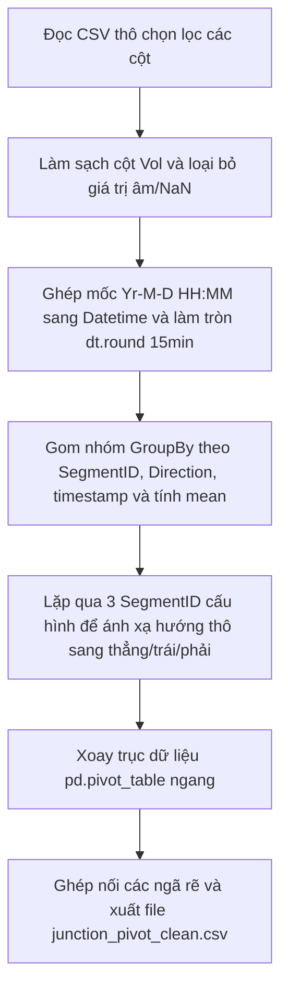

# Nhiệm Vụ 1: Tiền Xử Lý Dữ Liệu Lưu Lượng Giao Thông & Xoay Trục Hợp Nhất Đa Nút Giao
**Mã nhiệm vụ:** `TASK_ML_01` | **Giai đoạn:** 1 | **Thời gian thực hiện dự kiến:** Ngày 1 - Ngày 2

---

## 1. Mô Tả Nhiệm Vụ
Nhiệm vụ này tập trung vào tầng Kỹ nghệ Dữ liệu (Data Engineering) nền tảng. Chúng ta cần tiền xử lý tệp dữ liệu lưu lượng giao thông quy mô lớn **`Automated_Traffic_Volume_Counts_20260521.csv` (dung lượng 286MB)** chứa các bản ghi đo đạc thực tế tại thành phố New York, loại bỏ hoàn toàn các loại nhiễu, làm sạch cột volume (xử lý dấu phẩy phân cách hàng nghìn), và chuẩn hóa thời gian về các khung 15 phút đồng nhất.

Điểm cải tiến mấu chốt so với thiết kế cũ là tiến trình này sẽ xử lý và xoay trục (pivot) dữ liệu **đồng thời cho cả 3 nút giao (Segments) đại diện**:
1. **SegmentID 138:** Nút giao ngã ba tách làn (Northbound, Westbound, Eastbound).
2. **SegmentID 72887:** Tuyến trục Đông-Tây lớn (Eastbound, Westbound).
3. **SegmentID 83624:** Tuyến song hành Nam-Bắc (Northbound, Southbound).

Tất cả dữ liệu dọc của 3 nút giao này sẽ được gom nhóm, xoay trục sang bảng ngang (wide-format) và ghép nối thành một tệp dữ liệu hợp nhất `junction_pivot_clean.csv` nhằm sẵn sàng cho các mô hình học máy.

---

## 2. Dữ Liệu Đầu Vào (Inputs)
- **Tệp dữ liệu thô lớn:** [Automated_Traffic_Volume_Counts_20260521.csv](file:///D:/GIT%20REPO/trafffic-density-analysis-system/traffic-density-analysis-system/data/ml/Automated_Traffic_Volume_Counts_20260521.csv).
- **Cột dữ liệu thô sử dụng:** `Yr`, `M`, `D`, `HH`, `MM`, `Vol`, `SegmentID`, `Direction`.

---

## 3. Dữ Liệu Đầu Ra (Outputs)
- **Tệp dữ liệu xoay trục hợp nhất sạch:** [junction_pivot_clean.csv](file:///D:/GIT%20REPO/trafffic-density-analysis-system/traffic-density-analysis-system/ml_service/data/junction_pivot_clean.csv).
- **Cơ cấu cột của bảng đầu ra:**
  - `timestamp` (datetime): Mốc thời gian chuẩn hóa 15 phút.
  - `segment_id` (int): Mã định danh ngã rẽ vật lý.
  - `vol_straight` (int): Lưu lượng xe đi thẳng.
  - `vol_left` (int): Lưu lượng xe rẽ trái.
  - `vol_right` (int): Lưu lượng xe rẽ phải (có thể NaN ở một số tuyến không có làn phải).

---

## 4. Luồng Chạy Chi Tiết (Execution Flow)
Thuật toán tiền xử lý trong tệp `ml_service/preprocess.py` thực hiện các giai đoạn tuần tự sau:



### Chi tiết kỹ thuật xử lý:
1. **Đọc tối ưu:** Sử dụng `usecols` trong `pd.read_csv()` để chỉ tải các cột cần thiết, giúp tiết kiệm bộ nhớ RAM đáng kể.
2. **Làm sạch Vol:** Loại bỏ dấu phẩy phân tách hàng nghìn bằng `.str.replace(',', '')`, ép kiểu sang kiểu số thực bằng `pd.to_numeric(..., errors='coerce')`, loại bỏ dòng lỗi/rỗng và lọc bỏ giá trị âm.
3. **Làm tròn mốc thời gian:** Ghép chuỗi các cột ngày/giờ thành đối tượng datetime, sau đó áp dụng `.dt.round('15min')` để đưa các mốc đo lường lệch về đúng bin 15 phút chuẩn.
4. **Ánh xạ luồng di chuyển (Direction Mapping):**
   * **Segment 138:** `NB` $\rightarrow$ `vol_straight`, `WB` $\rightarrow$ `vol_left`, `EB` $\rightarrow$ `vol_right`.
   * **Segment 72887:** `EB` $\rightarrow$ `vol_straight`, `WB` $\rightarrow$ `vol_left`.
   * **Segment 83624:** `NB` $\rightarrow$ `vol_straight`, `SB` $\rightarrow$ `vol_left`.
5. **Xoay trục bảng (Pivot):** Thực hiện `pd.pivot_table(index='timestamp', columns='Direction', values='Vol')` cho mỗi phân khúc để chuyển đổi cấu trúc dọc sang ngang.
6. **Lập chỉ mục thời gian liên tục:** Tạo mảng thời gian đầy đủ liên tục `pd.date_range()` từ min đến max cho mỗi segment để điền các khoảng trống dữ liệu bị khuyết bằng 0 hoặc nội suy tuyến tính thích hợp.

---

## 5. Kiểm Tra & Xác Thực (Verification Plan)
Để chạy và xác thực dữ liệu đầu ra:

- **Lệnh chạy script tiền xử lý:**
  ```powershell
  python -m ml_service.preprocess
  ```
- **Tiêu chí nghiệm thu dữ liệu:**
  1. **Đường dẫn tồn tại:** Tệp tin `ml_service/data/junction_pivot_clean.csv` phải được tạo ra đầy đủ.
  2. **Kiểm tra dữ liệu rỗng:** Cột `vol_straight` và `vol_left` không được chứa giá trị NaN. Cột `vol_right` có thể rỗng ở Segment 72887 và 83624.
  3. **Tính liên tục thời gian:** Khoảng cách giữa các bản ghi liên tiếp trong cùng một SegmentID phải là bội số của 15 phút (900 giây).
