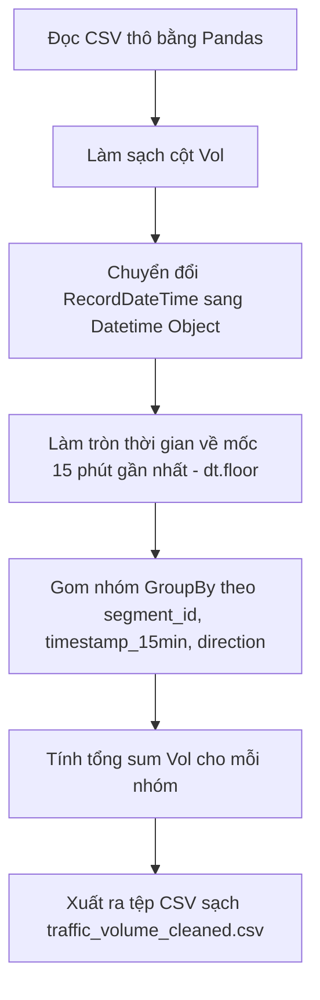

# Nhiệm Vụ 1: Tiền Xử Lý Dữ Liệu Lưu Lượng Giao Thông Thực Tế
**Mã nhiệm vụ:** `TASK_ML_01` | **Giai đoạn:** 1 | **Thời gian thực hiện dự kiến:** Ngày 1 - Ngày 2

---

## 1. Mô Tả Nhiệm Vụ
Nhiệm vụ này tập trung vào việc xử lý kỹ nghệ dữ liệu từ tệp dữ liệu lưu lượng giao thông thực tế quy mô lớn `Automated_Traffic_Volume_Counts_20260521.csv`. Dữ liệu thô chứa nhiều nhiễu như dấu phẩy phân tách hàng nghìn ở cột số lượng, định dạng ngày tháng không đồng nhất và các mốc thời gian ghi nhận không nằm tròn trong các khung thời gian 15 phút. 

Mục tiêu là làm sạch dữ liệu thô, chuyển đổi cột thời gian và gom nhóm (binning) toàn bộ lưu lượng về các khung cố định 15 phút để làm tiền đề cho việc dự báo chuỗi thời gian chu kỳ ngắn hạn.

---

## 2. Dữ Liệu Đầu Vào (Inputs)
- **Tệp dữ liệu thô:** [Automated_Traffic_Volume_Counts_20260521.csv](file:///D:/GIT%20REPO/trafffic-density-analysis-system/traffic-density-analysis-system/ml_service/data/Automated_Traffic_Volume_Counts_20260521.csv) (hoặc nằm trong thư mục `ml_service/data/`).
- **Cấu trúc tệp thô gồm các cột chính:**
  - `SegmentID` (int/string): Mã định danh đoạn đường/nút giao.
  - `RecordDateTime` (string): Thời gian ghi nhận sự kiện (định dạng hỗn hợp ví dụ `MM/DD/YYYY hh:mm:ss AM/PM` hoặc tương tự).
  - `Direction` (string): Hướng di chuyển (`N`, `S`, `E`, `W`, `L`, `R`, `ST`...).
  - `Vol` (string/int): Số lượng xe (chứa dấu phẩy phân cách, ví dụ: `1,250`).

---

## 3. Dữ Liệu Đầu Ra (Outputs)
- **Tệp dữ liệu sạch:** [traffic_volume_cleaned.csv](file:///D:/GIT%20REPO/trafffic-density-analysis-system/traffic-density-analysis-system/ml_service/data/traffic_volume_cleaned.csv).
- **Cấu trúc tệp đầu ra sạch:**
  - `segment_id` (int): Mã định danh đoạn đường sạch.
  - `timestamp_15min` (datetime/string): Thời gian đã làm tròn về bin 15 phút gần nhất (định dạng `YYYY-MM-DD HH:MM:S`).
  - `direction` (string): Hướng di chuyển chuẩn hóa.
  - `vol` (int): Số lượng xe sạch hoàn toàn (kiểu số nguyên).

---

## 4. Luồng Chạy Chi Tiết (Execution Flow)
Tác vụ được lập trình trong tệp `ml_service/preprocess.py` thực hiện theo các bước tuần tự sau:



### Chi tiết các bước thuật toán:
1. **Khởi tạo và Load dữ liệu:** 
   Sử dụng thư viện `pandas` đọc tệp CSV thô, chú ý xử lý bộ nhớ bằng cách đọc theo chunk nếu tệp tin quá lớn hoặc dùng tham số cấu hình phù hợp.
2. **Làm sạch cột `Vol`:**
   - Loại bỏ các ký tự dấu phẩy `,` và các khoảng trắng dư thừa trong chuỗi.
   - Ép kiểu dữ liệu sang số nguyên `int`. Loại bỏ hoặc điền giá trị 0 cho các dòng bị lỗi hoặc rỗng.
3. **Chuẩn hóa trường thời gian:**
   - Sử dụng `pd.to_datetime()` để chuyển đổi cột `RecordDateTime` sang kiểu dữ liệu thời gian trong Pandas.
   - Áp dụng hàm làm tròn xuống bin 15 phút bằng phương pháp `.dt.floor('15min')` trên cột thời gian, biến mốc `10:07` hay `10:14` thành `10:00`, mốc `10:23` thành `10:15`.
4. **Aggrergation (Gom nhóm & Tích lũy):**
   - Thực hiện gom nhóm dữ liệu theo bộ ba khóa chính: `SegmentID`, `RecordDateTime` (đã làm tròn 15 phút) và `Direction`.
   - Tính tổng lưu lượng xe (`sum`) trong mỗi nhóm 15 phút.
5. **Đổi tên cột & Xuất bản:**
   - Đổi tên các cột tương ứng sang chữ thường chuẩn snake_case: `segment_id`, `timestamp_15min`, `direction`, `vol`.
   - Xuất dữ liệu đã xử lý sạch ra tệp `ml_service/data/traffic_volume_cleaned.csv` không chứa cột index mặc định của Pandas.

---

## 5. Kiểm Tra & Xác Thực (Verification Plan)
Để đảm bảo mã hoạt động chính xác trước khi chuyển sang bước tiếp theo, hãy viết một đoạn mã kiểm thử nhanh (Smoke Test) tại `ml_service/smoke_test_preprocess.py`:

```python
import pandas as pd
import os

def test_preprocess():
    output_path = "ml_service/data/traffic_volume_cleaned.csv"
    assert os.path.exists(output_path), "LỖI: Chưa tạo ra file output!"
    
    df = pd.read_csv(output_path)
    assert not df.isnull().values.any(), "LỖI: File sạch vẫn chứa giá trị rỗng (Null)!"
    assert df['vol'].dtype in ['int64', 'int32'], "LỖI: Cột vol chưa được ép về kiểu số nguyên!"
    
    # Kiểm tra tính tuần hoàn 15 phút
    timestamps = pd.to_datetime(df['timestamp_15min'])
    invalid_minutes = [t.minute for t in timestamps if t.minute % 15 != 0]
    assert len(invalid_minutes) == 0, f"LỖI: Có mốc thời gian không chia hết cho 15 phút: {invalid_minutes[:5]}"
    
    print("XÁC THỰC THÀNH CÔNG: Dữ liệu đã sạch và sẵn sàng cho Task 2!")

if __name__ == "__main__":
    test_preprocess()
```

- **Lệnh thực thi chạy tiền xử lý:**
  ```bash
  python ml_service/preprocess.py
  ```
- **Lệnh thực thi smoke test xác thực:**
  ```bash
  python ml_service/smoke_test_preprocess.py
  ```
