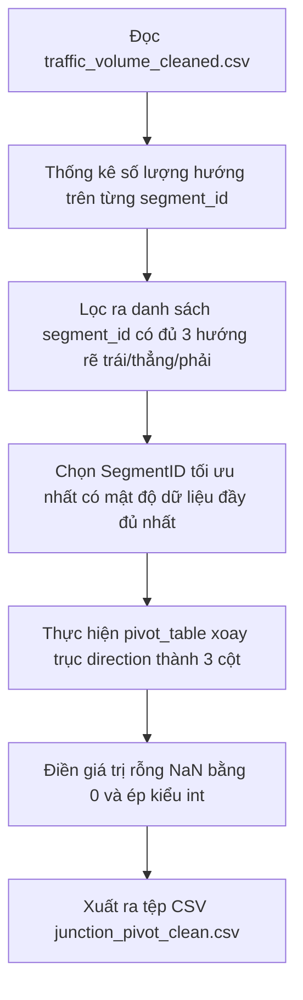

# Nhiệm Vụ 2: Trích Xuất Phân Tách Nhánh & Xoay Trục (Pivot) Dữ Liệu Nút Giao
**Mã nhiệm vụ:** `TASK_ML_02` | **Giai đoạn:** 1 | **Thời gian thực hiện dự kiến:** Ngày 3 - Ngày 4

---

## 1. Mô Tả Nhiệm Vụ
Sau khi làm sạch dữ liệu trong Nhiệm vụ 1, cơ sở dữ liệu hiện ở dạng bảng dọc (long-format) với mỗi dòng đại diện cho lưu lượng của một hướng đơn lẻ tại một đoạn đường. Để huấn luyện mô hình dự báo ngã rẽ đồng thời cho nút giao, chúng ta cần tìm một nút giao hình học tối ưu nhất có đầy đủ dữ liệu của cả 3 nhánh di chuyển độc lập (`left`, `straight`, `right`).

Nhiệm vụ này yêu cầu viết mã nguồn phân tích tìm mã `SegmentID` tốt nhất đại diện cho một nút giao ngã ba/ngã tư lý tưởng trong dữ liệu thực tế, sau đó xoay trục bảng (pivot) sang định dạng ngang (wide-format) sao cho mỗi mốc thời gian là một dòng có đủ 3 cột lưu lượng cho 3 hướng rẽ.

---

## 2. Dữ Liệu Đầu Vào (Inputs)
- **Tệp dữ liệu sạch:** [traffic_volume_cleaned.csv](file:///D:/GIT%20REPO/trafffic-density-analysis-system/traffic-density-analysis-system/ml_service/data/traffic_volume_cleaned.csv) từ Nhiệm vụ 1.
- **Cấu trúc dữ liệu:** Các cột `segment_id`, `timestamp_15min`, `direction`, `vol`.

---

## 3. Dữ Liệu Đầu Xuất (Outputs)
- **Tệp dữ liệu xoay trục hoàn thiện:** [junction_pivot_clean.csv](file:///D:/GIT%20REPO/trafffic-density-analysis-system/traffic-density-analysis-system/ml_service/data/junction_pivot_clean.csv).
- **Cấu trúc tệp đầu ra:**
  - `timestamp_15min` (datetime/string): Khóa thời gian chính dạng chuỗi thời gian.
  - `vol_straight` (int): Lưu lượng hướng đi thẳng.
  - `vol_left` (int): Lưu lượng hướng rẽ trái.
  - `vol_right` (int): Lưu lượng hướng rẽ phải.

---

## 4. Luồng Chạy Chi Tiết (Execution Flow)
Tác vụ được lập trình trong tệp `ml_service/pivot_junction.py` thực hiện theo các bước tuần tự sau:



### Chi tiết các bước thuật toán:
1. **Tìm kiếm Nút giao tối ưu (Segment Detection):**
   - Đọc dữ liệu sạch bằng Pandas.
   - Gom nhóm theo `segment_id` và đếm số lượng giá trị duy nhất (`nunique()`) của cột `direction`.
   - Lọc ra các `segment_id` có số lượng hướng di chuyển $\ge 3$. 
   - Đảm bảo trong các hướng di chuyển đó có thể ánh xạ tương ứng vào 3 loại hướng chuẩn: Rẽ trái (ví dụ: nhãn `L`, `Left` hoặc `left`), Đi thẳng (`straight`, `ST`, `S`), và Rẽ phải (`R`, `Right`, `right`).
   - Chọn ra mã `segment_id` có số lượng dòng ghi nhận nhiều nhất và phân bổ đều nhất theo thời gian (đại diện cho nút giao nghiên cứu điểm).
2. **Trích xuất & Ánh xạ hướng:**
   - Lọc riêng các dòng dữ liệu của `segment_id` đã được lựa chọn.
   - Viết hàm ánh xạ các nhãn hướng thô ban đầu sang 3 nhãn chuẩn hóa: `straight`, `left`, `right`.
3. **Thực hiện Xoay trục dữ liệu (Pivot):**
   - Sử dụng phương thức `pd.pivot_table()` của Pandas:
     - `index='timestamp_15min'`
     - `columns='direction'` (với các giá trị là `straight`, `left`, `right`)
     - `values='vol'`
     - `aggfunc='sum'` (để cộng dồn nếu có trùng lặp nhỏ).
4. **Làm sạch sau Pivot:**
   - Rất có thể một số mốc thời gian bị thiếu dữ liệu ở 1 trong 3 hướng dẫn đến giá trị rỗng `NaN`. Thực hiện điền các giá trị trống bằng phương thức `.fillna(0)`.
   - Ép kiểu dữ liệu của cả 3 cột số lượng sang kiểu số nguyên `int`.
5. **Xuất bản:**
   - Lưu kết quả dữ liệu xoay trục sạch sẽ ra tệp `ml_service/data/junction_pivot_clean.csv`.

---

## 5. Kiểm Tra & Xác Thực (Verification Plan)
Để đảm bảo mã hoạt động chính xác, hãy viết mã kiểm thử tại `ml_service/smoke_test_pivot.py`:

```python
import pandas as pd
import os

def test_pivot():
    output_path = "ml_service/data/junction_pivot_clean.csv"
    assert os.path.exists(output_path), "LỖI: Chưa tạo ra file output!"
    
    df = pd.read_csv(output_path)
    expected_cols = ['timestamp_15min', 'vol_straight', 'vol_left', 'vol_right']
    for col in expected_cols:
        assert col in df.columns, f"LỖI: Thiếu cột {col} bắt buộc!"
        
    assert not df[expected_cols[1:]].isnull().values.any(), "LỖI: Còn giá trị rỗng NaN trong cột số lượng xe!"
    assert (df['vol_straight'] >= 0).all(), "LỖI: Có số lượng xe âm!"
    
    print("XÁC THỰC THÀNH CÔNG: Đã trích xuất nút giao và xoay trục thành công!")

if __name__ == "__main__":
    test_pivot()
```

- **Lệnh thực thi chạy trích xuất và xoay trục:**
  ```bash
  python ml_service/pivot_junction.py
  ```
- **Lệnh thực thi smoke test xác thực:**
  ```bash
  python ml_service/smoke_test_pivot.py
  ```
