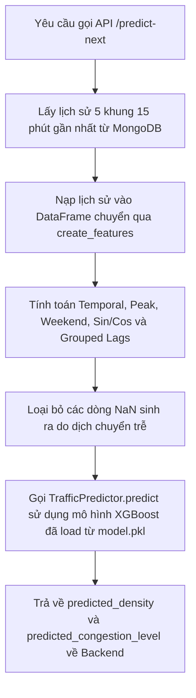

# Nhiệm Vụ 2: Kỹ Nghệ Đặc Trưng Chuỗi Thời Gian & Tích Hợp Lớp Dự Báo AI
**Mã nhiệm vụ:** `TASK_ML_02` | **Giai đoạn:** 1 | **Thời gian thực hiện dự kiến:** Ngày 3 - Ngày 4

---

## 1. Mô Tả Nhiệm Vụ
Khi đã có dữ liệu dạng bảng ngang sạch `junction_pivot_clean.csv`, bước tiếp theo là xây dựng tập đặc trưng (Feature Engineering) thông minh để mô hình học máy XGBoost nắm bắt được các xu hướng thời gian phức tạp của giao thông đô thị. Nhiệm vụ này yêu cầu lập trình lớp **`TrafficPredictor`** trong tệp `ml_service/traffic_predictor.py` có nhiệm vụ trích xuất các đặc trưng tự hồi quy (autoregressive lags), đặc trưng trượt ngắn hạn (rolling features), đặc trưng lịch trình và đặc trưng tuần hoàn (circular features).

Lớp `TrafficPredictor` sau đó được tích hợp trực tiếp vào dịch vụ Backend FastAPI endpoint `/predict-next` để xử lý các yêu cầu dự báo thời gian thực từ các camera trong hệ thống.

---

## 2. Dữ Liệu Đầu Vào (Inputs)
- **Tệp dữ liệu ngang hợp nhất:** [junction_pivot_clean.csv](file:///D:/GIT%20REPO/trafffic-density-analysis-system/traffic-density-analysis-system/ml_service/data/junction_pivot_clean.csv).
- **Mã nguồn lớp dự báo:** `ml_service/traffic_predictor.py`.

---

## 3. Dữ Liệu Đầu Ra (Outputs)
- **Mã nguồn hoàn thiện:** `ml_service/traffic_predictor.py` chứa đầy đủ logic trích xuất đặc trưng và suy luận (inference).
- **API Endpoint hoạt động thực tế:** `/predict-next` trả về cấu trúc JSON dự báo lưu lượng xe và mật độ giao thông.

---

## 4. Đặc Trưng Lập Trình (Feature Matrix Architecture)
Mô hình học máy sẽ sử dụng **10 đặc trưng đầu vào** được tối ưu hóa như sau:

| Tên Đặc Trưng | Kiểu Dữ Liệu | Cách Tính toán & Ý Nghĩa Kỹ Thuật |
| :--- | :---: | :--- |
| `hour` | `int` | Giờ trong ngày (0 - 23) biểu diễn thô chu kỳ ngày đêm. |
| `day_of_week` | `int` | Ngày trong tuần (Thứ 2 = 0 đến Chủ nhật = 6). |
| `is_peak_hour` | `int` | Cờ nhị phân (0 hoặc 1) đánh dấu giờ cao điểm Việt Nam (Sáng: 7-9h, Chiều: 17-19h). |
| `is_weekend` | `int` | Cờ nhị phân (0 hoặc 1) xác định Thứ bảy và Chủ nhật. |
| `hour_sin` | `float` | $\sin(2\pi \times \text{hour} / 24)$ - Mã hóa tính liên tục giữa giờ 23 và giờ 00. |
| `hour_cos` | `float` | $\cos(2\pi \times \text{hour} / 24)$ - Cặp tọa độ tuần hoàn chu kỳ 24h. |
| `lag_1` | `int` | Lưu lượng xe tại mốc 15 phút trước ($t-1$) - Quán tính giao thông ngắn hạn. |
| `lag_2` | `int` | Lưu lượng xe tại mốc 30 phút trước ($t-2$). |
| `lag_4` | `int` | Lưu lượng xe tại mốc 1 tiếng trước ($t-4$) - Nắm bắt xu hướng theo giờ. |
| `rolling_mean_3` | `float` | Trung bình trượt của 3 mốc trễ gần nhất: $\text{mean}(lag\_1, lag\_2, lag\_3)$. |

*Chú ý đặc biệt:* Do tệp `junction_pivot_clean.csv` chứa thông tin của cả 3 nút giao khác nhau, các đặc trưng trễ (`lag`) và trượt (`rolling`) phải được tính toán độc lập cho riêng từng `segment_id` bằng cách sử dụng phương thức `groupby('segment_id')` của Pandas để tránh rò rỉ hoặc sai lệch dữ liệu chéo giữa các ngã rẽ.

---

## 5. Luồng Chạy Chi Tiết (Execution Flow)
Quy trình trích xuất đặc trưng và dự báo tích hợp được tổ chức theo sơ đồ sau:



---

## 6. Kiểm Tra & Xác Thực (Verification Plan)
Để xác nhận tích hợp thành công:

1. **Khởi động server Backend:**
   ```powershell
   uvicorn backend.main:app --reload --host 127.0.0.1 --port 8000
   ```
2. **Kiểm tra API thông qua PowerShell/Curl:**
   ```powershell
   Invoke-RestMethod -Uri "http://127.0.0.1:8000/predict-next?camera_id=CAM_01" -Method Get
   ```
3. **Tiêu chí nghiệm thu:**
   * API phải trả về mã `200 OK` kèm theo dữ liệu JSON có cấu trúc chứa các khóa: `camera_id`, `predicted_density`, `predicted_congestion_level`, `source` (là `ml_service` khi có đủ dữ liệu lịch sử hoặc `fallback` nếu thiếu dữ liệu).
