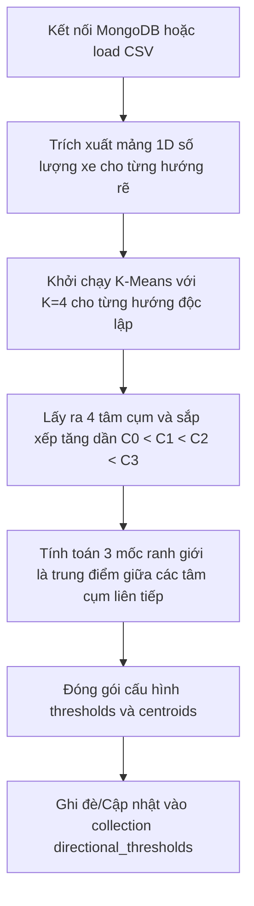

# Nhiệm Vụ 4: Phân Cụm K-Means Tự Thích Ứng Ngưỡng Mật Độ Ùn Tắc Động
**Mã nhiệm vụ:** `TASK_ML_04` | **Giai đoạn:** 2 | **Thời gian thực hiện dự kiến:** Ngày 8 - Ngày 10

---

## 1. Mô Tả Nhiệm Vụ
Trong hệ thống giao thông đô thị, mỗi nhánh rẽ có năng lực hạ tầng khác nhau (ví dụ: làn rẽ trái cua hẹp sức chứa thấp hơn làn đi thẳng rất nhiều). Nếu áp dụng một bộ ngưỡng ùn tắc tĩnh bằng số xe cố định cho tất cả các hướng (ví dụ: cứ trên 50 xe là tắc) thì hệ thống sẽ đưa ra đánh giá sai lệch thực tế. 

Nhiệm vụ này yêu cầu xây dựng một tiến trình tự động (chạy ngầm định kỳ) kết nối với MongoDB, lấy toàn bộ lịch sử đếm xe của từng hướng rẽ, áp dụng thuật toán học máy không giám sát **K-Means Clustering (với $K=4$)** để tự động tìm ra 4 cụm mật độ tự nhiên đại diện cho 4 trạng thái: `Low` (Thấp), `Medium` (Trung bình), `High` (Cao), và `Heavy` (Ùn tắc nghiêm trọng). Từ đó tính toán các ngưỡng ranh giới động và lưu vào MongoDB.

---

## 2. Dữ Liệu Đầu Vào (Inputs)
- **Cơ sở dữ liệu:** MongoDB collection `traffic_aggregation` chứa lịch sử đếm xe thật của camera, hoặc sử dụng tệp [junction_pivot_clean.csv](file:///D:/GIT%20REPO/trafffic-density-analysis-system/traffic-density-analysis-system/ml_service/data/junction_pivot_clean.csv) làm tập dữ liệu huấn luyện thay thế nếu DB chưa tích lũy đủ dữ liệu.
- **Tham số thuật toán:** Số lượng cụm $K=4$.

---

## 3. Dữ Liệu Đầu Ra (Outputs)
- **MongoDB Collection:** `directional_thresholds`.
- **Cấu trúc tài liệu (Document Schema) lưu trong Collection:**
  ```json
  {
    "camera_id": "CAM_01",
    "direction": "straight",
    "thresholds": {
      "low_to_medium": 32.5,
      "medium_to_high": 68.0,
      "high_to_heavy": 105.3
    },
    "centroids": [12.0, 53.0, 83.0, 127.6],
    "updated_at": "2026-05-23T02:00:00Z"
  }
  ```
  *(Có 3 bản ghi riêng biệt cho 3 hướng: `straight`, `left`, `right`)*.

---

## 4. Luồng Chạy Chi Tiết (Execution Flow)
Tác vụ được lập trình trong tệp `ml_service/density_cluster.py` thực hiện theo các bước tuần tự sau:



### Chi tiết các bước thuật toán:
1. **Truy vấn Dữ liệu lịch sử:**
   - Kết nối cơ sở dữ liệu MongoDB bằng thư viện `pymongo`.
   - Đọc dữ liệu lịch sử lưu lượng xe của camera `CAM_01`. Nếu dữ liệu trống, tự động nạp dữ liệu từ tệp CSV `junction_pivot_clean.csv` để chạy khởi tạo ban đầu.
2. **Thực hiện phân cụm (Clustering):**
   - Với mỗi hướng $D \in \{\text{straight}, \text{left}, \text{right}\}$:
     - Trích xuất toàn bộ chuỗi số lượng xe của hướng đó thành mảng một chiều: $V_D = [v_1, v_2, ..., v_N]^T$.
     - Khởi tạo và chạy `KMeans(n_clusters=4, random_state=42)` từ thư viện `sklearn.cluster`.
     - Lấy ra tọa độ các tâm cụm (centroids) từ thuộc tính `cluster_centers_` và sắp xếp chúng theo thứ tự tăng dần:
       $$C_0 < C_1 < C_2 < C_3$$
3. **Tính toán Ngưỡng ranh giới (Decision Boundaries):**
   - Ranh giới giữa các cấp độ được tính bằng trung điểm giữa hai tâm cụm kế tiếp:
     - Ngưỡng từ Thấp lên Trung bình (`low_to_medium`):
       $$T_1 = \frac{C_0 + C_1}{2}$$
     - Ngưỡng từ Trung bình lên Cao (`medium_to_high`):
       $$T_2 = \frac{C_1 + C_2}{2}$$
     - Ngưỡng từ Cao lên Ùn tắc nghiêm trọng (`high_to_heavy`):
       $$T_3 = \frac{C_2 + C_3}{2}$$
4. **Lưu trữ Cấu hình:**
   - Tạo đối tượng JSON chứa đầy đủ thông tin: `camera_id`, `direction`, `thresholds` (gồm 3 ngưỡng $T_1, T_2, T_3$), `centroids` (4 tâm cụm) và mốc thời gian cập nhật.
   - Ghi đè vào collection `directional_thresholds` của MongoDB (sử dụng phương thức `update_one` với tùy chọn `upsert=True` dựa trên khóa tìm kiếm `{"camera_id": ..., "direction": ...}`).

---

## 5. Kiểm Tra & Xác Thực (Verification Plan)
Hãy viết mã kiểm thử nhanh tại `ml_service/smoke_test_clustering.py` để xác thực cơ sở dữ liệu đã cập nhật các ngưỡng động chính xác:

```python
from pymongo import MongoClient
import os

def test_db_thresholds():
    db_url = os.getenv("DB_URL", "mongodb://localhost:27017/")
    db_name = os.getenv("MONGODB_DB", "traffic_density")
    
    client = MongoClient(db_url)
    db = client[db_name]
    collection = db["directional_thresholds"]
    
    directions = ["straight", "left", "right"]
    for d in directions:
        doc = collection.find_one({"camera_id": "CAM_01", "direction": d})
        assert doc is not None, f"LỖI: Không tìm thấy ngưỡng cấu hình cho hướng '{d}'!"
        
        t = doc["thresholds"]
        assert t["low_to_medium"] < t["medium_to_high"] < t["high_to_heavy"], \
            f"LỖI: Các ngưỡng của hướng '{d}' không tăng dần hợp lệ!"
            
        print(f"Xác thực hướng '{d}' OK. Ngưỡng ùn tắc động: "
              f"Low->Med: {t['low_to_medium']:.1f} | "
              f"Med->High: {t['medium_to_high']:.1f} | "
              f"High->Heavy: {t['high_to_heavy']:.1f}")

if __name__ == "__main__":
    test_db_thresholds()
```

- **Lệnh thực thi chạy phân cụm tìm ngưỡng:**
  ```bash
  python ml_service/density_cluster.py
  ```
- **Lệnh thực thi smoke test xác thực:**
  ```bash
  python ml_service/smoke_test_clustering.py
  ```
