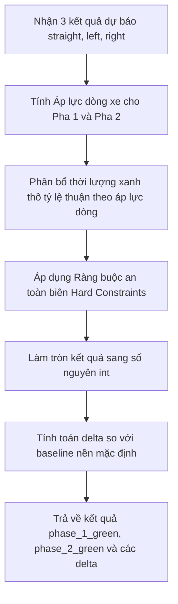

# Nhiệm Vụ 5: Phát Triển Bộ Tối Ưu Hóa Thời Lượng Đèn Xanh Động Cho 2 Pha Giao Thông
**Mã nhiệm vụ:** `TASK_ML_05` | **Giai đoạn:** 2 | **Thời gian thực hiện dự kiến:** Ngày 11 - Ngày 12

---

## 1. Mô Tả Nhiệm Vụ
Khi đã có mô hình dự báo chính xác số lượng xe của 3 nhánh trong 15 phút tiếp theo (Task 3), hệ thống cần chuyển đổi tri thức dự báo này thành quyết định điều khiển giao thông cụ thể. Nhiệm vụ này yêu cầu lập trình bộ thuật toán tối ưu hóa phân bổ thời lượng đèn xanh động cho 2 Pha giao thông chính tại ngã rẽ tách luồng:
- **Pha 1 (Pha Tuyến Chính):** Điều khiển luồng **Đi thẳng (straight)** và **Rẽ phải (right)**. Baseline nền mặc định: **50 giây**.
- **Pha 2 (Pha Ngả Rẽ Xung Đột):** Điều khiển luồng **Rẽ trái (left)**. Baseline nền mặc định: **30 giây**.

Tổng chu kỳ đèn (Cycle Time) là **90 giây**, trong đó khóa cứng **10 giây** dành cho các tín hiệu đèn vàng/đỏ chuyển tiếp an toàn giao lộ. Số giây xanh khả dụng để phân bổ động cho cả hai pha là **80 giây** ($G_{total} = 80$). Thuật toán cần tự động tính toán số giây đèn xanh tối ưu dưới các ràng buộc an toàn biên (Hard Constraints) đô thị.

---

## 2. Dữ Liệu Đầu Vào (Inputs)
- **Giá trị lưu lượng dự báo tiếp theo từ mô hình ML:**
  - `predicted_straight` (float): Số lượng xe dự báo đi thẳng.
  - `predicted_left` (float): Số lượng xe dự báo rẽ trái.
  - `predicted_right` (float): Số lượng xe dự báo rẽ phải.
- **Tham số cấu hình hệ thống:**
  - Tổng số giây xanh tối đa khả dụng: $G_{total} = 80$ giây.
  - Thời lượng đèn xanh tối thiểu của mỗi pha: $\ge 15$ giây.
  - Thời lượng đèn xanh tối đa của mỗi pha: $\le 55$ giây.

---

## 3. Dữ Liệu Đầu Ra (Outputs)
- **Mã nguồn giải thuật:** `ml_service/phase_optimizer.py` chứa lớp `PhaseLightOptimizer`.
- **Cơ cấu phân bổ giây xanh tối ưu trả về:**
  - `phase_1_green` (int): Số giây đèn xanh tối ưu cho Pha 1.
  - `phase_2_green` (int): Số giây đèn xanh tối ưu cho Pha 2.
  - `delta_phase_1` (int): Số giây tăng/giảm so với baseline Pha 1 (dao động từ $-25$ đến $+5$ giây).
  - `delta_phase_2` (int): Số giây tăng/giảm so với baseline Pha 2 (dao động từ $-15$ đến $+25$ giây).

---

## 4. Luồng Chạy Chi Tiết (Execution Flow)
Thuật toán tối ưu được cài đặt trong lớp `PhaseLightOptimizer` tại tệp `ml_service/phase_optimizer.py` thực hiện theo lô-gích toán học sau:



### Công thức toán học và lô-gích tối ưu:
1. **Tính toán Áp lực dòng xe (Flow Pressure Index):**
   - **Pha 1 (Tuyến chính):** Lưu thông thẳng là ưu tiên chính, luồng rẽ phải đi vào đường gom ít xung đột nên nhân hệ số ưu tiên thấp hơn.
     $$P_1 = \text{predicted\_straight} + 0.3 \times \text{predicted\_right}$$
   - **Pha 2 (Rẽ trái):** Luồng rẽ trái cua hẹp, tốc độ giải phóng xe chậm nên dễ dồn ứ, nhân hệ số cản trở hình học để tăng mức ưu tiên giải tỏa.
     $$P_2 = 1.5 \times \text{predicted\_left}$$
2. **Phân bổ thời lượng xanh thô:**
   - Tính toán tỷ lệ đèn xanh thô cho từng pha dựa trên tỷ số áp lực dòng xe (Flow Ratio):
     $$g_1^{raw} = \frac{P_1}{P_1 + P_2} \times G_{total}, \quad g_2^{raw} = \frac{P_2}{P_1 + P_2} \times G_{total}$$
     *(Nếu $P_1 + P_2 = 0$ do không có xe nào dự báo, áp dụng chia đều $g_1^{raw} = 50$, $g_2^{raw} = 30$)*.
3. **Áp dụng Ràng buộc biên an toàn (Hard Constraints):**
   - Để đảm bảo an toàn giao thông đô thị và không triệt tiêu hoàn toàn quyền lưu thông của ngả nào, thời lượng xanh phải nằm trong khoảng:
     $$15 \le g_1 \le 55 \quad \text{và} \quad 15 \le g_2 \le 55$$
   - Vì tổng $g_1 + g_2 = G_{total} = 80$, khi ta giới hạn chặt chẽ:
     $$25 \le g_1 \le 55$$
     Thì tự động $g_2 = 80 - g_1$ sẽ luôn nằm trong khoảng $[25, 55]$, thỏa mãn an toàn vượt mức tối thiểu 15s cho cả 2 pha.
   - Hàm Clamp giới hạn thời lượng:
     $$g_1 = \max(25, \min(55, g_1^{raw}))$$
     $$g_2 = 80 - g_1$$
4. **Tính toán Delta và Làm tròn:**
   - Ép các giá trị về số nguyên `int` làm tròn gần nhất.
   - Tính toán độ lệch (delta) so với cấu hình mặc định (P1 baseline = 50s, P2 baseline = 30s):
     $$\text{delta\_phase\_1} = g_1 - 50$$
     $$\text{delta\_phase\_2} = g_2 - 30$$

---

## 5. Kiểm Tra & Xác Thực (Verification Plan)
Để kiểm tra thuật toán phân bổ chính xác và không bao giờ vi phạm ràng buộc an toàn biên:

- **Chạy các kịch bản kiểm thử đơn vị (Unit Test) tại `ml_service/test_phase_optimizer.py`:**
  ```powershell
  python -m unittest ml_service/test_phase_optimizer.py
  ```
- **Các kịch bản kiểm định chất lượng:**
  1. **Luồng thẳng cực đông, rẽ trái vắng:** Pha 1 đạt giới hạn tối đa 55 giây, Pha 2 giữ giới hạn tối thiểu 25 giây.
  2. **Luồng rẽ trái cực đông, đi thẳng vắng:** Pha 1 giữ giới hạn tối thiểu 25 giây, Pha 2 đạt giới hạn tối đa 55 giây.
  3. **Hai hướng cân bằng:** Thời lượng đèn xanh nằm ổn định trong khoảng an toàn $[25, 55]$ giây và tổng luôn bằng 80.
