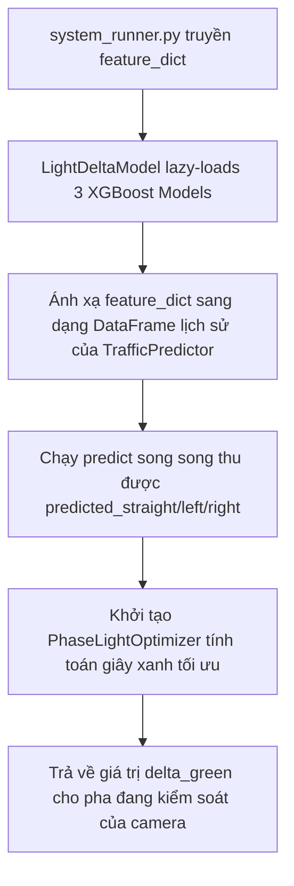

# Nhiệm Vụ 6: Phát Triển Lớp LightDeltaModel Để Giải Quyết Bất Đồng Bộ Kiến Trúc Hệ Thống
**Mã nhiệm vụ:** `TASK_ML_06` | **Giai đoạn:** 2 | **Thời gian thực hiện dự kiến:** Ngày 13 - Ngày 14

---

## 1. Mô Tả Nhiệm Vụ
Khi tích hợp tổng thể hệ thống, có một sự không nhất quán kỹ thuật quan trọng giữa tiến trình điều phối gốc `integration_system/system_runner.py` và thuật toán tối ưu hóa `PhaseLightOptimizer`. 
* Tiến trình `system_runner.py` mong muốn nạp một mô hình dự báo delta duy nhất tên là **`LightDeltaModel`** từ thư mục `ml_service/light_delta_model.py` và gọi phương thức `predict_delta(feature_dict)` trả về số giây tăng giảm.
* Trong khi đó, hệ thống học máy cốt lõi của chúng ta sử dụng **3 mô hình XGBoost** độc lập kết hợp với bộ phân bổ toán học **`PhaseLightOptimizer`**.

Nhiệm vụ này yêu cầu xây dựng lớp cầu nối (Adapter Pattern) **`LightDeltaModel`** tại tệp `ml_service/light_delta_model.py`. Lớp này sẽ lazy-load 3 mô hình XGBoost (thông qua lớp `TrafficPredictor`), tiếp nhận thông số trạng thái thời gian thực từ `system_runner.py`, chạy suy luận dự báo song song cho 3 ngả rẽ, nạp kết quả vào bộ tối ưu hóa `PhaseLightOptimizer` và trả về giá trị `delta` giây tối ưu nhất cho Pha tương ứng của camera đang được điều khiển.

---

## 2. Dữ Liệu Đầu Vào (Inputs)
- **Tập tin mô hình XGBoost:** `model_straight.pkl`, `model_left.pkl`, `model_right.pkl` (Task 3).
- **Thuật toán tối ưu:** `ml_service/phase_optimizer.py` (Task 5).
- **Yêu cầu gọi từ Orchestrator:** Lô-gích gọi `predict_delta(feature_dict)` trong `system_runner.py`.

---

## 3. Dữ Liệu Đầu Xe (Outputs)
- **Cầu nối hệ thống hoàn chỉnh:** [light_delta_model.py](file:///D:/GIT%20REPO/trafffic-density-analysis-system/traffic-density-analysis-system/ml_service/light_delta_model.py) chứa lớp `LightDeltaModel`.
- Giải quyết triệt để lỗi import và cảnh báo lỗi mô hình tại terminal khi chạy `system_runner.py`.

---

## 4. Đặc Tả Kiến Trúc Cầu Nối (Adapter Implementation Specs)
Lớp `LightDeltaModel` sẽ hoạt động theo cơ chế đóng vòng luồng dữ liệu khép kín:



### Hướng dẫn lập trình chi tiết:
1. **Lazy-loading & Singleton:**
   Lớp `LightDeltaModel` duy trì 3 instance của `TrafficPredictor` trỏ tới 3 tệp tin mô hình pkl tương ứng. Trọng số mô hình chỉ được nạp lên RAM một lần duy nhất khi gọi phương thức `_load()`.
2. **Khớp nối Đặc trưng (Feature Matching):**
   - Phương thức `predict_delta(feature_dict)` tiếp nhận một từ điển chứa các thông số: `queue_proxy`, `inbound_count`, `congestion_level`, `baseline_green`, `hour`, `day_of_week`.
   - Chuyển đổi và tạo DataFrame lịch sử giả lập thích ứng với định dạng đầu vào của phương thức `TrafficPredictor.predict()`.
3. **Thực thi Tối ưu & Trích xuất Delta:**
   - Sau khi có 3 số liệu dự báo lưu lượng, gọi `PhaseLightOptimizer.optimize(pred_straight, pred_left, pred_right)`.
   - Dựa trên `camera_id` đang điều khiển (ví dụ `CAM_01` quản lý hướng đi thẳng), trích xuất giá trị `delta_phase_1` (hoặc `delta_phase_2` nếu camera quản lý rẽ trái) để trả về giá trị số thực chính xác cho tiến trình `system_runner.py`.

---

## 5. Kiểm Tra & Xác Thực (Verification Plan)
Để nghiệm thu cầu nối:

- **Khởi chạy trực tiếp tiến trình tích hợp hệ thống:**
  ```powershell
  $env:NO_SUBPROCESS="1"
  python integration_system/system_runner.py
  ```
- **Tiêu chí đánh giá:**
  1. **Không có lỗi:** Terminal không xuất hiện lỗi `ModuleNotFoundError: No module named 'ml_service.light_delta_model'`.
  2. **Vận hành ML thực tế:** Dòng log hiển thị `Mode : ml` thay vì `mode: rule_fallback` hoặc `mode: rule`.
  3. **Giá trị Delta sinh động:** Giá trị `Delta applied` phải thay đổi linh hoạt dạng số thực (ví dụ: `+4.50s` hoặc `-12.20s`) dựa trên dữ liệu đầu vào thực đo của camera thay vì là `0.00s` cố định.
