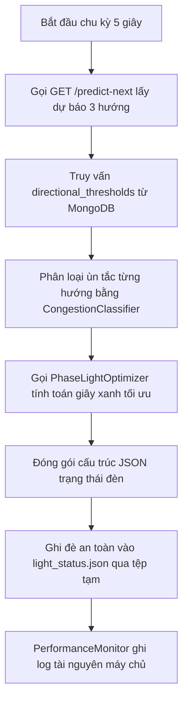

# Nhiệm Vụ 6: Refactor Tầng Điều Phối Hệ Thống (Orchestrator Integration System)
**Mã nhiệm vụ:** `TASK_ML_06` | **Giai đoạn:** 2 | **Thời gian thực hiện dự kiến:** Ngày 13 - Ngày 14

---

## 1. Mô Tả Nhiệm Vụ
Tầng điều phối hệ thống `integration_system/system_runner.py` hiện tại đóng vai trò là nhạc trưởng điều khiển chu trình lặp của hệ thống cứ mỗi 5 giây. Tuy nhiên, một số thành phần dữ liệu trung gian như dự báo (`forecast15m`), điều chỉnh đèn (`delta`) vẫn đang sử dụng hàm giả lập sinh số ngẫu nhiên (mock/random) để chạy thử giao diện.

Nhiệm vụ này yêu cầu refactor toàn bộ tệp `system_runner.py` để đóng vòng điều khiển logic bằng dữ liệu thực. Tiến trình sẽ trực tiếp gọi API Backend `/predict-next` để lấy dự báo 3 hướng, truy vấn collection `directional_thresholds` của MongoDB để phân cấp mật độ động, kích hoạt bộ tối ưu hóa `PhaseLightOptimizer` (Task 5), và ghi kết quả đèn tín hiệu thực tế ra tệp `light_status.json`.

---

## 2. Dữ Liệu Đầu Vào (Inputs)
- **Tệp điều phối gốc:** `integration_system/system_runner.py`
- **Bộ tối ưu hóa:** `ml_service/phase_optimizer.py` (từ Task 5).
- **API Endpoints khả dụng:**
  - `GET /aggregation` (Lấy lưu lượng xe thực tế).
  - `GET /predict-next?camera_id=CAM_01` (Gọi dự báo từ ML service).
- **MongoDB Collection:** `directional_thresholds` (Ngưỡng ùn tắc từ Task 4).

---

## 3. Dữ Liệu Đầu Ra (Outputs)
- **Tệp tin trạng thái đèn tín hiệu:** `light_status.json` (tọa lạc tại thư mục gốc dự án).
- **Cấu trúc tệp trạng thái đồng bộ hoàn chỉnh:**
  ```json
  {
    "camera_id": "CAM_01",
    "timestamp": "2026-05-23T02:00:05.123Z",
    "system_mode": "AI_OPTIMIZED",
    "forecast": {
      "straight": 78,
      "left": 22,
      "right": 14
    },
    "congestion_levels": {
      "straight": "Medium",
      "left": "Low",
      "right": "Low"
    },
    "phases": {
      "phase_1": {
        "status": "GREEN",
        "duration": 52,
        "delta": 2,
        "controlled_directions": ["straight", "right"]
      },
      "phase_2": {
        "status": "RED",
        "duration": 28,
        "delta": -2,
        "controlled_directions": ["left"]
      }
    },
    "performance": {
      "cpu_percent": 12.4,
      "ram_percent": 45.2
    }
  }
  ```

---

## 4. Luồng Chạy Chi Tiết (Execution Flow)
Tiến trình `system_runner.py` hoạt động theo một vòng lặp vô hạn `while True` với chu kỳ nghỉ `time.sleep(5)`. Luồng xử lý chi tiết trong mỗi chu kỳ lặp được mô tả như sau:



### Chi tiết logic tích hợp:
1. **Thu thập dữ liệu dự báo:**
   - Sử dụng thư viện `requests` gửi truy vấn tới Backend endpoint `http://127.0.0.1:8000/predict-next?camera_id=CAM_01`.
   - Tiếp nhận kết quả dự báo 15 phút tiếp theo cho cả 3 nhánh rẽ: `straight`, `left`, `right`.
2. **Xác định mức ùn tắc (Congestion Classification):**
   - Kết nối nhanh tới MongoDB truy vấn tài liệu cấu hình ngưỡng trong collection `directional_thresholds` của `CAM_01`.
   - Với mỗi hướng, đối chiếu số xe dự báo với 3 ngưỡng $T_1, T_2, T_3$:
     - Nếu $\text{vol} \le T_1$: nhãn `Low`.
     - Nếu $T_1 < \text{vol} \le T_2$: nhãn `Medium`.
     - Nếu $T_2 < \text{vol} \le T_3$: nhãn `High`.
     - Nếu $\text{vol} > T_3$: nhãn `Heavy`.
3. **Thực thi bộ tối ưu Pha Đèn:**
   - Truyền 3 tham số dự báo vào hàm tối ưu hóa của lớp `PhaseLightOptimizer`.
   - Tiếp nhận số giây xanh phân bổ mới cho Pha 1 (`phase_1_green`) và Pha 2 (`phase_2_green`) cùng các giá trị `delta`.
4. **Đồng bộ ghi đè tệp tin trạng thái:**
   - Tạo đối tượng JSON lưu trữ cấu trúc trạng thái đèn tín hiệu như ở mục dữ liệu đầu ra.
   - **Kỹ thuật ghi đè an toàn (Atomic Write):** Tránh hiện tượng dashboard React hoặc CV engine đọc đúng thời điểm file đang ghi dở gây lỗi cú pháp JSON:
     - Ghi dữ liệu ra tệp tạm: `light_status.json.tmp`.
     - Thực hiện đổi tên đè (Atomic Rename): `os.replace('light_status.json.tmp', 'light_status.json')`.
5. **Giám sát hiệu năng:**
   - Gọi `PerformanceMonitor` lấy chỉ số CPU/RAM và in báo cáo trạng thái ra terminal.

---

## 5. Kiểm Tra & Xác Thực (Verification Plan)
Để xác thực tầng tích hợp hoạt động thông suốt không bị ngắt quãng giữa chừng, hãy chạy kiểm thử tích hợp (Pipeline Test):

- **Lệnh chạy khởi động hệ thống điều phối:**
  ```bash
  # Tắt chế độ tự khởi động subprocess nếu bạn đã tự bật Backend riêng biệt
  $env:NO_SUBPROCESS="1"
  python integration_system/system_runner.py
  ```
- **Các bước kiểm tra chất lượng (QA Steps):**
  1. **Kiểm tra ghi tệp:** Xác nhận tệp `light_status.json` được sinh ra tại thư mục gốc dự án ngay sau khi khởi chạy hệ thống điều phối.
  2. **Kiểm tra tính liên tục:** Mở terminal kiểm tra thời gian ghi nhận (timestamp) của file `light_status.json` thay đổi đều đặn mỗi 5 giây.
  3. **Kiểm tra tính hợp lệ dữ liệu:** Sử dụng một công cụ parser JSON kiểm tra tệp tin không bị lỗi định dạng rỗng hoặc lỗi cú pháp dấu ngoặc nhọn. Đảm bảo các giá trị `forecast` và `delta` thay đổi có logic theo mô hình ML thay vì mang tính ngẫu nhiên của hàm mock cũ.
