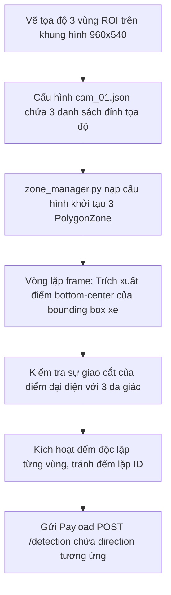

# Nhiệm Vụ 7: Cấu Hình 3 Vùng Kiểm Soát ROI & Đồng Bộ Hướng Phân Tách Computer Vision
**Mã nhiệm vụ:** `TASK_CV_07` | **Giai đoạn:** 3 | **Thời gian thực hiện dự kiến:** Ngày 15 - Ngày 17

---

## 1. Mô Tả Nhiệm Vụ
Hệ thống Computer Vision hiện tại đang sử dụng cấu hình mặc định đếm xe đi qua một vùng polygon lớn duy nhất chắn ngang nửa dưới của Camera `CAM_01`. Các sự kiện đếm xe gửi lên backend vì thế chưa phân định rõ rệt phương tiện đó sẽ rẽ trái, đi thẳng hay rẽ phải để làm dữ liệu tự động cho ML.

Nhiệm vụ này yêu cầu thiết lập lại cấu trúc hình học đếm xe bằng cách vẽ và định vị **3 đa giác kiểm soát ROI độc lập (Polygon ROI Zones)** đặt chặn tại 3 làn di chuyển tương ứng trên khung hình chuẩn. Tiến trình CV sẽ dựa vào thuật toán bám đuổi (ByteTrack) để xác định quỹ đạo của phương tiện đi qua đa giác nào, từ đó gán nhãn hướng di chuyển chính xác (`direction` bằng `left`, `straight` hoặc `right`) và đẩy sự kiện thật về Backend.

---

## 2. Dữ Liệu Đầu Vào (Inputs)
- **Tệp cấu hình camera mặc định:** `detection/configs_cameras/cam_01.json`.
- **Video mẫu chạy thử:** [traffic1.mp4](file:///D:/GIT%20REPO/trafffic-density-analysis-system/traffic-density-analysis-system/data/video/traffic1.mp4).
- **Mã nguồn xử lý CV:**
  - `detection/engine/zone_manager.py` (Quản lý đa giác).
  - `detection/main.py` (Luồng chạy chính).
- **Thư viện chính:** `supervision` (cung cấp lớp `PolygonZone` và `PolygonZoneAnnotator`).

---

## 3. Dữ Liệu Đầu Ra (Outputs)
- **Tệp cấu hình mới nâng cấp:** `detection/configs_cameras/cam_01.json` chứa thông tin tọa độ của 3 đa giác ROI.
- **API Payload gửi từ CV về Backend (`POST /detection`):**
  ```json
  {
    "event_id": "cam01_str_1716447600_948",
    "camera_id": "CAM_01",
    "track_id": 948,
    "vehicle_type": "car",
    "direction": "straight",   // Có thể là: straight, left, right
    "timestamp": "2026-05-23T02:00:15Z"
  }
  ```

---

## 4. Luồng Chạy Chi Tiết (Execution Flow)
Tác vụ được triển khai thông qua các bước xử lý ảnh và bám đuổi hành trình đối tượng:



### Hướng dẫn thiết lập tọa độ đa giác (ROI Coordinates Calibration):
1. **Thiết lập Đa giác 3 Làn:**
   Mở video mẫu bằng OpenCV để lấy kích thước khung hình chuẩn (hệ thống đang cấu hình `TARGET_WIDTH = 960`, do đó kích thước frame chuẩn sẽ là $960 \times 540$ pixel). Xác định các góc đỉnh đa giác của 3 làn đường:
   - **Vùng làn Trái (`zone_left`):** Đa giác bo hẹp làn đường rẽ trái phía bên trái màn hình.
   - **Vùng làn Thẳng (`zone_straight`):** Đa giác chắn làn đường rộng ở giữa chạy thẳng lên.
   - **Vùng làn Phải (`zone_right`):** Đa giác chắn lối rẽ nhỏ phía bên tay phải khung hình.
2. **Cập nhật `configs_cameras/cam_01.json`:**
   Lưu trữ các mảng điểm $[x, y]$ vào file cấu hình:
   ```json
   {
     "camera_id": "CAM_01",
     "baseline_green": 30,
     "zones": {
       "left": [[100, 480], [280, 320], [380, 320], [250, 480]],
       "straight": [[300, 480], [420, 300], [580, 300], [520, 480]],
       "right": [[580, 480], [620, 350], [750, 350], [820, 480]]
     }
   }
   ```
   *(Tọa độ trên chỉ mang tính minh họa, cần căn chỉnh cụ thể dựa trên góc nhìn thực tế của camera)*.

### Logic xử lý bám đuổi & Đếm xe (Tracking & Counting):
1. **Khởi tạo:**
   Lớp `ZoneManager` trong `zone_manager.py` đọc cấu hình `zones` từ file JSON, khởi tạo 3 đối tượng `sv.PolygonZone` độc lập với kích thước khung hình $960 \times 540$.
2. **Kiểm tra va chạm vùng đếm:**
   - Tại mỗi khung hình, sau khi ByteTrack thực hiện gán ID và trả về tọa độ các xe, xác định điểm tọa độ đáy trung tâm (Bottom-Center Point: $P = (x_{center}, y_{max})$) đại diện cho vị trí tiếp đất của phương tiện.
   - Truyền điểm $P$ của tất cả các xe vào 3 vùng `PolygonZone.trigger()`.
   - Nếu một `track_id` lần đầu tiên chạm vào `zone_left`, hệ thống ghi nhận đếm hướng `left`. Tương tự cho `straight` và `right`.
   - Lưu trữ lịch sử `counted_ids` trong RAM để đảm bảo 1 chiếc xe chỉ kích hoạt gửi sự kiện duy nhất 1 lần trên hành trình của mình.
3. **Gửi sự kiện:**
   Đóng gói thông tin và đẩy dữ liệu sự kiện thời gian thực lên backend FastAPI endpoint `/detection` bằng giao thức HTTP POST.

---

## 5. Kiểm Tra & Xác Thực (Verification Plan)
Để xác nhận việc cấu hình tọa độ và phân tách hướng đi của Computer Vision hoàn toàn chính xác, hãy chạy kiểm tra trực quan (Visual Smoke Test):

- **Lệnh khởi động luồng CV có hiển thị màn hình:**
  ```powershell
  # Đảm bảo hiển thị giao diện UI OpenCV để giám sát trực quan
  $env:NO_DISPLAY="false"
  $env:DRY_RUN="false"
  python -m detection.main
  ```
- **Các bước kiểm duyệt chất lượng trực quan:**
  1. **Kiểm tra giao diện:** Trên màn hình OpenCV hiện ra, bạn phải quan sát thấy 3 khung đa giác (màu sắc khác nhau như xanh lá, đỏ, lam) được vẽ đè lên 3 làn xe rõ rệt.
  2. **Kiểm tra đếm làn:** Khi một chiếc xe đi thẳng vượt vạch, số đếm tích lũy của làn thẳng phải tăng lên, trong khi số đếm làn trái và làn phải không được thay đổi.
  3. **Kiểm tra nhật ký:** Mở cơ sở dữ liệu MongoDB collection `vehicle_detections` để xác nhận các bản ghi mới ghi nhận trường `direction` có sự phân bổ đều đặn các giá trị: `straight`, `left`, `right`.
