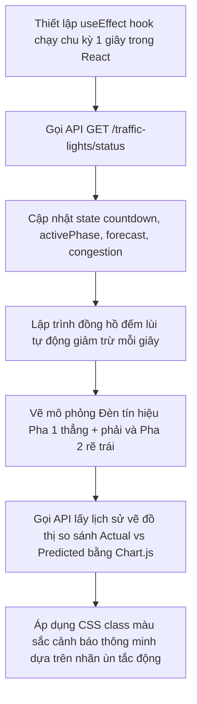

# Nhiệm Vụ 8: Đồng Bộ Hóa Giao Diện Đèn Tín Hiệu & Dự Báo Thời Gian Thực Trên Dashboard
**Mã nhiệm vụ:** `TASK_FE_08` | **Giai đoạn:** 3 | **Thời gian thực hiện dự kiến:** Ngày 18 - Ngày 19

---

## 1. Mô Tả Nhiệm Vụ
Trang quản trị Dashboard React (`frontend/`) hiện tại đóng vai trò hiển thị trực quan các thông số của hệ thống cho người điều hành. Tuy nhiên, ở các phiên bản trước, giao diện vẫn đang sử dụng dữ liệu giả lập sinh ngẫu nhiên (mock/random) để chạy thanh tiến trình đếm ngược đèn tín hiệu và vẽ đồ thị dự báo lưu lượng của các làn rẽ.

Nhiệm vụ này yêu cầu cập nhật mã nguồn giao diện React JS trong tệp `App.js` để kết nối trực tiếp với các API thật của Backend FastAPI. Dashboard sẽ hiển thị đồng hồ đếm ngược pha đèn tín hiệu đồng bộ từ file `light_status.json` do AI tối ưu hóa, vẽ đồ thị dự báo lưu lượng 3 hướng thực tế và hiển thị màu sắc cảnh báo thông minh dựa trên cấp độ ùn tắc tự thích ứng của từng làn.

---

## 2. Dữ Liệu Đầu Vào (Inputs)
- **Mã nguồn Frontend:**
  - [App.js](file:///D:/GIT%20REPO/trafffic-density-analysis-system/traffic-density-analysis-system/frontend/src/App.js).
  - [App.css](file:///D:/GIT%20REPO/trafffic-density-analysis-system/traffic-density-analysis-system/frontend/src/App.css).
- **API Endpoints từ Backend:**
  - `GET /traffic-lights/status` (Trả về nội dung tệp tin `light_status.json`).
  - `GET /predictions/history?limit=10` (Lấy lịch sử dự báo của AI để vẽ biểu đồ).
  - `GET /aggregation/history?limit=10` (Lấy lưu lượng xe thực tế đã tổng hợp để đối chiếu).

---

## 3. Dữ Liệu Đầu Ra (Outputs)
- **Giao diện Dashboard hoàn thiện:** Hoạt động tại địa chỉ `http://localhost:3000`, hiển thị dữ liệu trực quan đồng bộ 100% thời gian thực với hệ thống điều phối ngầm. Không còn chứa bất kỳ lô-gích mock số liệu ngẫu nhiên nào.

---

## 4. Luồng Chạy Chi Tiết (Execution Flow)
Các bước triển khai lập trình trong React Component được thực hiện tuần tự như sau:



### Chi tiết các bước cập nhật mã nguồn React:
1. **Thiết lập Vòng lặp lấy dữ liệu (Polling & Sync):**
   - Sử dụng `useEffect` thiết lập một bộ hẹn giờ `setInterval` chạy chu kỳ 2 giây gửi yêu cầu fetch dữ liệu từ Backend endpoint `/traffic-lights/status`.
   - Lưu trữ phản hồi JSON vào React State: `lightState`.
   - Thiết lập một tiến trình đếm ngược cục bộ chạy mỗi 1 giây (`setInterval` 1000ms):
     - Lấy số giây còn lại từ `lightState.phases.phase_x.duration`.
     - Tự động trừ đi 1 giây sau mỗi chu kỳ lặp để đảm bảo kim đồng hồ đếm ngược chạy mượt mà trên UI.
     - Khi đồng hồ giảm về 0 hoặc khi nhận được trạng thái chu kỳ pha mới từ API, đồng bộ lại số giây xanh từ dữ liệu server.
2. **Thiết lập hiển thị Đèn Tín Hiệu theo Pha (Phase Signal Visualization):**
   - Lập trình vẽ 2 cụm đèn độc lập:
     - **Cụm đèn Pha 1 (Làn Thẳng + Phải):** Hiển thị đèn xanh kèm thời gian đếm ngược của Pha 1 khi `phase_1.status === "GREEN"`. Lúc này, cụm đèn Pha 2 hiển thị màu đỏ.
     - **Cụm đèn Pha 2 (Làn Rẽ Trái):** Hiển thị màu xanh kèm thời gian đếm ngược của Pha 2 khi `phase_2.status === "GREEN"`. Lúc này, cụm đèn Pha 1 hiển thị màu đỏ.
3. **Cập nhật Biểu đồ Hồi quy (Regression Chart Sync):**
   - Đọc dữ liệu lịch sử dự báo và thực tế từ hai API `/predictions/history` và `/aggregation/history`.
   - Trích xuất 3 dòng dữ liệu chuỗi thời gian tương ứng với 3 hướng: đi thẳng, rẽ trái, rẽ phải.
   - Nạp dữ liệu vào cấu hình Dataset của Chart.js để vẽ 3 cặp đường so sánh song song: Thực tế (Actual) vs Dự báo (Predicted) cho từng hướng rẽ cụ thể của camera.
4. **Phân cấp màu sắc cảnh báo thông minh (Dynamic Congestion Styling):**
   - Áp dụng các quy tắc tạo CSS class động dựa trên chuỗi nhãn mật độ `congestion_levels` nhận được từ AI:
     - Nhãn `Low` $\rightarrow$ Class `.status-low` $\rightarrow$ Background xanh lục dịu mắt (`#10B981` / HSL).
     - Nhãn `Medium` $\rightarrow$ Class `.status-medium` $\rightarrow$ Background vàng nhạt ấm áp (`#F59E0B`).
     - Nhãn `High` $\rightarrow$ Class `.status-high` $\rightarrow$ Background màu cam hổ phách (`#F97316`).
     - Nhãn `Heavy` $\rightarrow$ Class `.status-heavy` $\rightarrow$ Background màu đỏ báo động chói sáng (`#EF4444` kèm hiệu ứng nhấp nháy pulse nhẹ).

---

## 5. Kiểm Tra & Xác Thực (Verification Plan)
Để đảm bảo giao diện hiển thị chính xác, hãy tiến hành kiểm tra tích hợp đầu cuối (End-to-End Test):

1. **Khởi động toàn bộ các dịch vụ nền:**
   - Đảm bảo MongoDB, FastAPI Backend, CV Engine (đọc video) và Orchestrator Runner đang chạy ổn định.
2. **Khởi chạy máy chủ Frontend:**
   ```powershell
   cd frontend
   npm start
   ```
3. **Các tiêu chí nghiệm thu giao diện (Acceptance Criteria):**
   - **Tính đồng bộ:** Con số đếm ngược giây đèn xanh hiển thị trên giao diện trình duyệt web phải khớp hoàn toàn với số giây được ghi trong file `light_status.json` do hệ thống runner quản lý.
   - **Tính động:** Khi video chạy qua các phân đoạn đông xe đột ngột, các thẻ hiển thị làn xe phải tự động chuyển màu linh hoạt tương ứng với các thay đổi mật độ.
   - **Biểu đồ:** Biểu đồ Chart.js vẽ đầy đủ các mốc thời gian lịch sử, không xuất hiện các lỗi trắng trang (crash UI) do thiếu dữ liệu hoặc sai định dạng.
