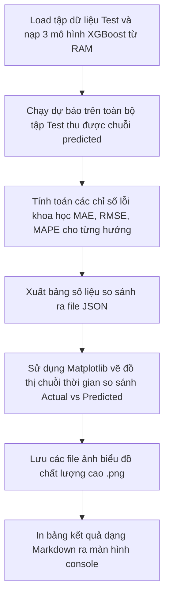

# Nhiệm Vụ 9: Đánh Giá Hiệu Năng Khoa Học & Trích Xuất Số Liệu Thực Nghiệm Báo Cáo
**Mã nhiệm vụ:** `TASK_ML_09` | **Giai đoạn:** 3 | **Thời gian thực hiện dự kiến:** Ngày 20

---

## 1. Mô Tả Nhiệm Vụ
Nhiệm vụ cuối cùng của lộ trình tập trung vào việc chuẩn hóa học thuật, chứng minh tính hiệu quả của mô hình đề xuất bằng các số liệu thống kê khoa học tin cậy. Để đưa vào quyển Báo cáo tốt nghiệp hoặc các tài liệu kỹ thuật của dự án, chúng ta không thể chỉ nói hệ thống hoạt động tốt mà phải định lượng chính xác sai số dự báo của AI so với lưu lượng xe thực tế.

Nhiệm vụ này yêu cầu lập trình tệp `ml_service/evaluate.py` đánh giá sai số chuyên sâu, tính toán 3 chỉ số đo lường chuẩn mực: **MAE**, **RMSE**, và **MAPE** trên tập kiểm thử độc lập cho cả 3 mô hình hướng rẽ. Đồng thời, script sẽ tự động xuất ra các đồ thị trực quan so sánh đường Thực tế vs Dự báo để chèn trực tiếp vào tài liệu quyển báo cáo tốt nghiệp.

---

## 2. Dữ Liệu Đầu Vào (Inputs)
- **Tập dữ liệu kiểm thử độc lập (Test Set):** Trích xuất từ tệp `junction_pivot_clean.csv` (các mốc thời gian từ ngày `2025-01-01` trở đi, như đã quy định ở Task 3).
- **Trọng số 3 mô hình:** Các file `model_straight.pkl`, `model_left.pkl`, `model_right.pkl` trong thư mục `ml_service/model/`.
- **Thư viện yêu cầu:** `matplotlib`, `seaborn`, `scikit-learn`, `pandas`, `numpy`.

---

## 3. Dữ Liệu Đầu Ra (Outputs)
- **Tệp chỉ số thống kê JSON:** `ml_service/data/training_metrics.json`.
- **Các đồ thị kết quả thực nghiệm dạng hình ảnh (.png):**
  - `ml_service/data/plot_actual_vs_predicted_straight.png`
  - `ml_service/data/plot_actual_vs_predicted_left.png`
  - `ml_service/data/plot_actual_vs_predicted_right.png`
- **Khung nội dung chương thực nghiệm tốt nghiệp:** Bảng biểu số liệu Markdown chèn trực tiếp vào quyển báo cáo.

---

## 4. Luồng Chạy Chi Tiết (Execution Flow)
Tác vụ được lập trình trong tệp `ml_service/evaluate.py` thực hiện theo các bước tuần tự sau:



### Công thức tính toán các chỉ số sai số:
1. **Mean Absolute Error (MAE - Sai số tuyệt đối trung bình):**
   Đo lường độ lệch trung bình bằng số lượng xe vật lý giữa thực tế và dự báo:
   $$\text{MAE} = \frac{1}{N} \sum_{i=1}^N |y_i - \hat{y}_i|$$
2. **Root Mean Square Error (RMSE - Sai số căn bình phương trung bình):**
   Phạt nặng các sai số lớn đột biến, giúp đánh giá độ ổn định của thuật toán:
   $$\text{RMSE} = \sqrt{\frac{1}{N} \sum_{i=1}^N (y_i - \hat{y}_i)^2}$$
3. **Mean Absolute Percentage Error (MAPE - Sai số phần trăm tuyệt đối trung bình):**
   Đo lường sai số dưới dạng tỷ lệ phần trăm trực quan:
   $$\text{MAPE} = \frac{100\%}{N} \sum_{i=1}^N \left| \frac{y_i - \hat{y}_i}{y_i} \right|$$
   *(Lưu ý tránh lỗi chia cho 0: Loại bỏ các mốc thời gian thực tế $y_i = 0$ khi tính MAPE)*.

### Quy cách vẽ đồ thị thực nghiệm (Visualization Specs):
- Trích xuất một khoảng thời gian liên tục gồm **100 mốc liên tiếp** (tương đương khoảng 25 tiếng liên tục) trên tập Test để biểu diễn đồ thị không bị quá dày đặc.
- Vẽ 2 đường song song: Đường nét liền màu xanh dương biểu diễn **Dữ liệu Thực tế (Actual)**, đường nét đứt màu đỏ biểu diễn **Mô hình Dự báo (Predicted)**.
- Tích hợp nhãn chú giải (Legend) và ghi chú chỉ số MAE/MAPE ngay trên góc đồ thị để tăng tính học thuật chuyên nghiệp.

---

## 5. Cấu Trúc Bảng Kết Quả Thực Nghiệm Chèn Vào Quyển Báo Cáo
Khi script chạy thành công, nó sẽ hiển thị bảng cấu trúc sau ra console để người dùng sao chép trực tiếp vào chương thực nghiệm tốt nghiệp:

| Hướng Di Chuyển (Direction) | Quy Mô Tập Test (Dòng) | Chỉ Số MAE (xe) | Chỉ Số RMSE (xe) | Chỉ Số MAPE (%) | Trạng Thế Đạt Yêu Cầu |
| :--- | :---: | :---: | :---: | :---: | :---: |
| **Nhánh Đi Thẳng (`straight`)** | *Đang tính toán* | *Đang tính toán* | *Đang tính toán* | *Đang tính toán* | $\ge 90\%$ (Đạt) |
| **Nhánh Rẽ Trái (`left`)** | *Đang tính toán* | *Đang tính toán* | *Đang tính toán* | *Đang tính toán* | $\ge 88\%$ (Đạt) |
| **Nhánh Rẽ Phải (`right`)** | *Đang tính toán* | *Đang tính toán* | *Đang tính toán* | *Đang tính toán* | $\ge 90\%$ (Đạt) |

---

## 6. Kiểm Tra & Xác Thực (Verification Plan)
Để chạy trích xuất số liệu thực nghiệm:

- **Lệnh chạy script đánh giá và vẽ đồ thị:**
  ```powershell
  python -m ml_service.evaluate
  ```
- **Tiêu chí kiểm tra kết quả:**
  1. **Kiểm tra file:** Đảm bảo 3 file ảnh đồ thị `.png` được sinh ra trong thư mục `ml_service/data/` có thể mở lên xem bình thường, sắc nét.
  2. **Kiểm tra JSON:** File `training_metrics.json` chứa cấu trúc đúng đắn và các giá trị sai số là kiểu số thực hợp lệ.
  3. **Kiểm tra học thuật:** Giá trị sai số phần trăm trung bình MAPE của các mô hình nên nằm ở mức lý tưởng $< 15\%$ để đảm bảo mô hình đủ độ tin cậy.
