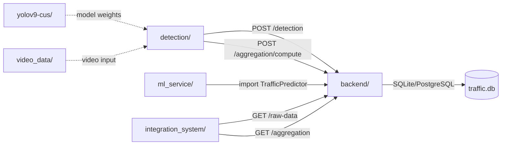

# 📊 Traffic Density Analysis System — Tổng Quan Dự Án

## 1. Giới Thiệu

**Traffic Density Analysis System** là một hệ thống phân tích mật độ giao thông thời gian thực, sử dụng Computer Vision (YOLOv9) để nhận diện và theo dõi phương tiện, kết hợp Machine Learning (XGBoost) để dự báo lưu lượng xe trong tương lai. Hệ thống được chia thành **4 module chính** giao tiếp với nhau qua REST API.

---

## 2. Kiến Trúc Tổng Thể

```
┌─────────────────┐     HTTP POST /detection     ┌─────────────────┐
│                 │ ──────────────────────────▶   │                 │
│   detection/    │     POST /aggregation/compute │   backend/      │
│  (Module A)     │ ──────────────────────────▶   │  (Module B)     │
│  Detect + Track │                               │  FastAPI + DB   │
└─────────────────┘                               └────────┬────────┘
                                                           │
                        GET /aggregation                   │
┌─────────────────┐ ◀─────────────────────────────         │
│ integration_    │     GET /raw-data                      │
│ system/         │ ◀─────────────────────────────         │
│ (Module D)      │                               ┌───────┴────────┐
│ Tích hợp hệ    │                               │                │
│ thống           │                               │  ml_service/   │
└─────────────────┘                               │  (Module C)    │
                        GET /predict-next         │  Dự báo ML     │
                    ◀─────────────────────────────┤                │
                                                  └────────────────┘
```

### Luồng Dữ Liệu Chính

```
Video/Camera ──▶ detection/main.py
                   │
                   ├─▶ Detect (YOLOv9) ──▶ Track (ByteTrack)
                   │
                   ├─▶ Zone crossing? ──▶ EventGenerator ──▶ POST /detection ──▶ vehicle_detections (DB)
                   │
                   └─▶ Mỗi 15 phút ──▶ POST /aggregation/compute ──▶ traffic_aggregation (DB)
                                                                          │
                                                                          ▼
                                                          GET /predict-next ──▶ ML Predict (XGBoost)
                                                                                    │
                                                                                    ▼
                                                                        traffic_predictions (DB)
```

---

## 3. Cây Thư Mục

```
traffic-density-analysis-system/
│
├── detection/                          # MODULE A: Nhận diện & theo dõi phương tiện
│   ├── __init__.py
│   ├── main.py                         # Entry point - vòng lặp xử lý video chính
│   ├── camera_engine.py                # Đọc video/camera bằng OpenCV
│   │
│   ├── engine/                         # Core engine xử lý Computer Vision
│   │   ├── __init__.py
│   │   ├── detector.py                 # YOLOv9 inference - nhận diện phương tiện
│   │   ├── tracker.py                  # ByteTrack - theo dõi phương tiện qua các frame
│   │   ├── counter.py                  # Đếm phương tiện (tổng + theo phút)
│   │   ├── density_estimator.py        # Ước lượng mật độ giao thông (LOW/MEDIUM/HIGH)
│   │   ├── zone_manager.py             # Quản lý vùng đếm (polygon zone)
│   │   ├── event_generator.py          # Tạo event khi xe vượt zone
│   │   └── frame_processor.py          # Tiền xử lý frame (resize)
│   │
│   ├── integration/                    # Gửi event đến backend
│   │   ├── __init__.py
│   │   └── publisher.py                # Non-blocking HTTP publisher (queue)
│   │
│   ├── configs_cameras/                # Cấu hình camera & vùng đếm
│   │   └── cam_01.json                 # Zone polygon cho camera CAM_01
│   │
│   ├── pro_models/                     # Trọng số model YOLOv9
│   │   ├── yolov9c.pt                  # Model pre-trained gốc (COCO)
│   │   ├── yolov9_img960_ultimate.pt   # Model custom đã fine-tune
│   │   ├── yolov9_ultimate_final.pt    # Model custom (bản khác)
│   │   └── best_final.pt              # Model custom (best)
│   │
│   ├── Ultralytics/                    # Config dir cho Ultralytics (tránh download)
│   └── ultralytics_yolov9/            # Code core YOLOv9 (models + utils)
│
├── backend/                            # MODULE B: Backend API & Database
│   ├── main.py                         # Entry point FastAPI app
│   ├── config.py                       # Cấu hình (database URL, page size, ...)
│   ├── database.py                     # SQLAlchemy engine, session, schema migration
│   ├── seed_data.py                    # Script tạo dữ liệu mẫu từ detection data
│   ├── README.md                       # Tài liệu chi tiết backend
│   │
│   ├── api/                            # API Routes (controllers)
│   │   ├── detection_routes.py         # POST /detection
│   │   ├── traffic_routes.py           # GET /raw-data
│   │   ├── aggregation_routes.py       # GET /aggregation, GET /aggregation/history, POST /aggregation/compute
│   │   ├── prediction_routes.py        # GET /predict-next, GET /predictions/history
│   │   ├── camera_routes.py            # GET /cameras, POST /cameras
│   │   └── health_routes.py            # GET /health
│   │
│   ├── models/                         # SQLAlchemy ORM models
│   │   ├── __init__.py                 # Export tất cả models
│   │   ├── vehicle_detection.py        # Bảng vehicle_detections
│   │   ├── traffic_aggregation.py      # Bảng traffic_aggregation
│   │   ├── traffic_prediction.py       # Bảng traffic_predictions
│   │   └── camera.py                   # Bảng cameras
│   │
│   ├── schemas/                        # Pydantic schemas (request/response validation)
│   │   ├── detection_schema.py         # Schema cho detection API
│   │   ├── aggregation_schema.py       # Schema cho aggregation API
│   │   ├── prediction_schema.py        # Schema cho prediction API
│   │   ├── camera_schema.py            # Schema cho camera API
│   │   └── traffic_schema.py           # Schema cho traffic API
│   │
│   └── services/                       # Business logic layer
│       ├── db_service.py               # Database session dependency injection
│       ├── detection_service.py        # CRUD cho vehicle_detections
│       ├── aggregation_service.py      # Gom dữ liệu + tính mức ùn tắc
│       ├── prediction_service.py       # Dự báo mật độ (gọi ml_service hoặc fallback)
│       └── camera_service.py           # CRUD cho cameras
│
├── ml_service/                         # MODULE C: Machine Learning - Dự báo
│   ├── traffic_predictor.py            # Class TrafficPredictor (XGBoost)
│   ├── train.py                        # Script huấn luyện model
│   ├── predict.py                      # Script test dự báo qua API
│   └── model.pkl                       # Model đã huấn luyện (serialized)
│
├── integration_system/                 # MODULE D: Tích hợp hệ thống
│   ├── system_runner.py                # Entry point - chạy pipeline tích hợp
│   ├── congestion_classifier.py        # Phân loại mức ùn tắc local
│   ├── traffic_light_logic.py          # Tối ưu đèn giao thông
│   ├── performance_monitor.py          # Giám sát CPU/RAM
│   ├── scheduler.py                    # Lập lịch gọi aggregation + prediction
│   └── pipeline_test.py               # Test pipeline end-to-end
│
├── yolov9-cus/                         # Training & Evaluation YOLOv9
│   ├── auto_label_test_images.py       # Auto-label + so sánh 2 models
│   ├── AUTO_LABEL_DUAL_MODELS_README.md
│   ├── CHANGES_DETAILED.md
│   ├── CLASS_MAPPING_FIX.md
│   ├── dataset/                        # Dataset training (images + labels)
│   ├── dataset2/                       # Dataset bổ sung
│   └── yolov9/                         # Code gốc YOLOv9 + tài liệu phân tích
│       ├── analysis.md
│       ├── detect_track_analysis.md
│       └── figure/                     # Biểu đồ kết quả
│
├── video_data/                         # Video đầu vào để test
│   ├── traffic1.mp4
│   └── traffictrim.mp4
│
├── md_file/                            # Tài liệu báo cáo dự án
│   ├── BAO_CAO_DU_AN.md
│   ├── BAO_CAO_TIEN_TRINH_DU_AN.md
│   ├── BAO_CAO_GIAI_DOAN_2_MODULE_B.md
│   ├── BAO_CAO_MODULE_B_BACKEND.md
│   ├── MODULE_INTEGRATION_SYSTEM.md
│   └── MODULE_ML_SERVICE.md
│
├── traffic.db                          # SQLite database
├── yolov9c.pt                          # Trọng số YOLOv9 pre-trained (root)
├── requirements.txt                    # Danh sách thư viện Python
├── traffic_density_git_project.ipynb   # Notebook thử nghiệm
├── README.md                           # Hướng dẫn chạy dự án
└── .gitignore
```

---

## 4. Chi Tiết Từng Module

### 4.1. Module A — `detection/` (Nhận Diện & Theo Dõi)

**Mục đích**: Đọc video/camera → nhận diện phương tiện → theo dõi → đếm → gửi event đến backend.

| File | Chức năng |
|------|-----------|
| `main.py` | Vòng lặp chính: đọc frame → pipeline detect/track → gửi event. Hỗ trợ Dynamic Frame Skip (skip nhiều frame khi đường vắng, ít frame khi đông). Tự gọi aggregation mỗi 15 phút video. |
| `camera_engine.py` | Wrapper OpenCV `VideoCapture`. Cung cấp `read()`, `get_video_ms()` (timestamp video), `get_fps()`. |
| `engine/detector.py` | Load model YOLOv9 bằng `torch.load()`. Inference 960×960, NMS, lọc vehicle classes (bus, car, motorcycle, truck). |
| `engine/tracker.py` | Sử dụng **ByteTrack** (qua thư viện `supervision`) để gán ID theo dõi cho mỗi phương tiện qua nhiều frame. |
| `engine/counter.py` | Đếm tổng phương tiện theo loại + đếm theo chu kỳ 1 phút (dựa theo thời gian video). |
| `engine/density_estimator.py` | Rolling window (10 frame) tính trung bình số xe → phân loại LOW (<5), MEDIUM (<15), HIGH (≥15). |
| `engine/zone_manager.py` | Quản lý polygon zone. Kiểm tra xe có vượt qua zone hay không (dùng `cv2.pointPolygonTest`). Dùng OrderedDict FIFO tránh memory leak. |
| `engine/event_generator.py` | Tạo dict event chứa: `event_id` (UUID), `camera_id`, `track_id`, `vehicle_type`, `density`, `timestamp`. |
| `engine/frame_processor.py` | Resize frame về `target_width` (960px) giữ tỉ lệ. |
| `integration/publisher.py` | Non-blocking publisher: đẩy event vào Queue (max 200), background thread gửi HTTP POST. Nếu queue đầy, bỏ event cũ nhất. |
| `configs_cameras/cam_01.json` | Cấu hình zone cho camera CAM_01: polygon 4 điểm xác định vùng đếm. |

**Luồng xử lý trong main.py:**

```
1. Đọc frame từ video
2. Dynamic Frame Skip (dựa vào density frame trước)
3. FrameProcessor.process() → resize
4. Detector.detect() → list bounding boxes
5. Tracker.update() → gán track_id
6. DensityEstimator.update() → cập nhật mật độ
7. Với mỗi track:
   ├── ZoneManager.check_crossing() → xe đã vào zone?
   ├── VehicleCounter.count() → tăng bộ đếm
   ├── EventGenerator.generate() → tạo event
   └── EventPublisher.publish() → gửi backend (async)
8. Vẽ bounding box + density lên frame
9. Mỗi 15 phút video → trigger POST /aggregation/compute
```

---

### 4.2. Module B — `backend/` (Backend API & Database)

**Mục đích**: Nhận dữ liệu từ detection, lưu trữ, gom nhóm (aggregation), dự báo, và cung cấp API cho các module khác.

**Framework**: FastAPI + SQLAlchemy + SQLite (có thể đổi sang PostgreSQL).

#### API Endpoints

| Method | Endpoint | Chức năng |
|--------|----------|-----------|
| `POST` | `/detection` | Nhận event phát hiện phương tiện từ Module A, lưu vào `vehicle_detections` |
| `GET` | `/raw-data` | Truy vấn dữ liệu thô với filter (camera_id, vehicle_type, density, time range) |
| `GET` | `/aggregation` | Lấy thống kê gom nhóm (realtime hoặc từ DB) |
| `GET` | `/aggregation/history` | Lịch sử aggregation (phân trang) |
| `POST` | `/aggregation/compute` | Gom dữ liệu 15 phút gần nhất, tính congestion level, lưu DB |
| `GET` | `/predict-next` | Dự báo lưu lượng 15 phút tới (gọi ML hoặc fallback trung bình) |
| `GET` | `/predictions/history` | Lịch sử dự báo (phân trang) |
| `GET` | `/cameras` | Danh sách camera |
| `POST` | `/cameras` | Thêm camera |
| `GET` | `/health` | Health check (status + database) |

#### Database Schema

| Bảng | Cột chính | Mô tả |
|------|-----------|-------|
| `vehicle_detections` | id, event_id, camera_id, track_id, vehicle_type, density, event_type, confidence, timestamp | Mỗi sự kiện xe vượt zone |
| `traffic_aggregation` | id, camera_id, vehicle_count, congestion_level, timestamp | Thống kê gom nhóm theo chu kỳ |
| `traffic_predictions` | id, camera_id, predicted_density, horizon_minutes, source, timestamp | Kết quả dự báo |
| `cameras` | id, camera_id, name, location | Thông tin camera |

#### Kiến trúc phân lớp

```
api/ (Routes/Controllers)
  └── Nhận request, validation, gọi service
schemas/ (Pydantic)
  └── Request/Response schemas, validation rules
services/ (Business Logic)
  └── CRUD, aggregation logic, prediction logic
models/ (ORM)
  └── SQLAlchemy models mapping database tables
database.py
  └── Engine, Session, schema migration
config.py
  └── Environment-based configuration
```

#### Công thức tính mức ùn tắc (`compute_congestion`)

| Số xe | Mức độ |
|-------|--------|
| < 10  | Low |
| < 30  | Medium |
| < 60  | High |
| ≥ 60  | Severe |

---

### 4.3. Module C — `ml_service/` (Machine Learning)

**Mục đích**: Huấn luyện và sử dụng model XGBoost để dự báo lưu lượng giao thông 15 phút tiếp theo.

| File | Chức năng |
|------|-----------|
| `traffic_predictor.py` | Class `TrafficPredictor` — core ML: feature engineering, train (TimeSeriesSplit 5-fold CV), predict |
| `train.py` | Script huấn luyện: đọc CSV `urban_traffic.csv` → train → lưu `model.pkl` |
| `predict.py` | Script test: gọi API `GET /predict-next` → hiển thị kết quả |
| `model.pkl` | Model XGBoost đã serialize bằng joblib |

#### Feature Engineering

| Feature | Mô tả |
|---------|-------|
| `hour` | Giờ trong ngày (0-23) |
| `day_of_week` | Ngày trong tuần (0=Thứ 2, 6=Chủ nhật) |
| `is_peak_hour` | 1 nếu giờ 7-9 hoặc 17-19, ngược lại 0 |
| `lag_1` | Số xe 15 phút trước |
| `lag_2` | Số xe 30 phút trước |
| `rolling_mean_3` | Trung bình 3 khung gần nhất |

#### Quy trình dự báo (Tích hợp vào Backend)

```
backend/services/prediction_service.py
   │
   ├── Lấy N bản ghi aggregation gần nhất từ DB
   │
   ├── Nếu có model.pkl + đủ ≥3 dòng dữ liệu:
   │   └── Gọi TrafficPredictor.predict() → source = "ml_service"
   │
   └── Nếu không:
       └── Tính trung bình vehicle_count → source = "fallback"
```

---

### 4.4. Module D — `integration_system/` (Tích Hợp Hệ Thống)

**Mục đích**: Tích hợp các module lại, bổ sung phân loại ùn tắc, tối ưu đèn giao thông, giám sát hiệu năng.

| File | Chức năng |
|------|-----------|
| `system_runner.py` | Entry point: vòng lặp 5 giây, gọi `/raw-data` → `/aggregation` → phân loại → tối ưu đèn → monitor |
| `congestion_classifier.py` | Phân loại mức ùn tắc local: Low (<15), Medium (<30), High (<50), Severe (≥50) |
| `traffic_light_logic.py` | Tối ưu thời gian đèn xanh: Low=20s, Medium=40s, High=60s, Severe=90s |
| `performance_monitor.py` | Đo CPU% và RAM% bằng `psutil` |
| `scheduler.py` | Lập lịch gọi aggregation + ML prediction mỗi 60 giây |
| `pipeline_test.py` | Test pipeline đơn giản với vehicle_count ngẫu nhiên |

---

### 4.5. `yolov9-cus/` (Training & Đánh Giá Model)

**Mục đích**: Chứa code huấn luyện custom YOLOv9, auto-label, đánh giá so sánh model.

| File/Folder | Chức năng |
|-------------|-----------|
| `auto_label_test_images.py` | Script inference 2 model (custom vs pre-trained) trên tập test, tạo label YOLO format, báo cáo so sánh CSV |
| `dataset/`, `dataset2/` | Dataset gồm images + labels (YOLO format) cho train/val/test |
| `yolov9/` | Source code gốc YOLOv9 + tài liệu phân tích (analysis.md, detect_track_analysis.md) |

#### Custom Vehicle Classes

| Class ID | Tên |
|----------|-----|
| 0        | bus |
| 1        | car |
| 2        | motorcycle |
| 3        | truck |

---

## 5. Công Nghệ & Thư Viện

### 5.1. Core AI — Detection & Tracking

| Thư viện | Phiên bản | Vai trò |
|----------|-----------|---------|
| **PyTorch** (`torch`, `torchvision`) | — | Framework deep learning, load model YOLOv9, inference, NMS |
| **OpenCV** (`opencv-python`) | — | Đọc video, xử lý frame, vẽ bounding box, resize |
| **Supervision** (`supervision`) | — | ByteTrack tracker, tiện ích Computer Vision |
| **NumPy** (`numpy`) | — | Xử lý mảng số, tọa độ bounding box |
| **Ultralytics** (`ultralytics`) | — | Tiện ích YOLO (config, model loading) |
| **SciPy** (`scipy`) | — | Thuật toán Hungarian matching (cho tracking) |
| **Shapely** (`shapely`) | — | Xử lý hình học đa giác |

### 5.2. Machine Learning

| Thư viện | Vai trò |
|----------|---------|
| **XGBoost** (`xgboost`) | Thuật toán gradient boosting cho dự báo lưu lượng |
| **scikit-learn** (`scikit-learn`) | TimeSeriesSplit, metrics (MAE, RMSE) |
| **pandas** (`pandas`) | Xử lý dữ liệu dạng bảng, feature engineering |
| **joblib** | Serialize/deserialize model (.pkl) |

### 5.3. Backend API

| Thư viện | Vai trò |
|----------|---------|
| **FastAPI** (`fastapi`) | Web framework async, tự động tạo OpenAPI docs |
| **Uvicorn** (`uvicorn`) | ASGI server chạy FastAPI |
| **Pydantic** (`pydantic`) | Validation request/response schemas |
| **SQLAlchemy** (`sqlalchemy`) | ORM, quản lý database |
| **SQLite** / **PostgreSQL** | Database lưu trữ (SQLite mặc định, hỗ trợ PostgreSQL) |

### 5.4. Utilities

| Thư viện | Vai trò |
|----------|---------|
| **requests** | HTTP client (detection → backend) |
| **python-dotenv** | Load biến môi trường từ `.env` |
| **loguru** | Logging nâng cao |
| **tqdm** | Progress bar |
| **psutil** | Monitoring CPU/RAM |
| **matplotlib**, **seaborn** | Trực quan hóa dữ liệu |

---

## 6. Hướng Dẫn Chạy

### Bước 1: Cài đặt dependencies

```bash
pip install -r requirements.txt
```

### Bước 2: Chạy Backend (bắt buộc chạy trước)

```bash
uvicorn backend.main:app --reload
```
> Backend chạy tại `http://127.0.0.1:8000`. Swagger UI: `http://127.0.0.1:8000/docs`

### Bước 3: Chạy Detection

```bash
python -m detection.main
```
> Đọc video từ `video_data/traffic1.mp4`, detect + track, gửi event lên backend.

### Bước 4: Seed dữ liệu (nếu cần)

```bash
python -m backend.seed_data
```

### Bước 5: Chạy ML Prediction

```bash
python -m ml_service.predict
```

### Bước 6: Chạy Integration System

```bash
python integration_system/system_runner.py
```

---

## 7. Biến Môi Trường

| Biến | Mặc định | Mô tả |
|------|----------|-------|
| `DATABASE_URL` | `sqlite:///./traffic.db` | Connection string database |
| `TRAFFIC_API_URL` | `http://127.0.0.1:8000/detection` | URL API nhận event detection |
| `TRAFFIC_VIDEO_SOURCE` | `video_data/traffic1.mp4` | Đường dẫn video đầu vào |
| `TRAFFIC_MODEL_PATH` | `detection/pro_models/yolov9_img960_ultimate.pt` | Đường dẫn model YOLOv9 |
| `TRAFFIC_API_BASE` | `http://127.0.0.1:8000` | Base URL backend (dùng bởi integration) |
| `TRAFFIC_CAMERA_ID` | `CAM_01` | ID camera mặc định |
| `BACKEND_API_TITLE` | `Traffic AI Backend` | Tiêu đề API |
| `DEFAULT_PAGE_SIZE` | `100` | Số record mặc định mỗi trang |
| `MAX_PAGE_SIZE` | `500` | Số record tối đa mỗi trang |
| `PREDICTION_HORIZON_MINUTES` | `15` | Khung dự báo (phút) |

---

## 8. Điểm Nổi Bật Kỹ Thuật

### Dynamic Frame Skip
- **LOW density**: skip 5 frame → tiết kiệm tài nguyên
- **MEDIUM density**: skip 3 frame → cân bằng
- **HIGH density**: skip 1 frame → xử lý gần mọi frame, tăng độ chính xác

### Non-blocking Event Publishing
- Sử dụng `queue.Queue` + background daemon thread
- `publish()` return ngay lập tức, không block vòng lặp detect
- Queue đầy → bỏ event cũ, ưu tiên event mới (FIFO eviction)

### Rolling Window Density
- Trung bình 10 frame gần nhất thay vì snapshot tức thời
- Tránh density giật HIGH→LOW→HIGH khi detector miss vài frame

### Schema Migration tự động
- `database.py`: tự thêm cột mới vào bảng đã tồn tại bằng `ALTER TABLE`
- Không cần migration tool riêng (Alembic)

### ML Prediction Fallback
- Nếu model.pkl tồn tại + đủ dữ liệu → dùng XGBoost (`source = "ml_service"`)
- Nếu không → dùng trung bình vehicle_count gần nhất (`source = "fallback"`)

---

## 9. Sơ Đồ Quan Hệ Module



---

> **Ghi chú**: File này được tạo tự động dựa trên phân tích mã nguồn thực tế của dự án. Cập nhật lần cuối: 26/04/2026.
